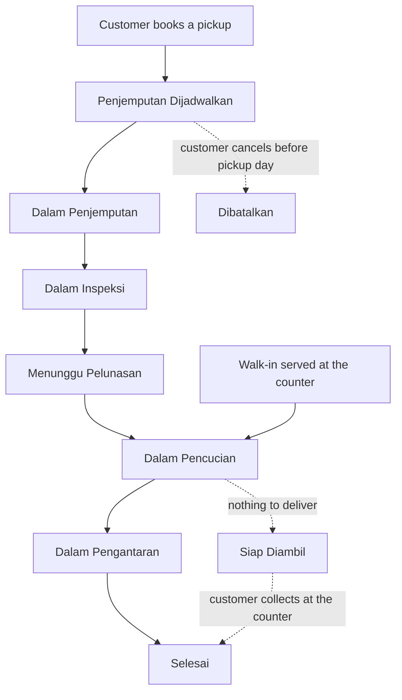

# UmimaClean — Shoe Care Operations Platform

An end-to-end operations platform for **UmimaClean**, a shoe, bag, and helmet cleaning service in the Bandung Raya area. The system takes an order from the moment a customer books a pickup on their phone through collection, inspection, pricing, payment, cleaning, and delivery — and gives the owner a single place to see the money and the workload behind it all.

---

## The problem it solves

A cleaning service of this kind runs on messages, notebooks, and memory. Orders arrive over WhatsApp, prices are quoted verbally, staff assignments are agreed in a group chat, and revenue is worked out at the end of the month from a stack of receipts. That works until it doesn't: two staff drive to the same address, a customer is quoted one price and charged another, an order sits finished on a shelf because nobody remembers whose it is, and the owner cannot answer basic questions about which services actually earn money.

UmimaClean replaces that with one shared record of what happened. Every order has a number, a status anyone can look up, an itemised price, a payment trail, and a log of which staff member did what and when.

---

## Who uses it

The platform serves three distinct audiences, each with its own purpose-built experience.

| Audience                         | What they do                                                                           | How they use it                            |
| -------------------------------- | -------------------------------------------------------------------------------------- | ------------------------------------------ |
| **Customers** (Pelanggan)        | Book a pickup, track their order, pay, collect a receipt                               | Mobile-first, on their own phone           |
| **Field & shop staff** (Petugas) | Claim pickups and deliveries, inspect and price items, record cleaning, serve walk-ins | Mobile-first, in the van or at the counter |
| **Owner / management** (Admin)   | Monitor the shop, manage the catalogue and accounts, resolve payments, read reports    | Desktop-first, adapting down to mobile     |

Nobody sees anything outside their role. Staff and administrator accounts have no public sign-up path at all — they can only be created from inside the admin area, so the public form can never mint a privileged account.

---

## How an order moves

The heart of the system is a single, unambiguous order lifecycle. Every participant — customer, staff, and owner — is looking at the same status at the same time.



1. **Booking.** The customer picks a future date and a saved address. Today is not on offer — the van is already out on a route planned that morning — and each day has a fixed pickup capacity, so the team is never booked beyond what it can physically collect.
2. **Collection.** A staff member claims the pickup, which immediately shows the customer that someone is on the way. Completion is recorded with a proof photo.
3. **Inspection.** Staff record each item — brand, model, material, size, condition — and select the services it needs. This is where the price is set, and it is itemised rather than a single number.
4. **Payment.** The customer receives the quote and pays by QRIS. Prices are copied onto the order at inspection time, so a later change to the catalogue never reprices work that has already been quoted.
5. **Cleaning.** The order enters the wash. A printable tag lists every item in the batch so nothing is mixed up on the rack.
6. **Delivery.** Staff claim the delivery run and confirm hand-over with a proof photo, which closes the order.

**Walk-in orders** follow a shorter path: staff record the items with an intake photo, take payment at the counter in cash, by debit, or by QRIS, and the order goes straight into cleaning. Cash is entered as the amount the customer handed over, so the change is worked out on screen and printed on the receipt rather than done in somebody's head.

Once washed, a walk-in moves to **Siap Diambil** — the shelf — rather than straight to finished: the shoes are done, paid for, and still in the shop. Staff can send the customer a WhatsApp saying so, and the order closes when somebody actually walks out with it.

A walk-in customer who has used the app before can be bound to their account at the counter, which keeps the order in their own history and makes a **walk-in delivery** possible: they bring the shoes in themselves and have them delivered back to the address on their account.

---

## What each role gets

### For customers

- **Book a pickup** for a chosen date, from a saved address
- **Live order tracking** — the status updates on screen as staff work, without refreshing
- **An itemised quote** showing exactly what is being cleaned and what each service costs
- **QRIS payment** with the order moving on the moment payment clears
- **A receipt** for every completed order
- **Self-service account management** — address book, phone number, password

### For staff

- **A task board** of available pickups, deliveries, inspections, washing, and finished walk-ins waiting to be collected — each card carrying an order number, a badge, and a distance, and nothing more
- **Claim-and-release** so two people never drive to the same address. A claim lasts three hours — enough to cross Bandung in traffic — and lapses on its own, so an abandoned task returns to the pool the same day
- **Customer details on claimed tasks only**, so the address and phone number appear once somebody has taken the job under their own name
- **Walk-in intake with a customer lookup**, so a returning customer is bound to the account they already have instead of being typed in twice
- **WhatsApp from the shop's number** to chase a payment or say an order is ready to collect, recorded against the order so nobody is messaged twice
- **Proof-of-work photos** captured at collection and hand-over
- **Structured inspection** that records the item and prices it from the live catalogue
- **Printable order tags** for the cleaning rack, and a counter receipt printed twice — one copy for the customer, one for the shoes

### For management

- **Dashboard** — orders in progress, revenue, payments awaiting settlement, customer and staff counts, revenue trend, and forward pickup load against capacity
- **Order monitor** — every order in the shop, online and walk-in, filterable by status and type and searchable by number, name, or phone, with a full detail view including the audit trail
- **Payment reconciliation** — a controlled way to settle orders whose payment confirmation never arrived
- **Service catalogue** — the price list the whole business quotes from
- **User management** — customer, staff, and administrator accounts, including an admin-only sign-up form and the ability to switch an account off without touching the work attributed to it
- **A live activity feed** — orders arriving, moving, and being paid for, as it happens
- **Revenue reporting** — totals, averages, daily trend, breakdown by payment method and by order type, and a ranking of the services that actually earn

---

## Reporting and data export

Every management screen can be exported to a **Microsoft Excel workbook** in one click.

| Export         | What the file contains                                                                                         |
| -------------- | -------------------------------------------------------------------------------------------------------------- |
| Dashboard      | Six sheets — headline figures, orders by status, online vs. walk-in, revenue trend, pickup load, recent orders |
| Orders         | Every order matching the current filters, with customer, address, dates, payment state, and total              |
| Reconciliation | The full backlog of unsettled payments, ready to be checked against a bank statement                           |
| Services       | The complete price list                                                                                        |
| Users          | The account register, by role                                                                                  |
| Revenue report | Five sheets — summary, daily revenue, payment methods, order types, top services                               |

Two things make these files genuinely usable rather than merely available:

- **The file matches the screen.** An export carries whatever filters, search terms, and date range the user is looking at — but never stops at the page they happen to be on. What you filter is what you get, in full.
- **The numbers are numbers.** Amounts are written as real currency values and dates as real dates, so a column can be summed, sorted, filtered, and charted in Excel. Nothing arrives as text that only looks like a figure.

---

## Safeguards and accountability

The system is built on the assumption that money and customer property need a paper trail.

- **Every action is attributed.** Collections, inspections, cleaning, deliveries, and manual payment overrides are all recorded against the staff member who performed them, with a timestamp.
- **Payment overrides are deliberate, narrow, and logged.** When a payment confirmation is lost in transit, only an administrator can settle the order by hand, only for money that arrived in person — cash or card — and only after stating a reason. A QRIS payment is always confirmed by Midtrans, because that is the only party that can know. The override is permanently recorded in the administrator's name.
- **History cannot be quietly erased.** A customer or staff account that appears anywhere in the order record cannot be deleted, and neither can a service that has priced an order — the receipt for that order still names it. Somebody who leaves has their account switched off instead, which stops working on their very next request and takes none of their work with it.
- **Administrators cannot lock the business out.** An administrator cannot delete or demote their own account, which would otherwise be a one-way door out of the admin area.
- **Capacity is enforced, not advisory.** The daily pickup limit is applied at booking time rather than discovered when the van is already full.
- **Quoted prices are frozen.** Updating the catalogue changes what future work costs, never what past work cost.
- **Resetting a password ends every other session.** A reset exists to lock out whoever knew the old password, so leaving those sessions signed in would make it a formality.
- **Verification links belong to the person who asked for them.** A phone-change link carries the account it was issued for, so it cannot move somebody else's number if it is opened on a shared machine.
- **Proof photos are kept for 90 days and then deleted.** The audit trail — who did what, and when — stays; only the image goes.
- **Sensitive actions are rate-limited**, including sign-up, sign-in, password reset, and payment requests.

---

## Integrations

| Service                                         | Role in the platform                                                             |
| ----------------------------------------------- | -------------------------------------------------------------------------------- |
| **Midtrans**                                    | QRIS payment processing and settlement confirmation                              |
| **Fonnte (WhatsApp)**                           | Password reset and phone-verification links delivered to the customer's WhatsApp |
| **Leaflet maps** (Google map & satellite tiles) | Address pinpointing and staff route planning                                     |

---

## Technology

Deliberately a small, conventional stack — one application, one database, no moving parts that need separate operating.

| Layer                 | Choice                                                    |
| --------------------- | --------------------------------------------------------- |
| Application framework | AdonisJS 7 (Node.js, TypeScript)                          |
| User interface        | React 19 with Inertia.js and Tailwind CSS                 |
| Database              | PostgreSQL                                                |
| Live updates          | Server-sent events, for order tracking                    |
| File storage          | Local disk for proof-of-work photos, retained for 90 days |
| Spreadsheets          | ExcelJS                                                   |

The application is covered by an automated test suite spanning unit, functional, and full browser tests, which run the real interface in a real browser.

---

## Running the project

Requires **Node.js 24+**, **pnpm**, and a **PostgreSQL** database.

```bash
pnpm install                       # install dependencies
cp .env.example .env               # configure database and integration credentials
node ace generate:key              # generate the application key
node ace migration:run             # create the database schema
node ace db:seed                   # load the starting catalogue and accounts
pnpm dev                           # start the application
```

The `.env` file holds the database connection and the credentials for the two
external services — **Midtrans** (merchant ID and server key) for payments and
**Fonnte** (API key) for WhatsApp delivery.

| Command          | Purpose                                           |
| ---------------- | ------------------------------------------------- |
| `pnpm dev`       | Run the application locally with live reload      |
| `pnpm build`     | Produce a production build                        |
| `pnpm start`     | Run the production build                          |
| `pnpm test`      | Run the full test suite                           |
| `pnpm typecheck` | Verify types across the application and interface |
| `pnpm lint`      | Check code style                                  |
| `pnpm format`    | Apply formatting                                  |

### Demo data

`db:seed` loads the price list and the first admin account. In development it
also loads a worked example of a shop mid-week: every role signed up, an order
sitting in every status, every recorded action somewhere in an audit trail, and
payments in all five transaction states across cash, QRIS, and debit. Proof
photos and QR codes are generated as real files, so the pages that show them
have something to show.

```bash
node ace migration:fresh --seed    # rebuild the database with the demo shop in it
```

Every demo account signs in with the password **`demo12345`**, and the seeder
prints the full list when it finishes. The ones worth starting from:

| Role     | Phone          | Lands on                                                        |
| -------- | -------------- | --------------------------------------------------------------- |
| Admin    | `081200000001` | The dashboard (password `admin12345` — the non-demo admin)      |
| Admin    | `081200000002` | The dashboard, with a month of orders and revenue behind it     |
| Staff    | `081300000001` | The trip queue, holding no task of their own                    |
| Staff    | `081300000002` | Straight back into the pickup they have already claimed         |
| Staff    | `081300000006` | Nothing — a deactivated account, kept for the actions it signed |
| Customer | `081400000001` | **An order in every one of the nine statuses** — start here     |
| Customer | `081400000002` | An ordinary history of four orders                              |
| Customer | `081400000007` | The booking form, with no address given yet                     |
| Customer | `081400000008` | Nothing — a deactivated account with a readable order history   |

Orders are spread across all eight customers so each list reads like a real
history, which means no ordinary account shows the whole lifecycle at once.
`081400000001` is the exception: it holds one order in every status, from a
booking that can still be cancelled through to a finished order with a receipt,
so the statuses can be walked through from a single sign-in.

The demo seeder never runs outside development, and refuses to run a second
time rather than doubling the data. To start over, run `migration:fresh --seed`
again.

Housekeeping runs on a schedule rather than on a request. Point cron, a systemd
timer, or whatever the host already uses at it once a night:

```bash
node ace prune:records    # delete expired proof photos and orphaned addresses
```

The test suite is organised by role — see [docs/role_testing.md](docs/role_testing.md)
for the permission matrix and what belongs where.

---

## Project status

The platform covers the complete operational cycle described above: customer booking and payment, staff field and counter work, and management oversight, reporting, and export. It is a private, unlicensed codebase built for UmimaClean and is not distributed for reuse.
