# Catalogue — Guide

The catalogue is the shop's price list. Every price an order ends up with comes
from here.

## What a catalogue entry is

Each entry describes one service the shop sells:

- **Name** — what it is called, 3 to 100 characters
- **Description** — 3 to 255 characters
- **Price**
- **Category** — what kind of work it is
- **Type** — how the price should be read

## Categories decide what it applies to

The category is not just a label for grouping. It controls which items the
service can be applied to during inspection:

| Category    | Offered for |
| ----------- | ----------- |
| Shoe wash   | Shoes       |
| Shoe repair | Shoes       |
| Bag wash    | Bags        |
| Helmet wash | Helmets     |
| Additional  | Everything  |

So creating a service under "bag wash" means staff will never see it when
inspecting a helmet. If a service is not showing up where expected, the category
is the first thing to check.

**Additional** is the exception. Add-ons are not tied to any item type, because
things like a protective coating or a rush fee apply just as well to a shoe as
to a bag.

## Types

The type controls how the price is presented: a fixed price, a "starting from"
price for work that varies, or an add-on.

## Changing prices

Prices can be changed at any time, including on services that have already been
ordered.

This is safe because **the price is copied onto the order at the moment of
inspection**. A shoe clean priced today keeps today's price forever, even if the
catalogue changes tomorrow. Old receipts stay accurate.

## Deleting

A catalogue entry can only be deleted if **no order has ever used it**.

If it has been used, deletion is refused with a message saying the service has
already been ordered. The list screen knows which entries are in use so the
delete option can be hidden rather than failing when clicked.

The reason is traceability. Even though the price and name were copied onto the
order line, each line still points back to the catalogue entry. Removing it
would break the link an admin follows when checking a receipt.

The practical consequence: **you cannot tidy up old services.** A service the
shop no longer offers but has sold in the past stays in the list forever. There
is no archive or hide flag — if that becomes a problem it needs a new column.

## Finding entries

The list is searchable by name and description, newest first, ten to a page.

## Screenshots

Every state below is shown at three widths — desktop (1440px), tablet (834px) and mobile (430px). The hero above is the desktop view, which is how this role's screens are normally used.

**Service list with in-use markers**

| Desktop                                                                                          | Tablet                                                                                         | Mobile                                                                                         |
| ------------------------------------------------------------------------------------------------ | ---------------------------------------------------------------------------------------------- | ---------------------------------------------------------------------------------------------- |
|  | 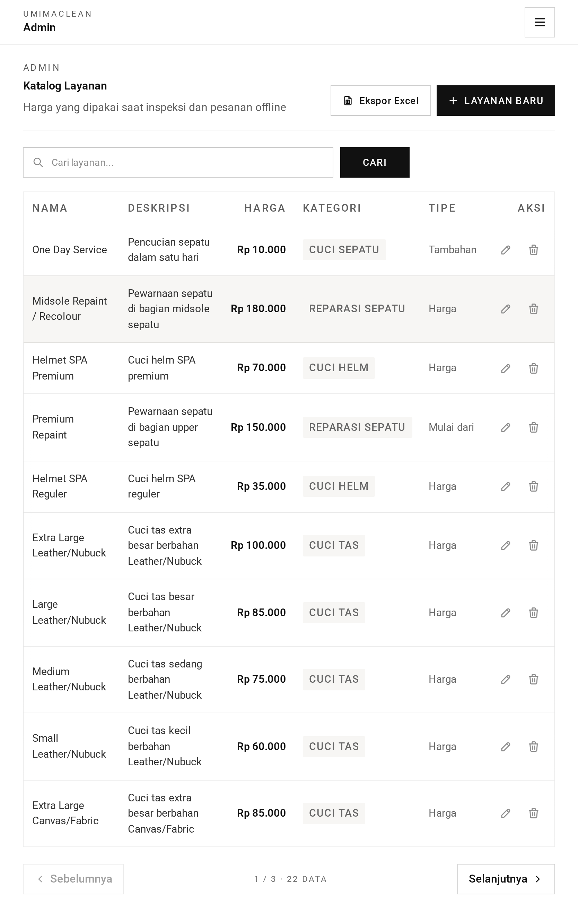 | 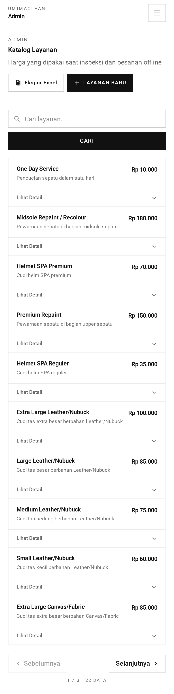 |

**Adding a service**

| Desktop                                                                           | Tablet                                                                          | Mobile                                                                          |
| --------------------------------------------------------------------------------- | ------------------------------------------------------------------------------- | ------------------------------------------------------------------------------- |
| 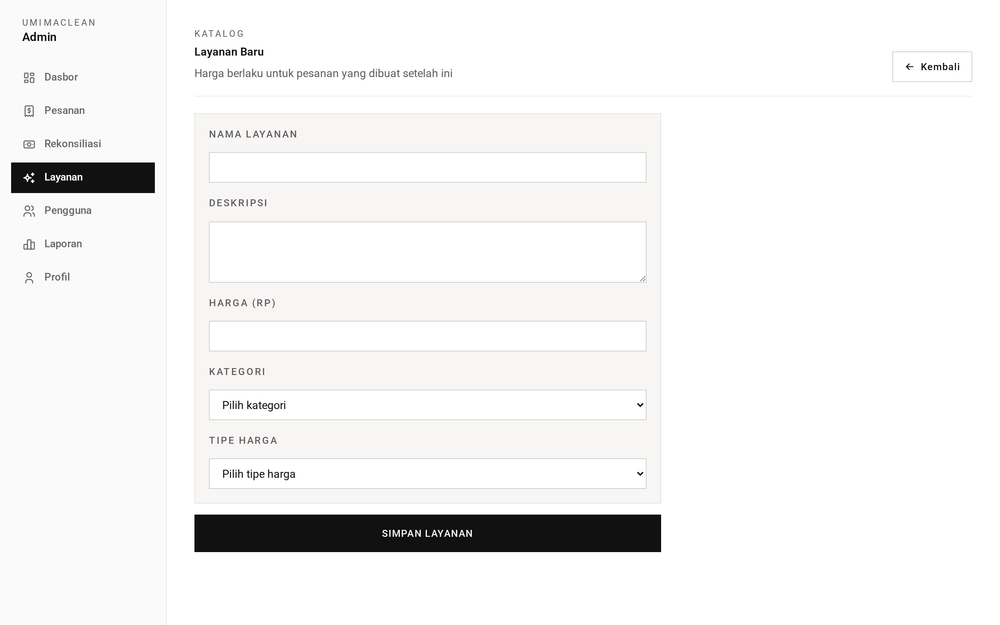 | 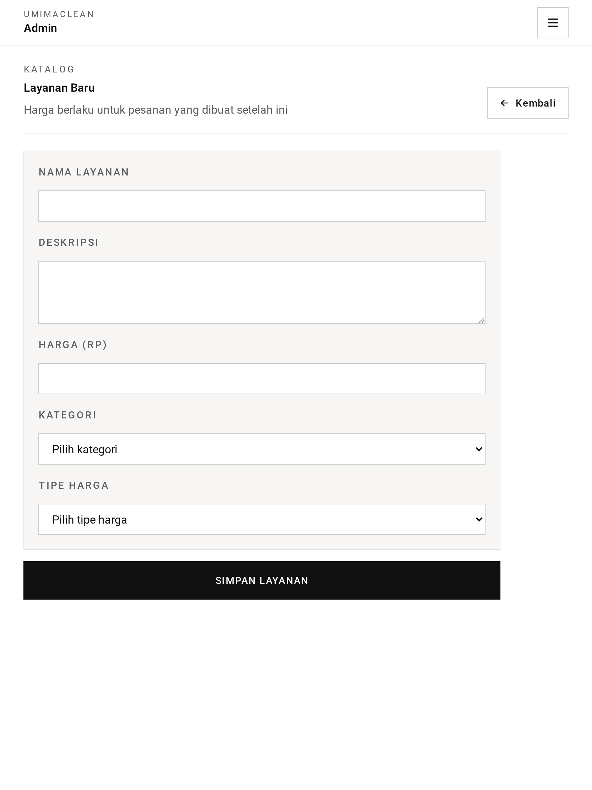 | 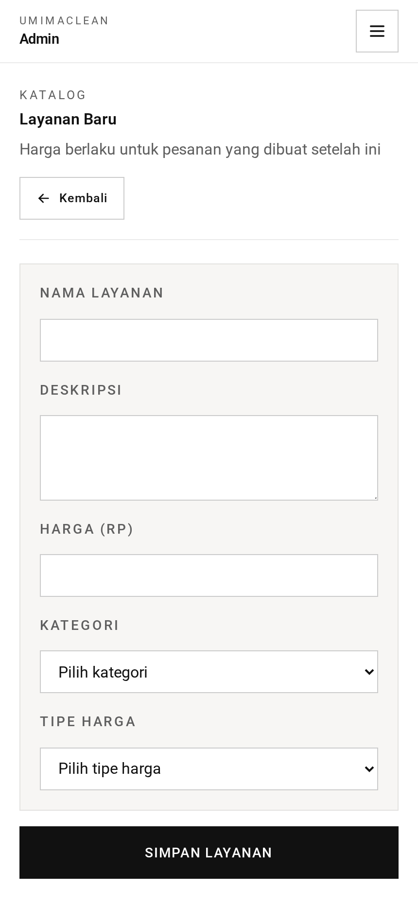 |

**Editing a service that has already been ordered**

| Desktop                                                                                                        | Tablet                                                                                                       | Mobile                                                                                                       |
| -------------------------------------------------------------------------------------------------------------- | ------------------------------------------------------------------------------------------------------------ | ------------------------------------------------------------------------------------------------------------ |
| 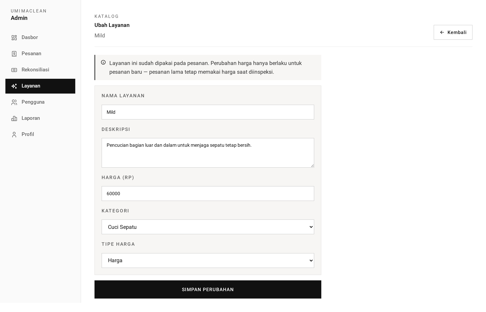 | 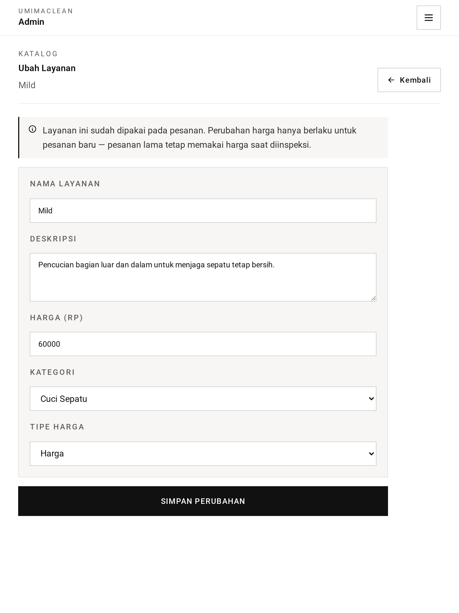 | 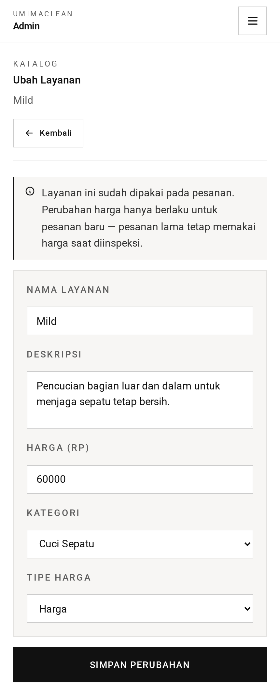 |

**Editing an unused service — deletion still available**

| Desktop                                                                                                                    | Tablet                                                                                                                   | Mobile                                                                                                                   |
| -------------------------------------------------------------------------------------------------------------------------- | ------------------------------------------------------------------------------------------------------------------------ | ------------------------------------------------------------------------------------------------------------------------ |
| 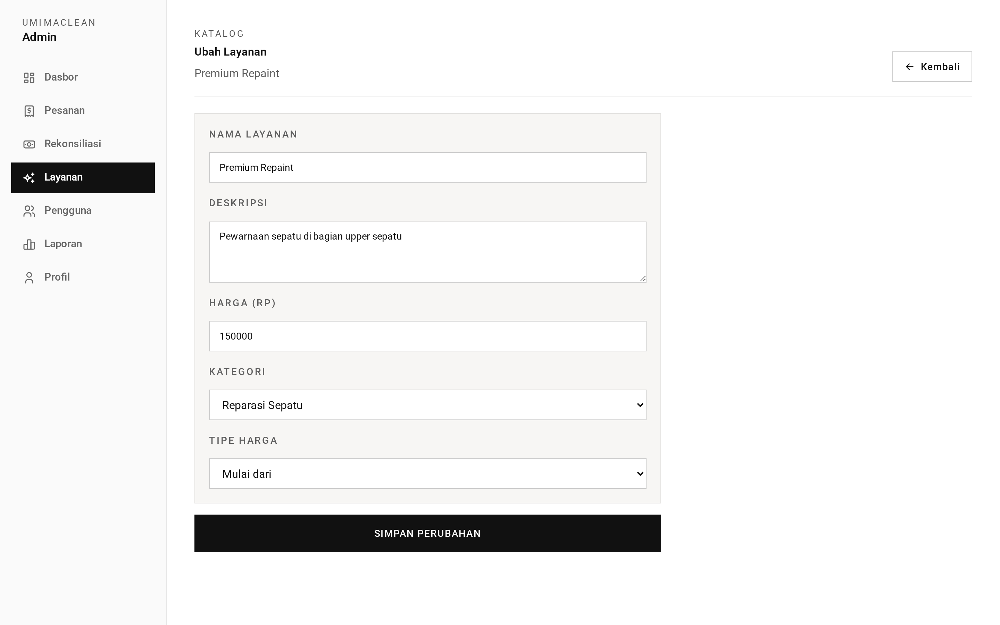 | 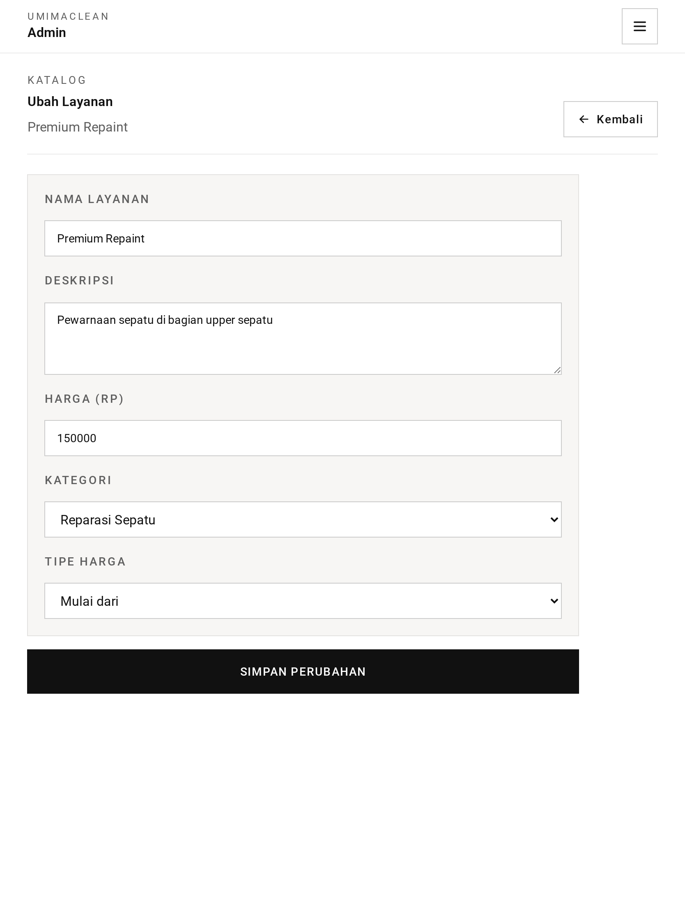 | 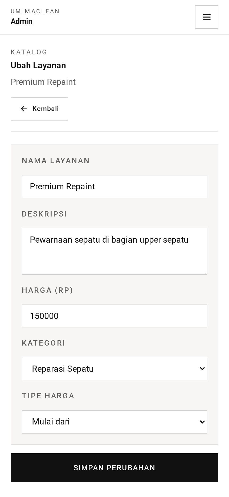 |

→ One-minute version: [tldr.md](tldr.md)
→ Implementation detail: [technical.md](technical.md)
