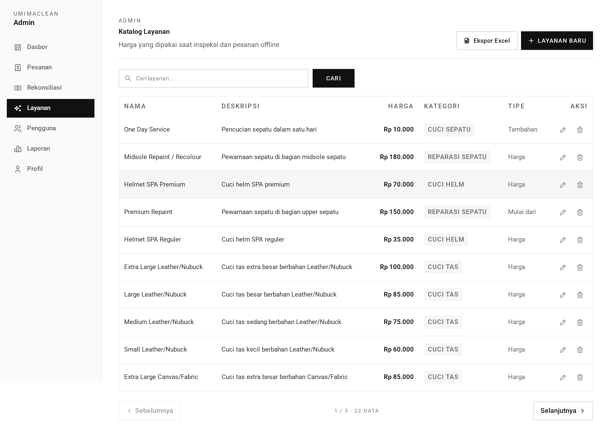

# Catalogue — TL;DR

The services the shop sells and what they cost. This is what
[inspection](../../staff/inspection/) prices orders from.



## The five things to know

1. **A catalogue entry that has been ordered cannot be deleted.** The
   `catalogue_id` FK on `order_items` is `RESTRICT`, and the service checks
   first with a clear message.
2. **Prices are copied onto the order line at inspection time.** Changing a price
   never rewrites historical orders.
3. **Category decides which item types can use it.** `shoe_wash` and
   `shoe_repair` apply to shoes, `bag_wash` to bags, `helmet_wash` to helmets.
4. **`additional` type is item-type agnostic** — a coating or rush fee applies to
   anything.
5. **The form field is `catalogueName`, the column is `name`** — mapped in
   `#toAttributes`.

## Routes at a glance

| Method   | URL                                                    | Purpose                  |
| -------- | ------------------------------------------------------ | ------------------------ |
| GET      | `/admin/catalogues`                                    | List (paginated 10)      |
| GET/POST | `/admin/catalogues/create` · `/admin/catalogues`       | Add                      |
| GET/PUT  | `/admin/catalogues/:id/edit` · `/admin/catalogues/:id` | Edit                     |
| DELETE   | `/admin/catalogues/:id`                                | Delete (blocked if used) |

## Validator

```ts
catalogueValidator = {
  catalogueName: string.trim().minLength(3).maxLength(100),
  description: string.trim().minLength(3).maxLength(255),
  price: number.positive().max(100_000_000),
  category: vine.enum(CatalogueCategory),
  type: vine.enum(CatalogueType),
}
```

## The gotcha

**Editing an in-use catalogue is allowed; deleting it is not.** So a price can be
changed freely — it only affects future orders — but the row must stay so a
receipt can still be traced back. The edit screen receives `isInUse` so the UI
can warn.

→ Plain-language walkthrough: [guide.md](guide.md)
→ Implementation detail: [technical.md](technical.md)
