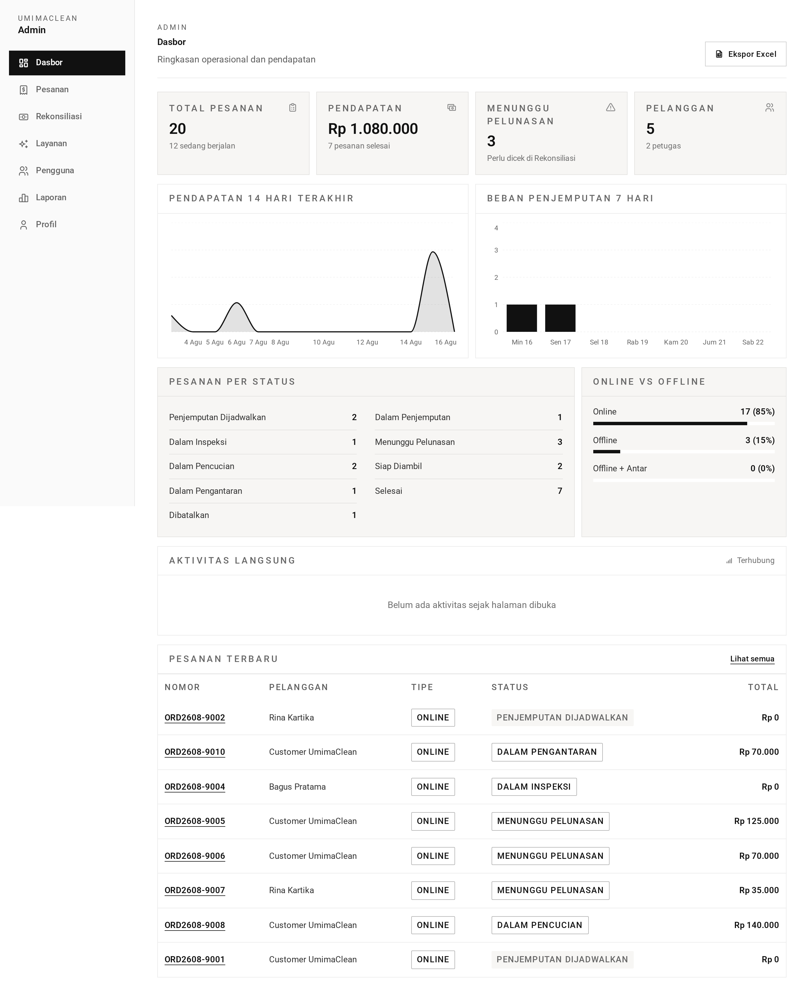
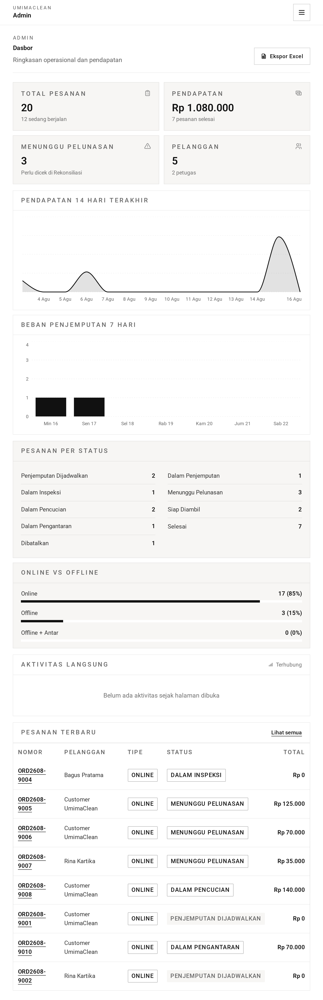
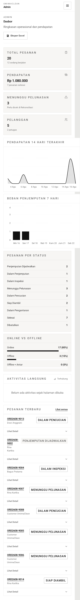

# Dashboard — Guide

The admin landing view: one screen answering "how is the shop doing right now?"

It is purely informational. Nothing on it changes anything.

## The summary numbers

At the top, a row of headline figures:

- **Total orders** ever placed
- **Active orders** — work currently in progress
- **Completed orders**
- **Awaiting payment** — orders priced but not yet paid
- **Revenue** — money actually settled
- **Customers** and **staff** counts

### What "active" means

This is worth pinning down, because it is easy to misread.

"Active" is not simply "not finished". It counts orders in seven specific
stages: pickup scheduled, in pickup, in inspection, awaiting payment, in
cleaning, cleaning done, and in delivery.

Completed and cancelled orders are excluded. So active + completed will not
equal total unless you also count cancellations.

### What "revenue" means

Revenue counts only money that has actually settled — payments confirmed either
by the payment gateway or by an admin marking them paid.

An order that has been priced but not paid contributes nothing, no matter how
large. That is deliberate: this figure is money received, not money owed. The
awaiting-payment count is where you see what is outstanding.

## The breakdowns

Two distributions: orders by **status** and orders by **type** (online, offline,
walk-in-with-delivery).

Both list **every possible value**, including ones with a count of zero. A status
nobody has used still appears with a zero rather than vanishing. This keeps the
chart's shape stable between page loads rather than having categories appear and
disappear.

## Revenue trend

Daily settled revenue over the last **14 days**.

Days with no revenue show as zero rather than being skipped, so the line is
continuous and the spacing is honest — a quiet week looks quiet instead of being
compressed away.

## Pickup load

A forward look at the **next 7 days**, showing for each day how many pickups are
booked against the daily capacity of 10.

This is the planning tool. It shows where the pressure is before it arrives.

Cancelled orders are excluded from the count, and only pickups still waiting to
be collected occupy a slot — once a courier collects an order, it frees up.

## Recent orders

The **8 most recently created** orders, newest first, as a quick pulse on what
is coming in.

## Performance note

All six blocks are fetched **at the same time** rather than one after another.
The page therefore takes about as long as the slowest single query, not the sum
of all of them.

## Screenshots

Every state below is shown at three widths — desktop (1440px), tablet (834px) and mobile (430px). The hero above is the desktop view, which is how this role's screens are normally used.

**Dashboard — summary, trend, pickup load, recent orders**

| Desktop                                                                                                                | Tablet                                                                                                               | Mobile                                                                                                               |
| ---------------------------------------------------------------------------------------------------------------------- | -------------------------------------------------------------------------------------------------------------------- | -------------------------------------------------------------------------------------------------------------------- |
|  |  |  |

→ One-minute version: [tldr.md](tldr.md)
→ Implementation detail: [technical.md](technical.md)
