# Admin Orders — Guide

The admin's window onto every order in the shop, regardless of who placed it or
what stage it is at.

## What an admin can and cannot do

**Can**: look at any order, filter and search the whole list, open full detail,
and export to a spreadsheet.

**Cannot**: move an order along. An admin cannot mark something collected,
washed, or delivered. Those actions belong to staff, who are physically handling
the goods.

The one money-related exception is confirming a payment that arrived outside the
app — that is [reconciliation](../reconciliation/), which is its own screen.

This separation is deliberate. The admin view is for oversight, not for
operating the workflow.

## Finding orders

Three filters, all optional and combinable:

**Search** matches against the order number, the customer's name, or their phone
number. Partial matches work — typing part of a phone number finds it.

**Status** narrows to one stage: awaiting payment, in cleaning, and so on.

**Type** narrows to online, offline, or walk-in-with-delivery orders.

Results are newest first, 15 to a page.

## Order detail

Opening an order shows everything the system knows: the customer, the delivery
address, every item with the services applied to it, the full action history
(who did what, when, with photographs), and every payment attempt.

The action history is the audit trail. It shows the pickup photo, the inspection
photo, the cleaning photo, and who was responsible for each step.

## Exporting

The export produces a spreadsheet of orders with their number, customer name and
phone, status, type, total, pickup date, and creation time.

**Whatever filters are applied carry over to the export.** Filtering to
"awaiting payment" and exporting gives just those orders.

One thing to know: **the export is not paginated.** It returns every row
matching the filter, not just the page being viewed. Exporting with no filters
means exporting the entire order table. That is usually what people want, but it
is worth being aware of on a large dataset.

## Why search can be slow at scale

Searching by partial text is inherently harder for a database than matching an
exact value. This app adds special indexes for exactly that purpose, so partial
searches on order numbers, names, and phones stay fast as the table grows.

## Screenshots

Every state below is shown at three widths — desktop (1440px), tablet (834px) and mobile (430px). The hero above is the desktop view, which is how this role's screens are normally used.

**All orders, newest first**

| Desktop                                                                               | Tablet                                                                              | Mobile                                                                              |
| ------------------------------------------------------------------------------------- | ----------------------------------------------------------------------------------- | ----------------------------------------------------------------------------------- |
|  | 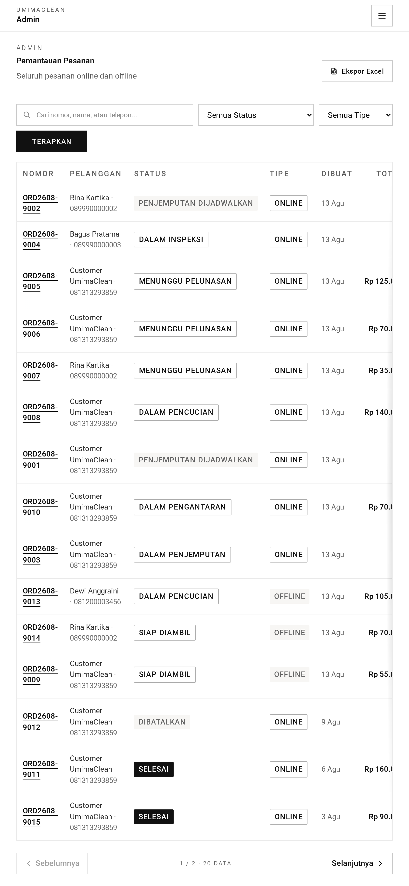 | 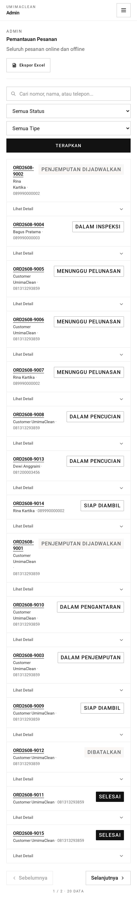 |

**Filtered by status**

| Desktop                                                                            | Tablet                                                                           | Mobile                                                                           |
| ---------------------------------------------------------------------------------- | -------------------------------------------------------------------------------- | -------------------------------------------------------------------------------- |
| 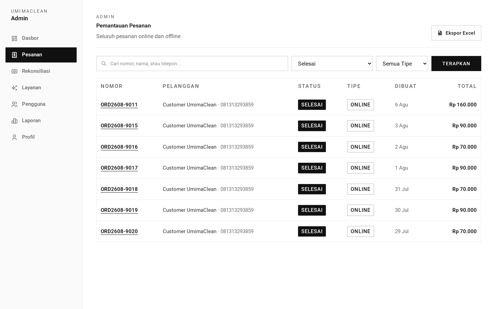 | 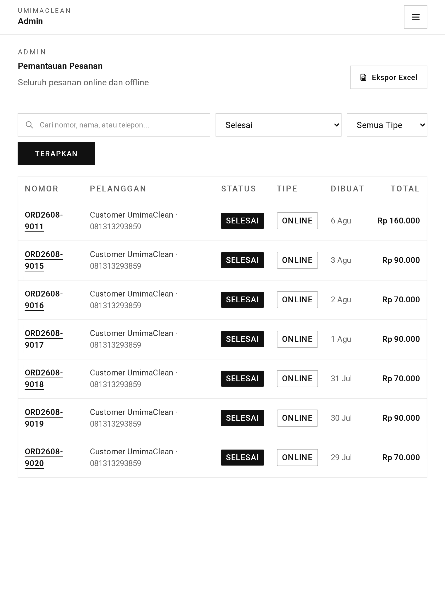 | 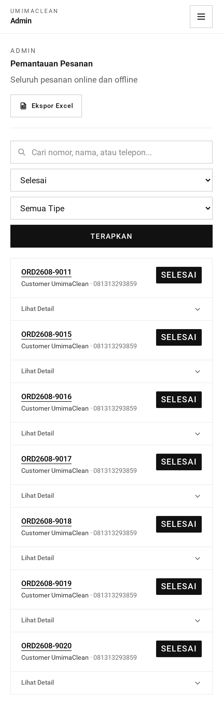 |

**Partial search on the order number**

| Desktop                                                                                          | Tablet                                                                                         | Mobile                                                                                         |
| ------------------------------------------------------------------------------------------------ | ---------------------------------------------------------------------------------------------- | ---------------------------------------------------------------------------------------------- |
| 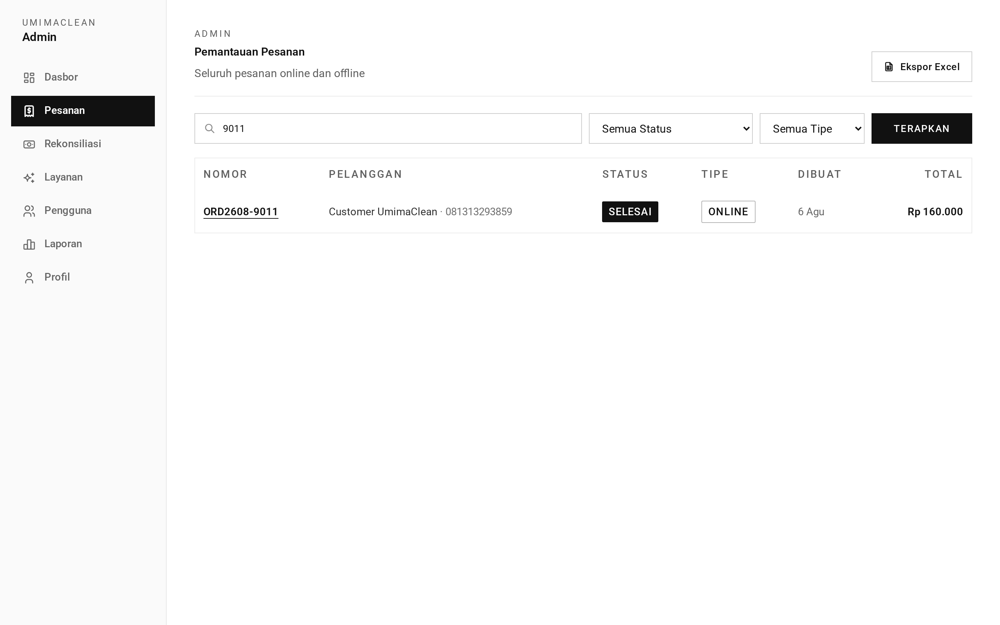 | 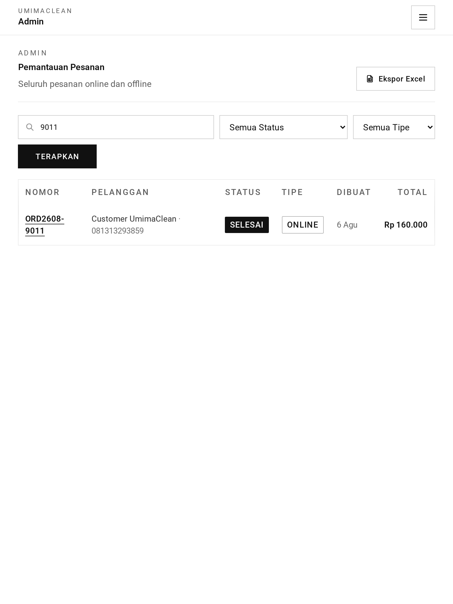 | 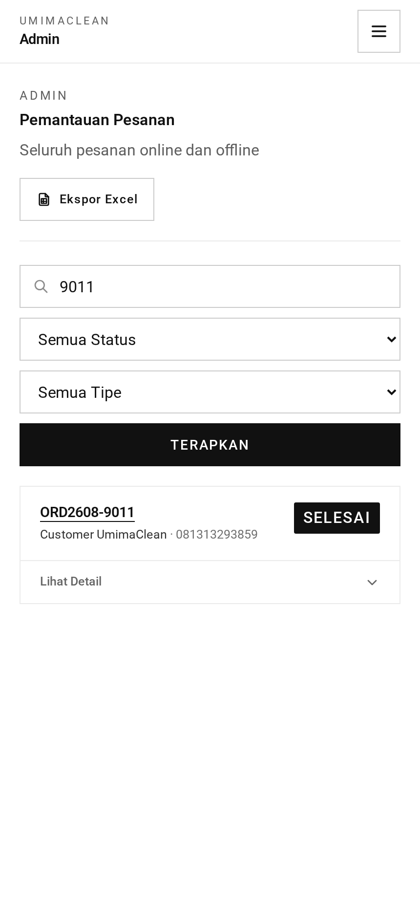 |

**A search that matches nothing**

| Desktop                                                                                    | Tablet                                                                                   | Mobile                                                                                   |
| ------------------------------------------------------------------------------------------ | ---------------------------------------------------------------------------------------- | ---------------------------------------------------------------------------------------- |
| 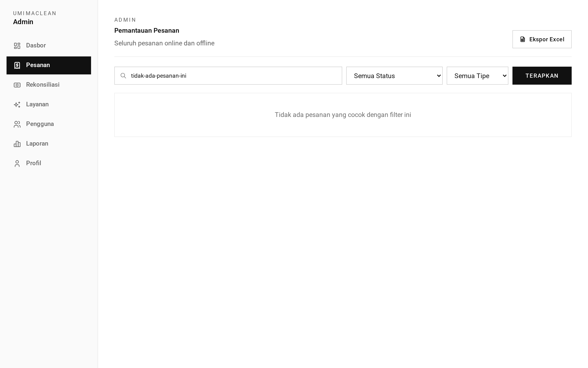 | 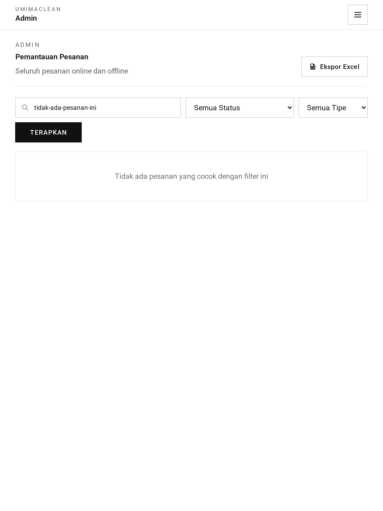 | 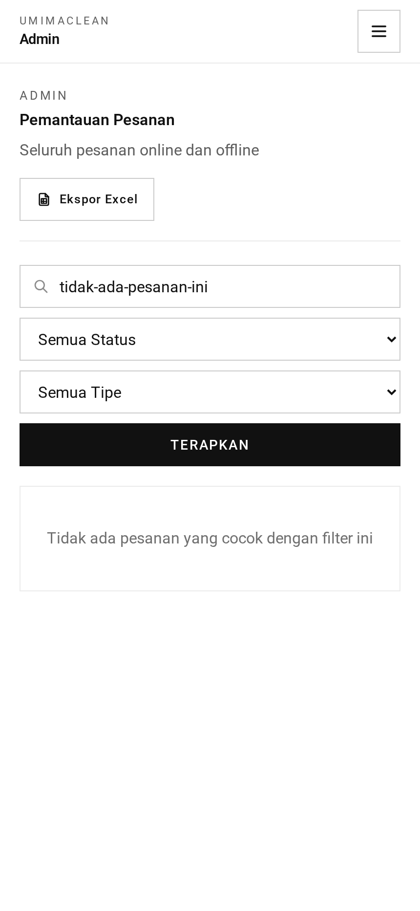 |

**Order detail with items, actions and transactions**

| Desktop                                                                                                       | Tablet                                                                                                      | Mobile                                                                                                      |
| ------------------------------------------------------------------------------------------------------------- | ----------------------------------------------------------------------------------------------------------- | ----------------------------------------------------------------------------------------------------------- |
| 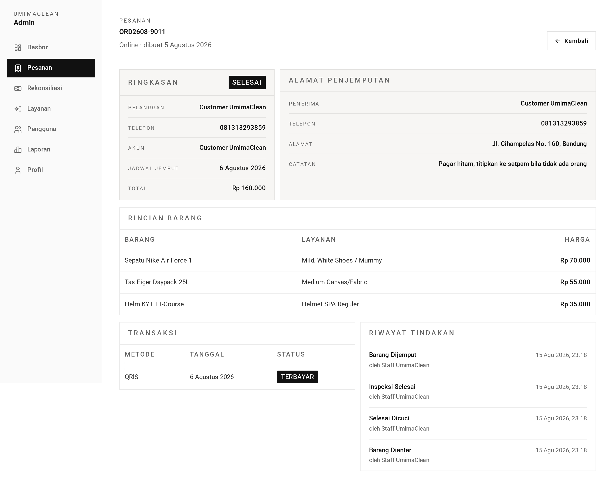 | 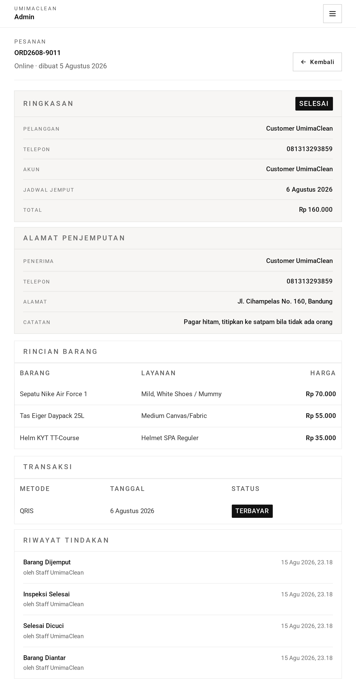 | 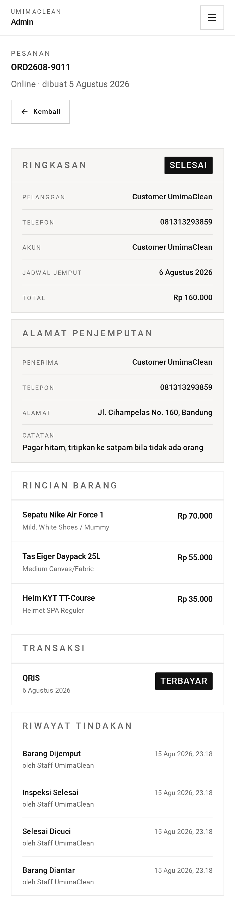 |

→ One-minute version: [tldr.md](tldr.md)
→ Implementation detail: [technical.md](technical.md)
