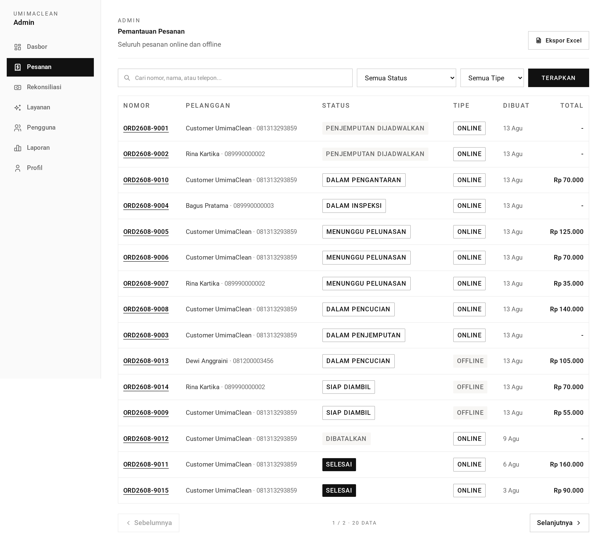

# Admin Orders — TL;DR

Every order in the shop, filterable and exportable. **Read-only** — the admin
cannot advance an order's status from here.

## The five things to know

1. **Read-only.** List, detail, export. Status changes belong to staff; payment
   confirmation lives in [reconciliation](../reconciliation/).
2. **Three filters, all optional**: free-text search, status, type. Plus paging.
3. **Search matches order number, customer name, or phone**, with a leading
   wildcard.
4. **The list pages at 15**; the export ignores paging and returns every matching
   row.
5. **Orders are addressed by order number**, not id.

## Routes at a glance

| Method | URL                     | Purpose                   |
| ------ | ----------------------- | ------------------------- |
| GET    | `/admin/orders`         | Filtered, paginated list  |
| GET    | `/admin/orders/:number` | Full detail               |
| GET    | `/admin/orders/export`  | XLSX of all matching rows |

## Export columns

Nomor · Pelanggan · Telepon · Status · Tipe · Total · Jadwal Jemput · Dibuat

## The gotcha

**The export is unbounded.** `listAllForAdmin` runs the same query without
`.paginate()`, loads every match into memory, and builds a workbook. With a
narrow filter that is fine; with no filter at all it grows with the table.

Second gotcha: **`ILIKE '%term%'` cannot use a btree index**, which is why
`orders` carries three trigram GIN indexes on `order_number`, `customer_name`,
and `customer_phone`.

→ Plain-language walkthrough: [guide.md](guide.md)
→ Implementation detail: [technical.md](technical.md)
