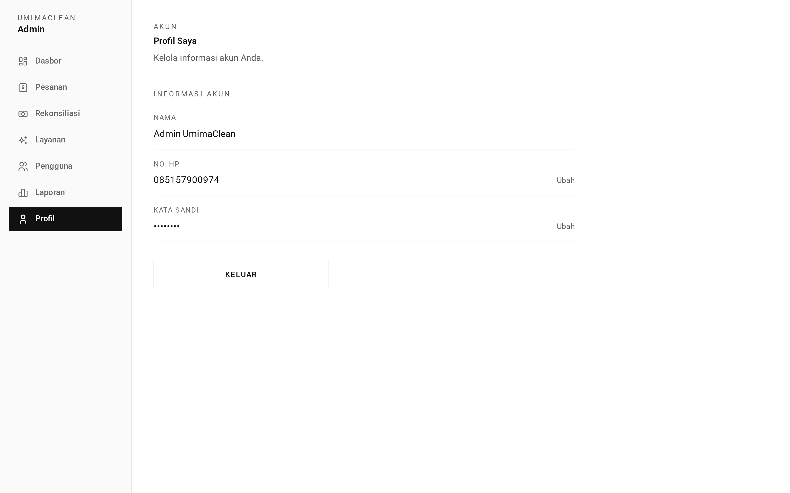
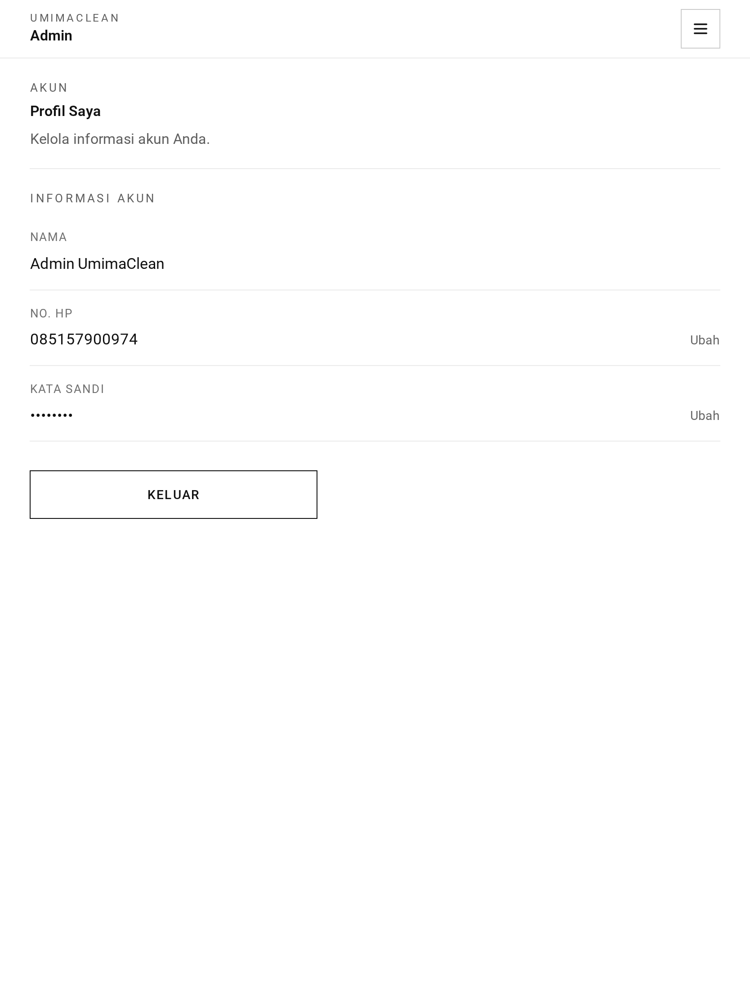
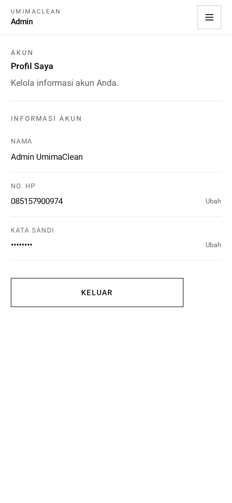

# Admin Profile — Guide

Where an admin manages their own account. Identical in behaviour to the customer
and staff profile pages.

## Where admins land

After logging in, an admin arrives at their **profile page** — not the
dashboard. The dashboard is one step away at `/admin`.

Admins log in through the internal entrance at `/internal/login`, the same door
staff use.

## The three forms

**Name** — letters, spaces and dashes, up to 50 characters. Saved immediately.

**Password** — requires the current password plus the new one twice. New
passwords are 8 to 16 characters with both letters and digits, no symbols. This
does not sign them out elsewhere.

**Phone** — a two-step change. Enter the new number, receive a WhatsApp
verification link **on that new number**, open it to confirm. The link lasts 15
minutes.

Since the phone number is the login identity for every role, this verification
step matters as much for an admin as for a customer — arguably more.

## Two ways an admin can edit an account

This is worth being clear about, because an admin can reach their own account
from two places.

**This page** edits only name, password, and phone. It cannot touch role or
active status. It always operates on whoever is logged in.

**The [user management](../users/) screens** can edit any account including
their own, and can change role and active status. When an admin opens their own
record there, the app flags it as "this is you" so they know.

The important asymmetry: an admin **cannot delete their own account** — that is
blocked outright with a clear message. But they **can deactivate** themselves
through the user screen, and if the active toggle is not submitted the account
is deactivated by default. An admin who is careless on that form can lock
themselves out.

## What is not here

No access to other people's profiles, no role management, no user list. Those
all live under [users](../users/).

## Worth knowing

This page is the same code as the customer and staff profile pages, mounted at a
different prefix. A change here changes all three roles at once.

## Screenshots

Every state below is shown at three widths — desktop (1440px), tablet (834px) and mobile (430px). The hero above is the desktop view, which is how this role's screens are normally used.

**Admin's own account page**

| Desktop                                                                               | Tablet                                                                              | Mobile                                                                              |
| ------------------------------------------------------------------------------------- | ----------------------------------------------------------------------------------- | ----------------------------------------------------------------------------------- |
|  |  |  |

→ One-minute version: [tldr.md](tldr.md)
→ Implementation detail: [technical.md](technical.md)
