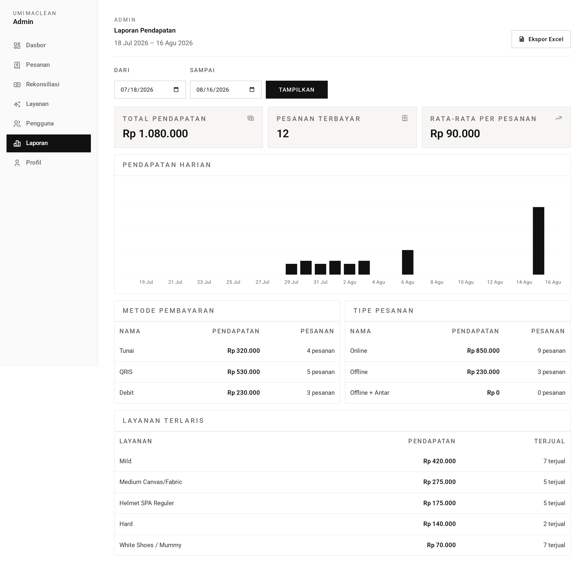

# Reports — TL;DR

Revenue over a chosen date range, broken down by day, payment method, order
type, and top services. Exportable to XLSX.

## The five things to know

1. **The default range is the last 30 days**, ending today.
2. **A reversed range is silently corrected** — `from > to` swaps rather than
   erroring.
3. **Revenue counts settled transactions only**, joined back to their order.
4. **Average order value is integer-rounded**, and is `0` when there are no
   paid orders.
5. **The export contains only the daily series** — date and revenue — not the
   breakdowns shown on screen.

## Routes at a glance

| Method | URL                     | Purpose                       |
| ------ | ----------------------- | ----------------------------- |
| GET    | `/admin/reports`        | The report, filtered by range |
| GET    | `/admin/reports/export` | XLSX of the daily series      |

## What is computed

| Block               | Meaning                                              |
| ------------------- | ---------------------------------------------------- |
| `totalRevenue`      | Sum of `orders.total_price` for settled transactions |
| `paidOrders`        | `countDistinct` of orders                            |
| `averageOrderValue` | revenue ÷ orders, rounded                            |
| `series`            | Daily revenue, zero-filled                           |
| `byPaymentMethod`   | Every `PaymentMethod`, zero-filled                   |
| `byType`            | Every `OrderType`, zero-filled                       |
| `topServices`       | Top 10 catalogues by revenue                         |

## The gotcha

**`topServices` counts `order_items` rows, labelled `orders`.** An order with
three services contributes three to that count. It is a line count, not an order
count — do not compare it against `paidOrders`.

→ Plain-language walkthrough: [guide.md](guide.md)
→ Implementation detail: [technical.md](technical.md)
