# Users — Guide

Where accounts are created, edited, and given their roles.

## Why this screen matters

Public signup can only ever create a **customer**. There is no way for someone to
register as staff or admin, and no way for staff to promote themselves.

So this screen is the only route by which anyone becomes staff or admin. It is
the app's privilege boundary.

## The list

Every account, newest first, ten to a page. It can be filtered by role and
searched by name or phone number — partial matches work.

The page also shows how many accounts exist in each role.

## Creating an account

An admin supplies a name, phone number, password, and role. The rules are the
same as public signup: names are letters, spaces and dashes; phone numbers must
be valid Indonesian mobile numbers and unique; passwords are 8 to 16 characters
with letters and digits and no symbols.

The account is usable immediately. There is no invitation or activation step.

## Editing an account

Editing can change the name, phone, role, and active status, and optionally set
a new password.

**The password is only changed if one is actually typed.** Saving an edit to
correct a name will not reset that person's login. This matters — it would be
easy to lock someone out by accident otherwise.

**Changing a phone number here skips WhatsApp verification.** When a user changes
their own number they must confirm it via a link. When an admin changes it, it
just changes. That is intentional — an admin fixing a typo should not need the
user's cooperation — but it means an admin can set a number the user does not
control.

### Deactivating

An account can be marked inactive rather than deleted. This is the intended way
to retire someone: their history stays intact and their account stops being
usable.

**Be careful with the active toggle.** If the form is submitted without that
field set, the account is deactivated by default. An admin editing their own
account can lock themselves out this way. The app warns when you are editing
yourself, but does not prevent it.

## Deleting an account

Deletion is refused in two cases.

**You cannot delete yourself.** This is checked directly and gives a clear
message.

**You cannot delete an account with order history.** Any account that has ever
placed an order is protected, because removing it would orphan that history —
the orders would point at a user who no longer exists.

The list screen knows which accounts are protected so the delete option can be
hidden rather than failing on click.

In practice this means most real accounts are permanently undeletable, and
deactivation is the tool you actually use. Deletion is really only for accounts
created by mistake that never did anything.

## What lives elsewhere

An admin editing their **own** name, password, or phone through the normal
[profile](../profile/) page follows different rules — that path cannot touch role
or active status, and it does require the current password to change a password.

## Screenshots

Every state below is shown at three widths — desktop (1440px), tablet (834px) and mobile (430px). The hero above is the desktop view, which is how this role's screens are normally used.

**All accounts with per-role counts**

| Desktop                                                                                       | Tablet                                                                                      | Mobile                                                                                      |
| --------------------------------------------------------------------------------------------- | ------------------------------------------------------------------------------------------- | ------------------------------------------------------------------------------------------- |
| 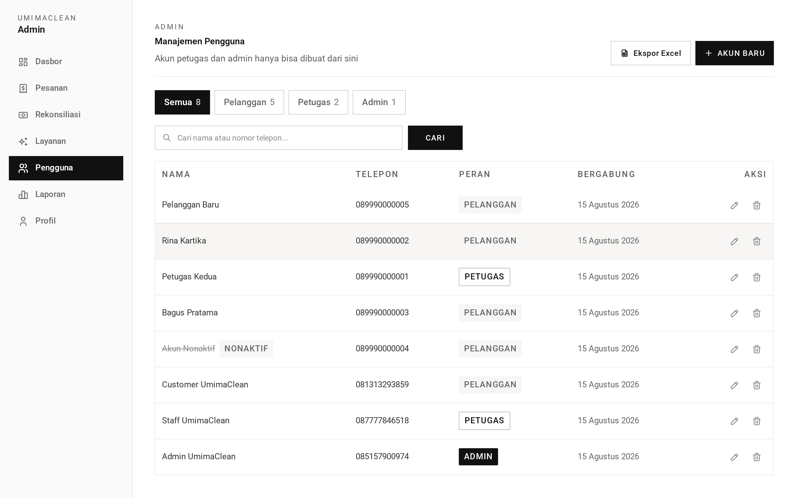 | 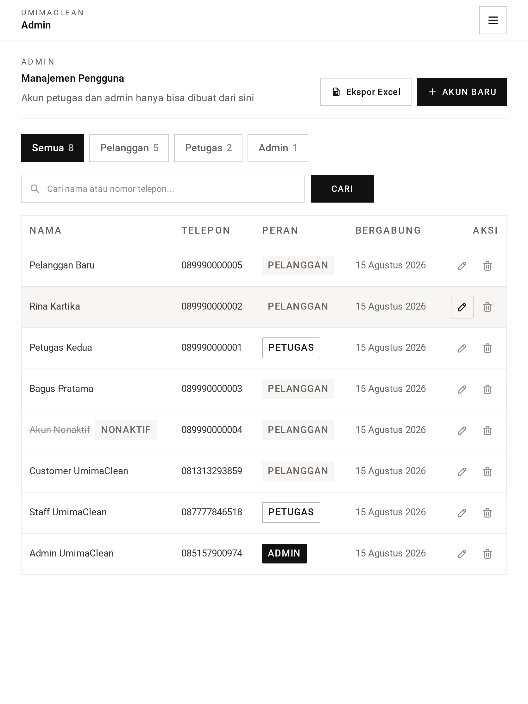 | 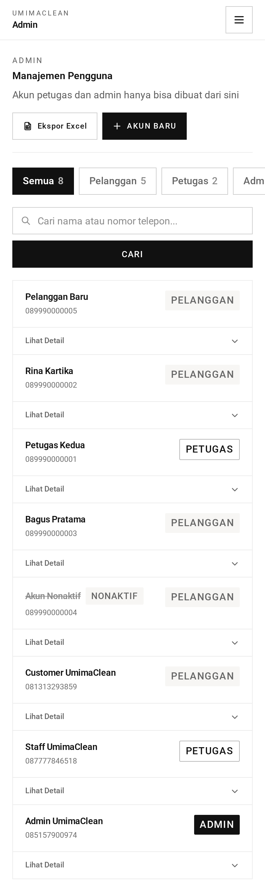 |

**Filtered to staff**

| Desktop                                                                          | Tablet                                                                         | Mobile                                                                         |
| -------------------------------------------------------------------------------- | ------------------------------------------------------------------------------ | ------------------------------------------------------------------------------ |
| 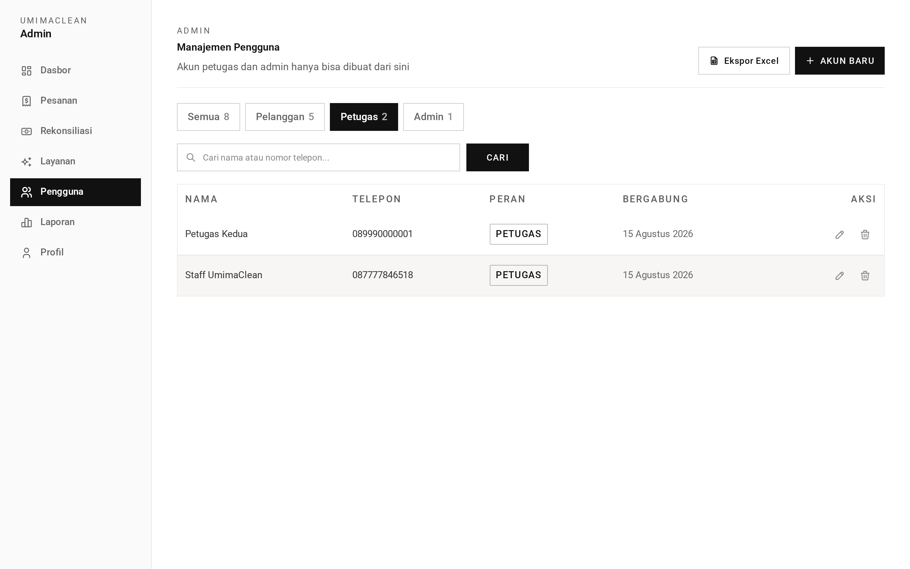 | 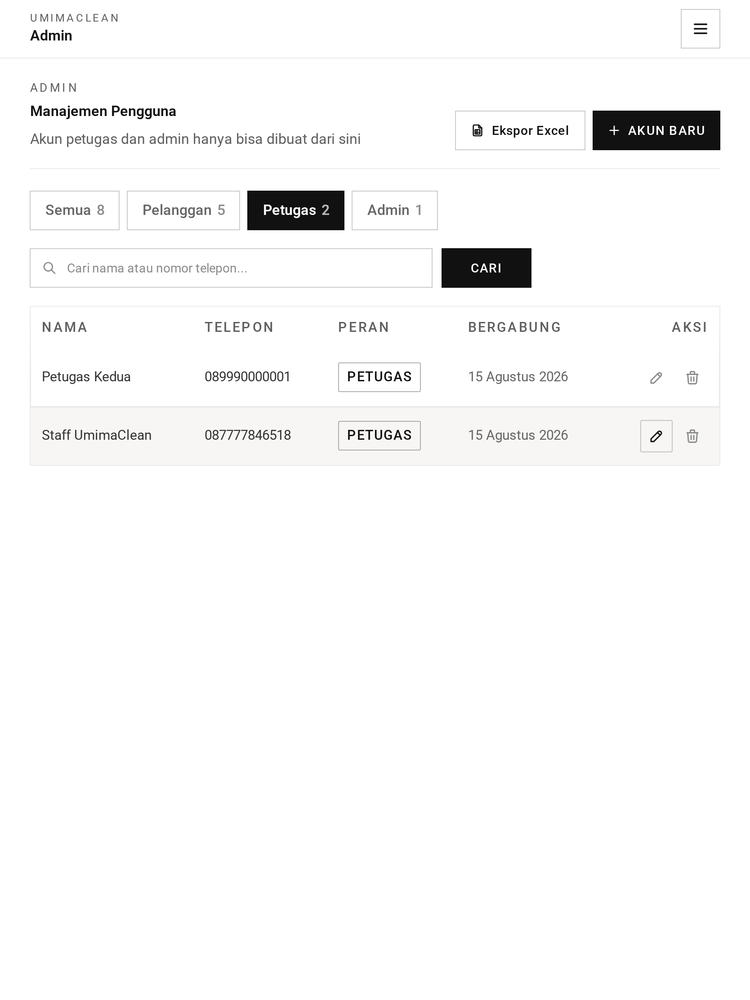 | 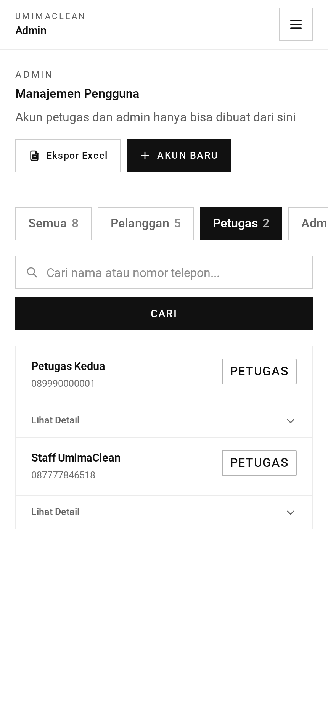 |

**Creating an account — the only path to staff/admin**

| Desktop                                                                                                         | Tablet                                                                                                        | Mobile                                                                                                        |
| --------------------------------------------------------------------------------------------------------------- | ------------------------------------------------------------------------------------------------------------- | ------------------------------------------------------------------------------------------------------------- |
| 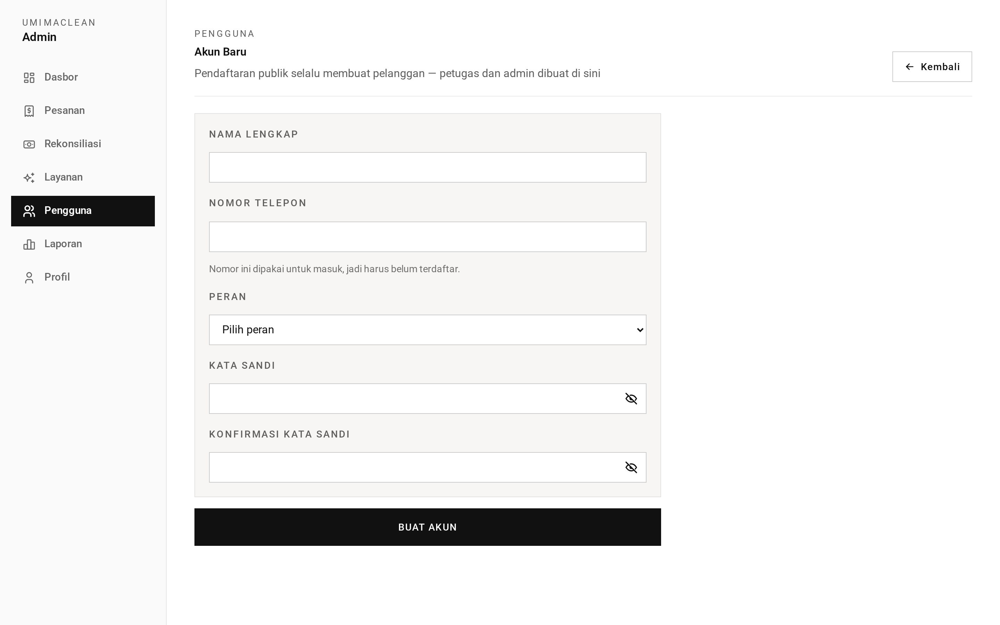 | 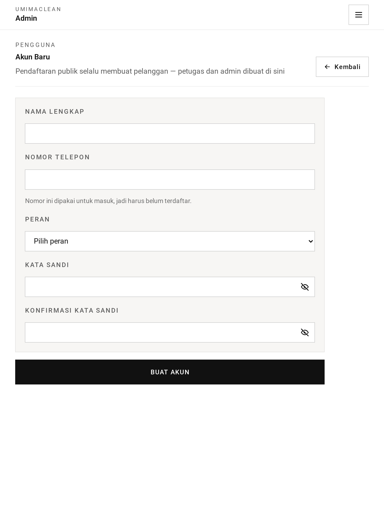 | 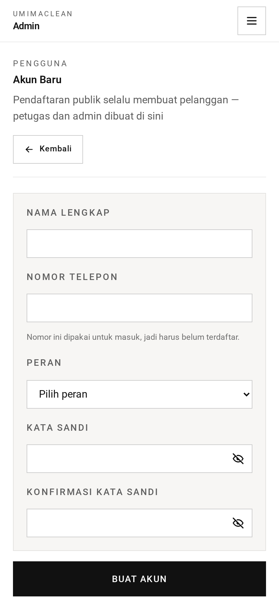 |

**Editing another account**

| Desktop                                                                            | Tablet                                                                           | Mobile                                                                           |
| ---------------------------------------------------------------------------------- | -------------------------------------------------------------------------------- | -------------------------------------------------------------------------------- |
| 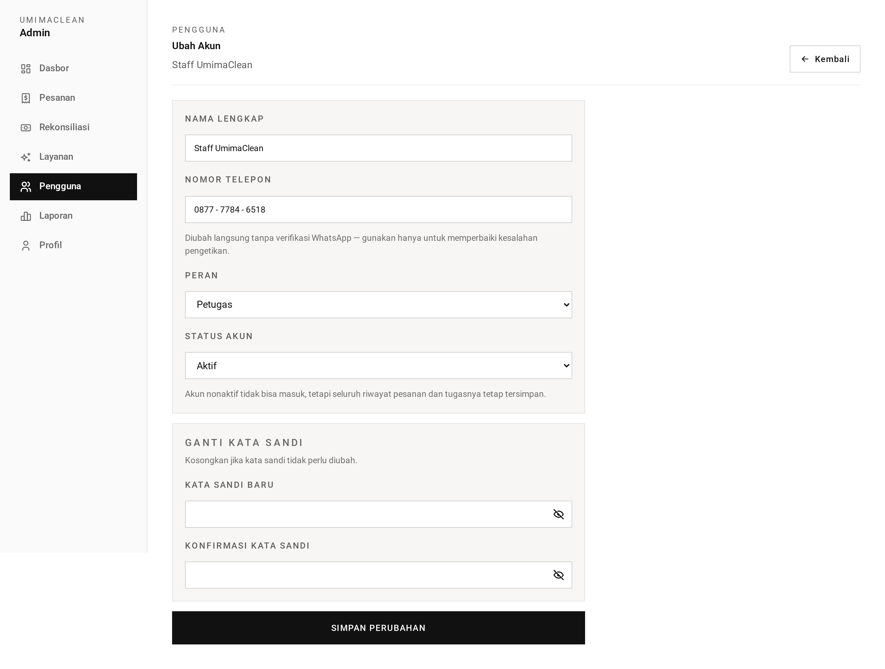 | 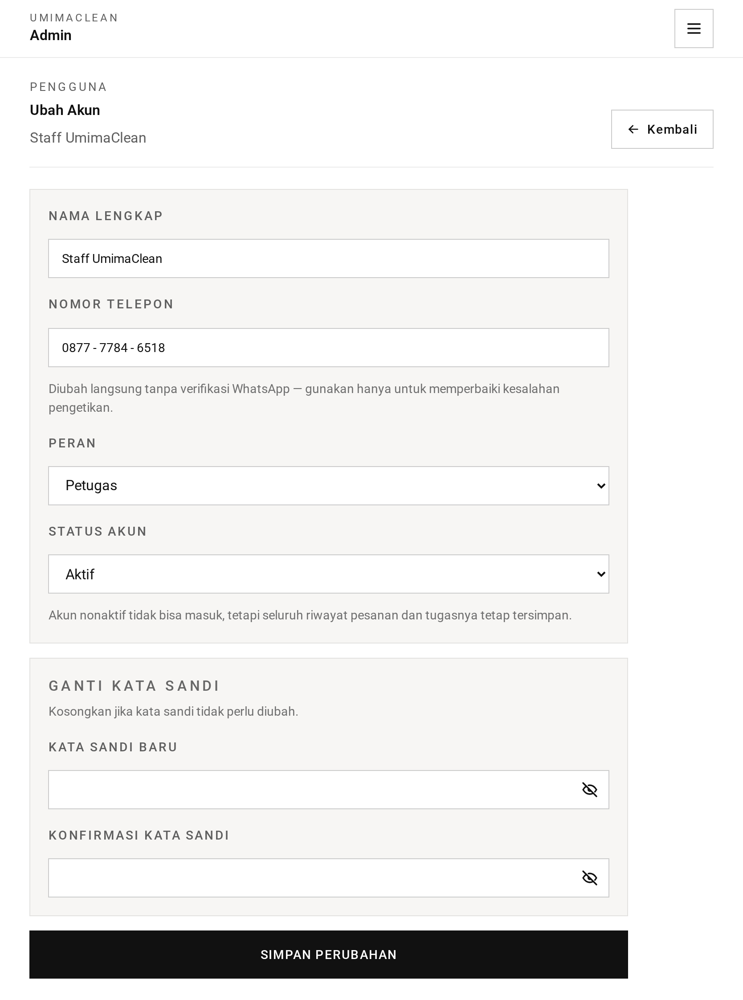 | 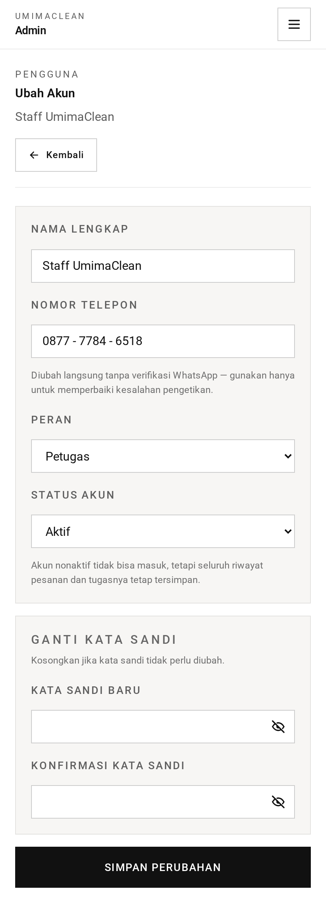 |

**Editing your own account (`isSelf`)**

| Desktop                                                                                             | Tablet                                                                                            | Mobile                                                                                            |
| --------------------------------------------------------------------------------------------------- | ------------------------------------------------------------------------------------------------- | ------------------------------------------------------------------------------------------------- |
|  |  |  |

→ One-minute version: [tldr.md](tldr.md)
→ Implementation detail: [technical.md](technical.md)
