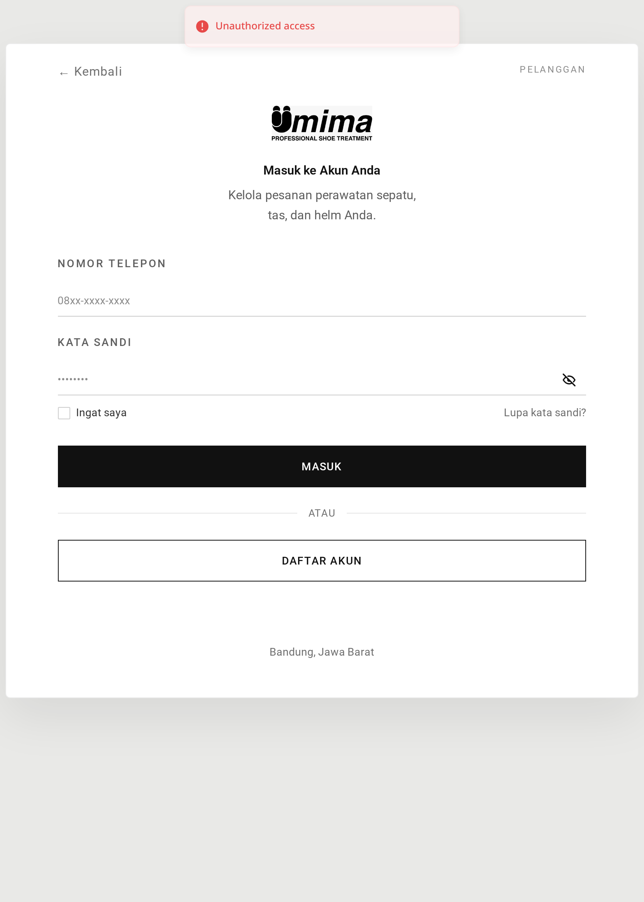
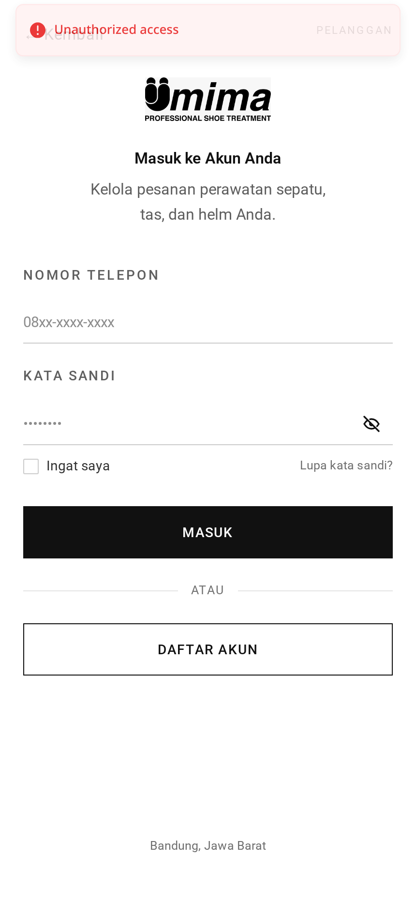
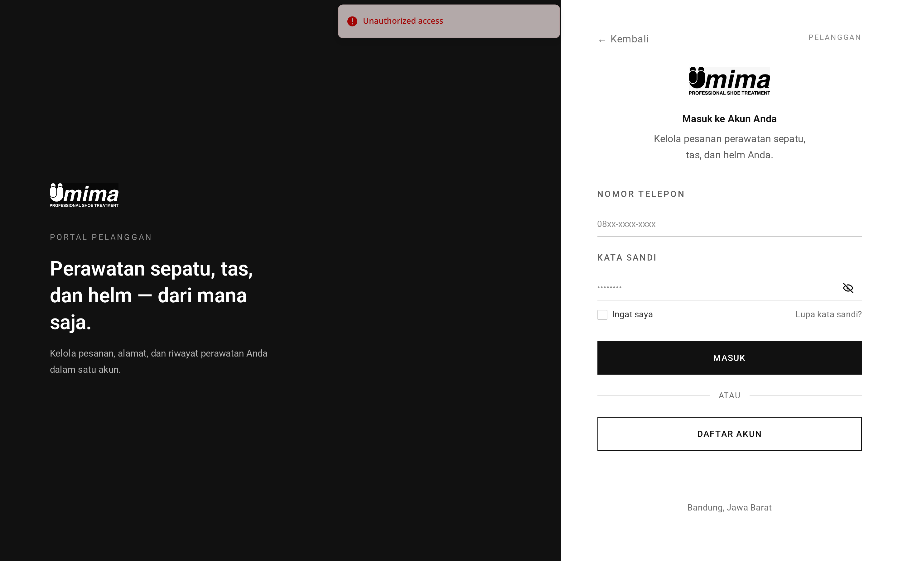
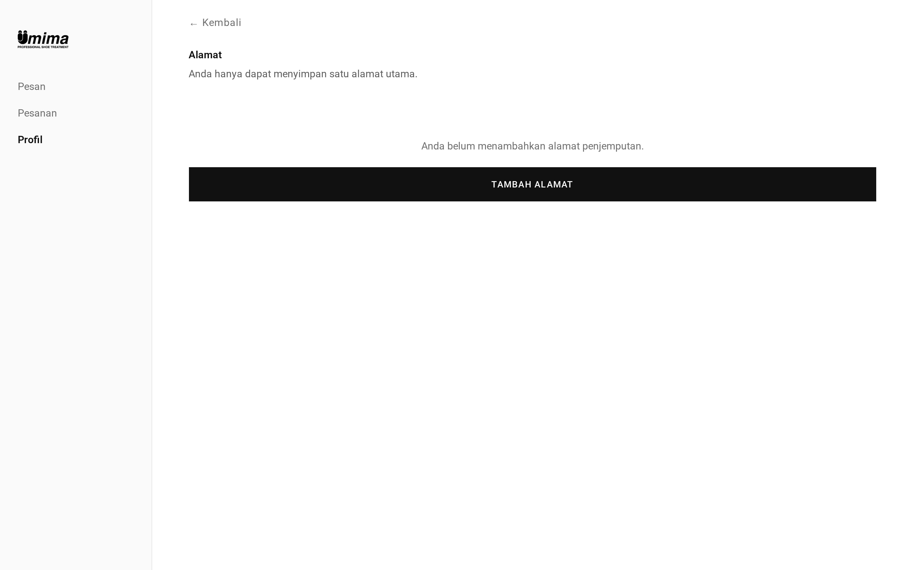
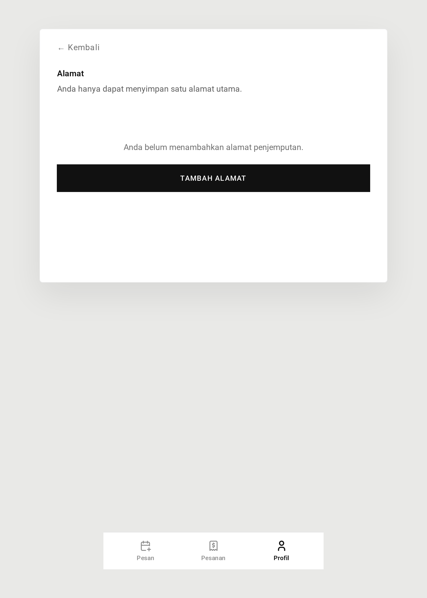
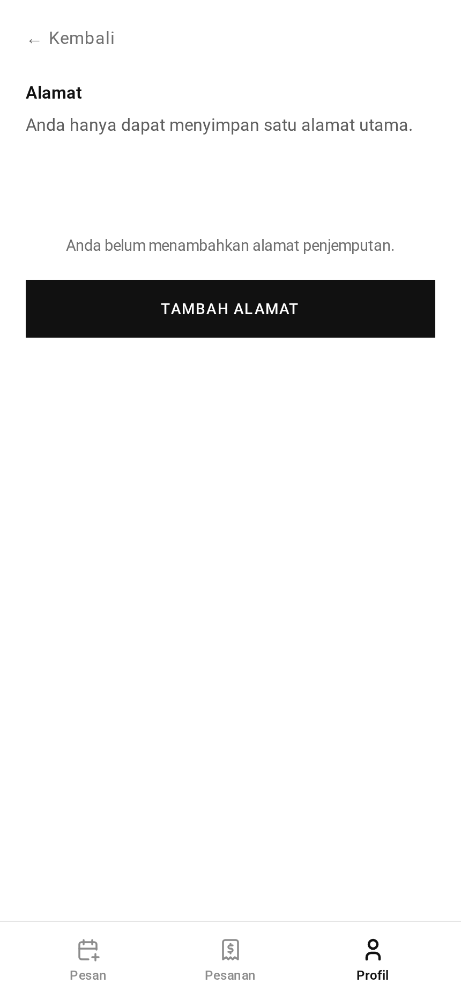

# Address — Guide

The address is where UmimaClean picks goods up from and delivers them back to.
Each customer keeps exactly one.

## One address, not a list

There is no address book. A customer has a single saved address. Saving a new
one replaces what was there before.

This is a deliberate simplification: the service is a local pickup-and-delivery
operation, and every order for a customer goes to the same place unless they
move.

## Setting an address

The customer opens the address page and gets a map.

They can find their location three ways:

1. **Search by name.** Typing a place name queries a mapping service and returns
   matching locations. Crucially, results outside the service area are filtered
   out before the customer ever sees them — so anything offered is guaranteed
   servable.
2. **Nearby landmarks.** The app can list recognisable places near a point,
   which helps when the exact street address is unclear.
3. **Drop the pin manually.** Drag the marker to the right spot.

Alongside the map they fill in the recipient's name and phone (which may differ
from the account holder — useful when goods go to an office or a relative), the
street address as text, and an optional note for the courier.

## The service area check

When the form is submitted the app checks whether the pin falls inside one of
the operational areas.

This is a genuine geographic check against real polygon shapes, not a distance
from a central point. An address just across a boundary can be rejected while
one further away in a covered neighbourhood is accepted.

If the pin is outside, the save is rejected with a message explaining the
location is beyond the pickup-and-delivery range. The error is attached to a
field called `radius`, which is a slight misnomer — there is no radius involved.

## What happens to the old address

This is the part worth understanding.

When a new address is saved, the app looks at whether any order still references
the old one:

- **No orders reference it** → the old address row is deleted outright.
- **Some order references it** → the old row is kept but marked inactive.

The second case matters for history. An order completed six months ago should
still show where it was delivered. Deleting the address would either break that
record or silently rewrite the past. Keeping an inactive copy preserves it.

Inactive addresses that no order references can be swept up later by a
housekeeping routine.

## Why the address decides delivery

The saved address is what makes an order deliverable.

- A customer with an address gets their cleaned goods **delivered**.
- An order with no address ends at **ready for collection** — the customer comes
  to the shop.

This also applies at the counter: staff taking a walk-in order can only offer
delivery if the customer has an account **and** that account has a saved
address. Without both, the order is collect-at-shop.

## Search limits

Location search is capped at 30 requests per minute per user. The map searches
as you type, so this is generous in normal use but will trip if something loops.

## Screenshots

Every state below is shown at three widths — desktop (1440px), tablet (834px) and mobile (430px). The hero above is the desktop view, which is how this role's screens are normally used.

**Saved address with its map pin**

| Desktop                                                                                        | Tablet                                                                                       | Mobile                                                                                       |
| ---------------------------------------------------------------------------------------------- | -------------------------------------------------------------------------------------------- | -------------------------------------------------------------------------------------------- |
|  |  |  |

**Map picker with search and nearby places**

| Desktop                                                                                                    | Tablet                                                                                                   | Mobile                                                                                                   |
| ---------------------------------------------------------------------------------------------------------- | -------------------------------------------------------------------------------------------------------- | -------------------------------------------------------------------------------------------------------- |
|  |  |  |

**No address saved yet**

| Desktop                                                                               | Tablet                                                                              | Mobile                                                                              |
| ------------------------------------------------------------------------------------- | ----------------------------------------------------------------------------------- | ----------------------------------------------------------------------------------- |
|  |  |  |

→ One-minute version: [tldr.md](tldr.md)
→ Implementation detail: [technical.md](technical.md)
