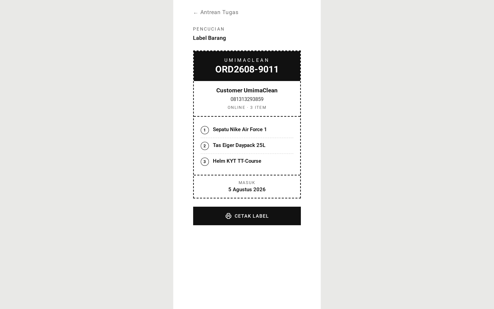
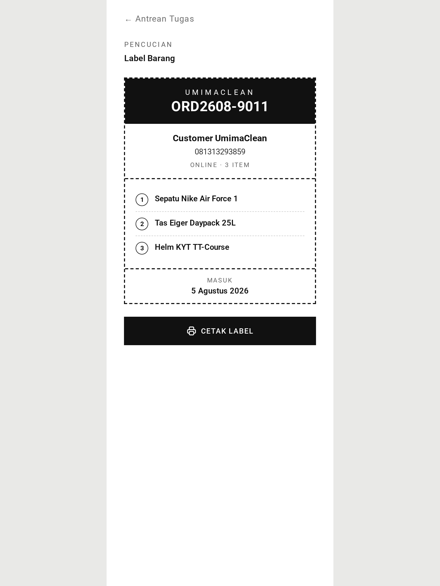

# Cleaning & Collection — Guide

Once a customer has paid, the goods enter the wash queue. This covers what
happens from there to the customer getting them back.

## Cleaning

Paid orders appear in the **cleaning** tab. Unlike trips and inspections, these
are not claimed — several people work the wash area at the same time, and
locking each order to one person would just get in the way.

When the goods are washed, a staff member marks the order done and attaches a
**photo** of the finished work. That photo is the record of what was returned
and in what condition.

### What happens next depends on the address

This is the branch that shapes the rest of the order.

- **The order has a delivery address** → it moves to the delivery queue, and a
  courier will take it back.
- **The order has no address** → it moves to _ready for collection_, and the
  customer comes to the shop.

The staff member does not choose. The app decides from whether the order has an
address, and the confirmation message tells them which happened.

This is why the [address](../../customer/address/) matters so much: it is what
makes an order deliverable. Counter orders taken from a walk-in customer with no
account have no address, so they always end at collect-at-shop.

## Telling the customer

Nobody has to remember this. Once a day the app messages every customer whose
order is waiting to be collected, saying the goods are ready.

Three things are worth knowing:

**It only sends once.** The app remembers that a notice went out for an order,
so tomorrow's run passes it by. Customers do not get pestered.

**An order collected in the meantime is left alone.** The app re-checks each
order right before writing to it, so nobody is told their goods are ready after
they have already taken them home.

**A messaging failure blocks nothing.** If WhatsApp cannot be reached for one
customer, the rest of the round still goes out and that order is tried again on
the next day's run.

## Handing the goods over

When the customer arrives, a staff member marks the order collected. This is the
simplest action in the app: no photo, no claim, no form. The order moves to
**completed** and the work is done.

Because there is no claim, whoever is standing at the counter can do it. The app
still records who did it and when.

## The tag

There is a printable **tag** page for each order, showing the order's details.
This is what gets attached to the physical goods so they can be identified in
the wash area and matched back to the right customer.

The tag page can be opened for any order, at any stage.

## Quick comparison

|               | Photo? | Claimed? | Moves order to                     |
| ------------- | ------ | -------- | ---------------------------------- |
| Cleaning done | yes    | no       | delivery _or_ ready-for-collection |
| Ready notice  | —      | no       | (no status change)                 |
| Collected     | no     | no       | completed                          |

## Screenshots

Every state below is shown at three widths — desktop (1440px), tablet (834px) and mobile (430px). The hero above is the mobile view, which is how this role's screens are normally used.

**Printable tag attached to the physical goods**

| Desktop                                                                                                              | Tablet                                                                                                             | Mobile                                                                                                             |
| -------------------------------------------------------------------------------------------------------------------- | ------------------------------------------------------------------------------------------------------------------ | ------------------------------------------------------------------------------------------------------------------ |
|  |  |  |

→ One-minute version: [tldr.md](tldr.md)
→ Implementation detail: [technical.md](technical.md)
