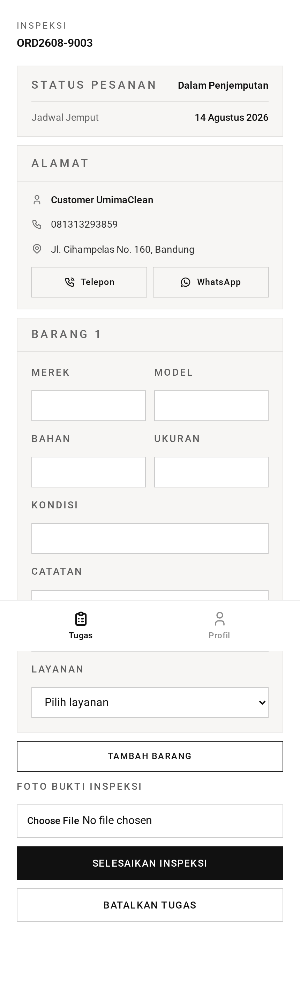

# Inspection — TL;DR

**This is where an order gets its price.** Staff examine the collected goods,
match each item to catalogue services, and the total is computed from that.



## The five things to know

1. **The price is created here, nowhere else.** `totalPrice` goes from `null` to
   a real number.
2. **Items are deleted and re-created.** Inspection wipes the customer's declared
   items and writes what staff actually found.
3. **Each item gets one main service plus optional add-ons.** The main service
   must match the item type; add-ons must be `additional` type.
4. **A photo is required**, same 5 MB JPG/PNG rule as trips.
5. **Completing it moves the order to `awaiting_payment`** and releases the
   claim.

## Routes at a glance

| Method | URL                               | Purpose               |
| ------ | --------------------------------- | --------------------- |
| GET    | `/staff/tasks/:number/inspection` | Open — **claims it**  |
| POST   | `/staff/tasks/:number/inspection` | Submit the inspection |
| DELETE | `/staff/tasks/:number/inspection` | Return to the queue   |

## Catalogue matching

```ts
ItemTypeCategories = {
  shoe: [shoe_wash, shoe_repair],
  bag: [bag_wash],
  helmet: [helmet_wash],
}
```

A main service is valid if its type is **not** `additional` **and** its category
is in that item type's list.

## The gotcha

**The customer's item list is thrown away.** What they described at booking is
replaced entirely by what staff record. If a customer said "1 shoe" and sent
three, the inspection is the truth and the price follows it.

Second gotcha: **re-inspecting re-prices from scratch.** There is no
incremental edit — the total is recomputed from the submitted items every time.

→ Plain-language walkthrough: [guide.md](guide.md)
→ Implementation detail: [technical.md](technical.md)
