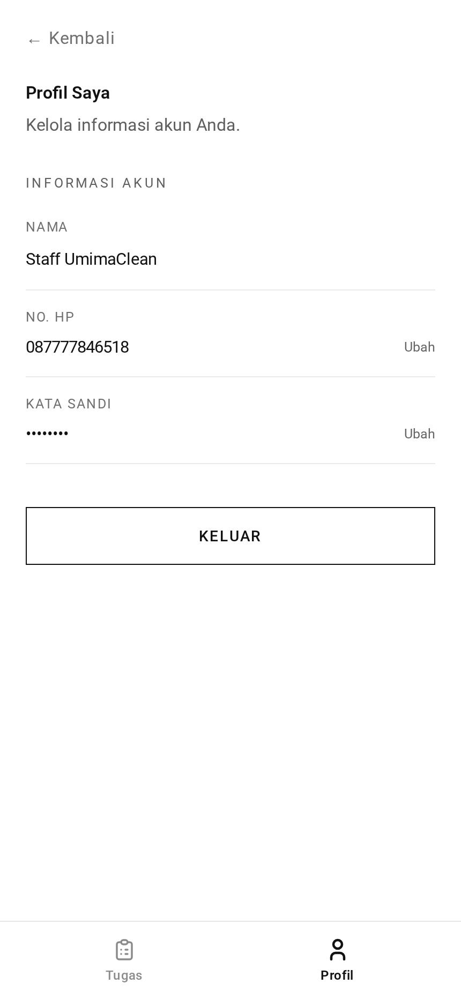

# Staff Profile — TL;DR

A staff member's own account details. **Functionally identical to the customer
and admin profile** — same service, same rules, different URL prefix.



## The five things to know

1. **Same three forms** as every other role: name, password, phone.
2. **`/staff` prefix.** Routes are `staff.profile.show`, `staff.password.update`,
   `staff.phone.store`, `staff.phone.update`.
3. **Phone changes still need WhatsApp verification** — a signed link valid for
   15 minutes, sent to the new number.
4. **Staff cannot change their own role.** Only an admin can, through
   [admin/users](../../admin/users/).
5. **This is where staff land after login** (`staff.profile.show`), not the task
   queue.

## Routes at a glance

| Method | URL                   | Purpose                 |
| ------ | --------------------- | ----------------------- |
| GET    | `/staff/profile`      | Show the profile        |
| PUT    | `/staff/profile`      | Change the name         |
| PUT    | `/staff/password`     | Change the password     |
| POST   | `/staff/phone`        | Request a phone change  |
| GET    | `/staff/phone/verify` | Confirm via signed link |

## The gotcha

**One `ProfileService` serves all three roles.** The role-specific bit is a
lookup table:

```ts
PHONE_VERIFICATION_ROUTE = {
  customer: 'customer.phone.update',
  staff: 'staff.phone.update',
  admin: 'admin.phone.update',
}
```

So a change to profile behaviour affects customers and admins too. Do not treat
the staff controllers as a private copy.

→ Plain-language walkthrough: [guide.md](guide.md)
→ Implementation detail: [technical.md](technical.md)
→ Full detail shared with the customer version: [customer/profile](../../customer/profile/)
