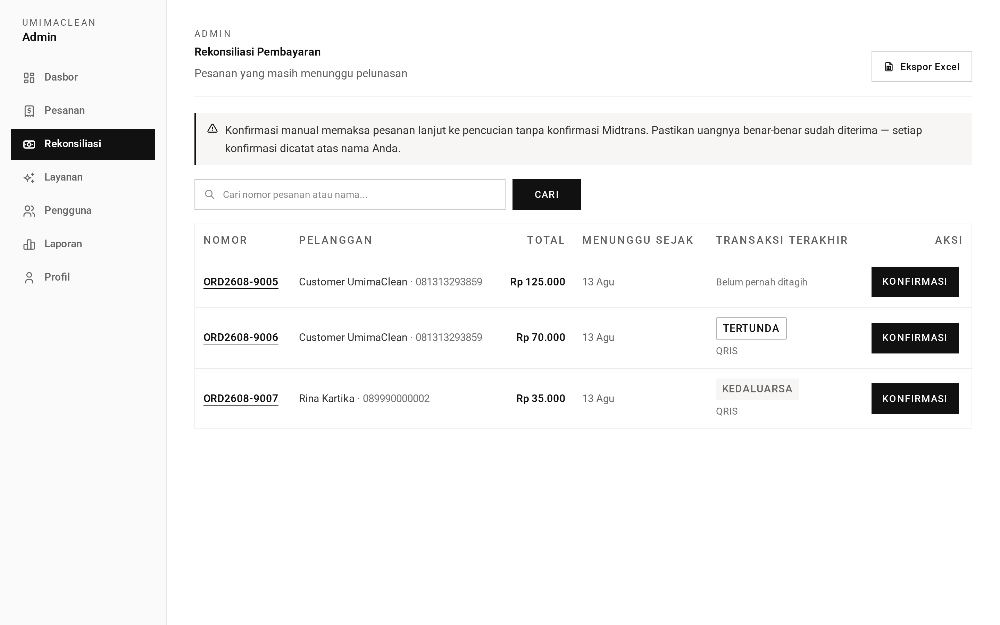
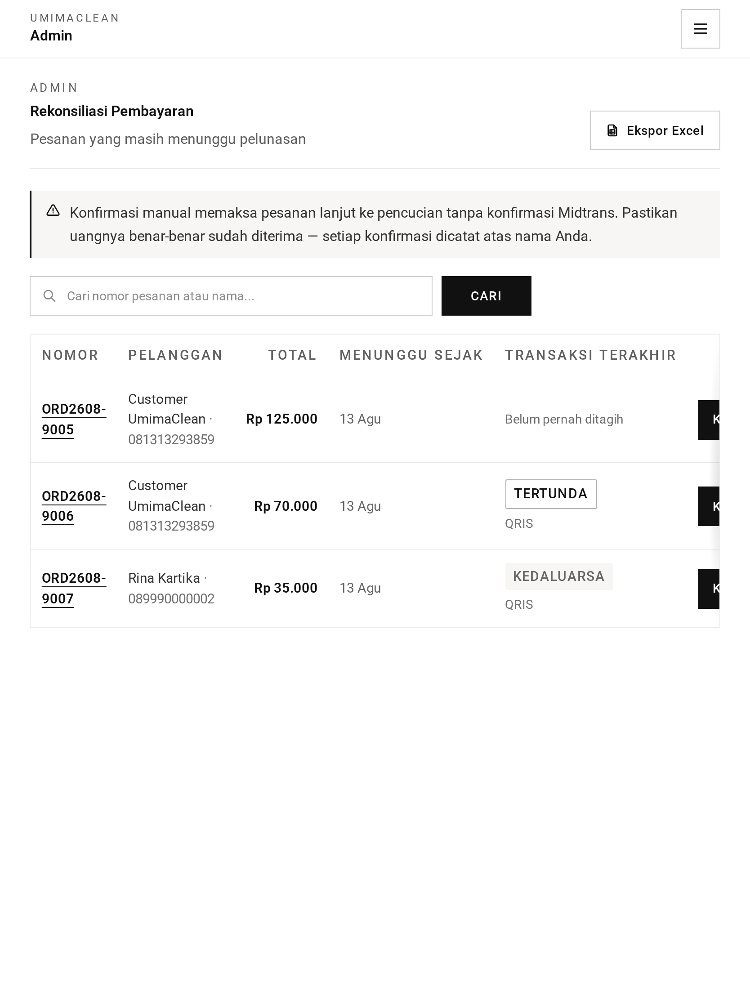
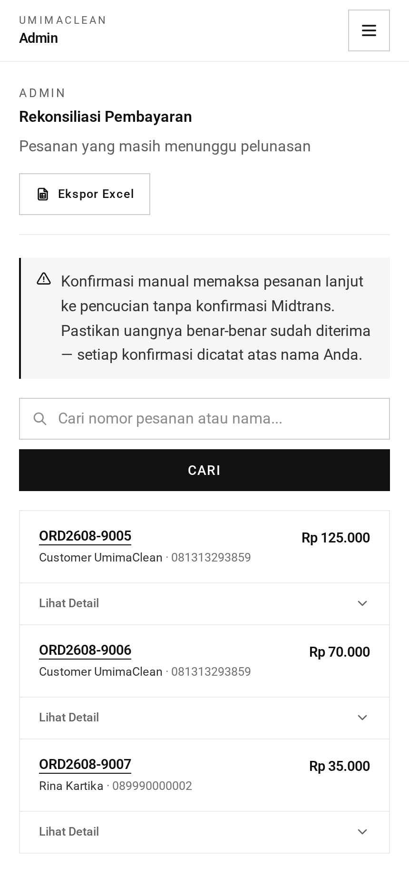
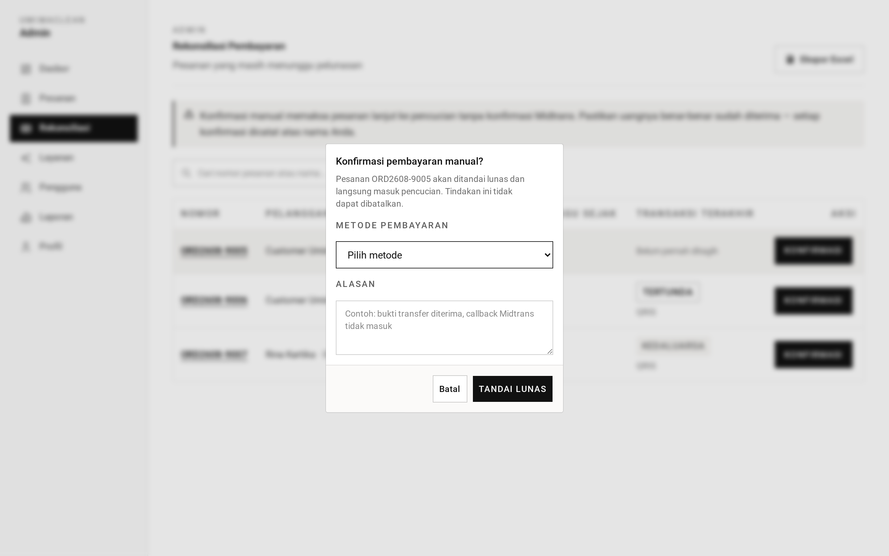
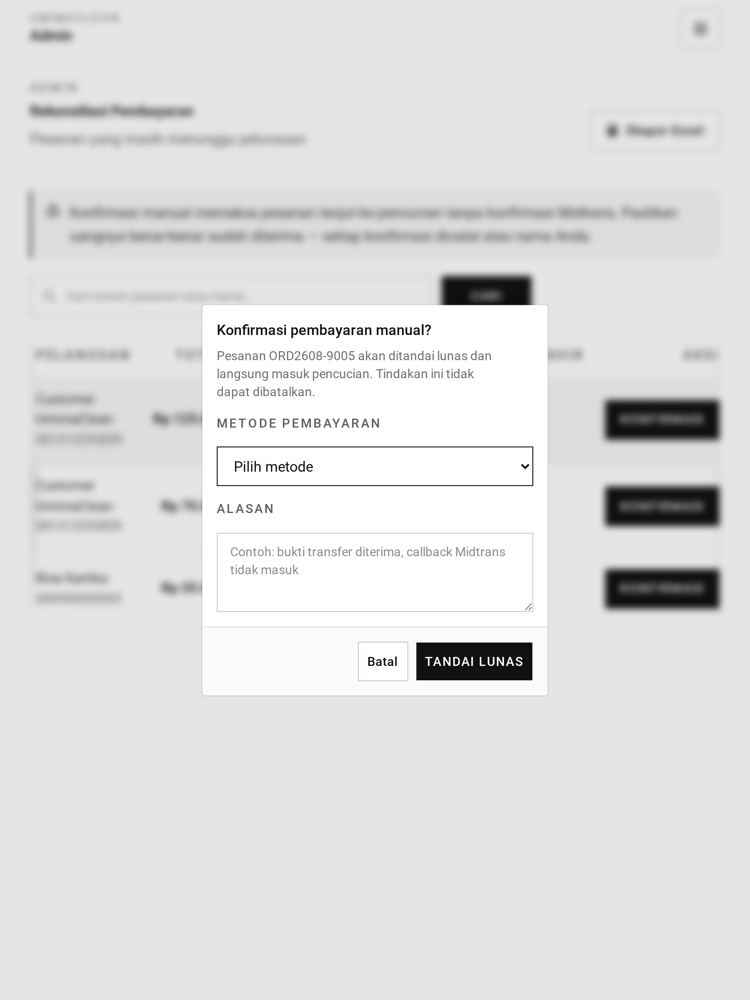
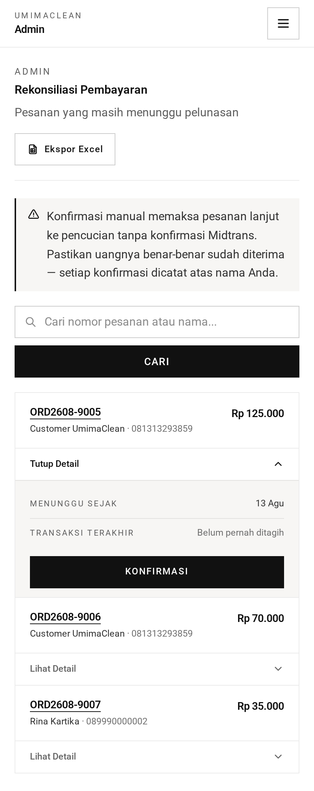

# Rekonsiliasi — Panduan

Tidak semua pembayaran tiba lewat aplikasi. Beginilah admin mencatat yang tidak.

## Kapan dibutuhkan

Jalur normalnya adalah QRIS: pelanggan memindai, gerbang pembayaran
mengonfirmasi, dan pesanan maju dengan sendirinya. Tanpa keterlibatan manusia.

Tetapi uang tiba dengan cara lain:

- Pelanggan membayar tunai di konter.
- Mereka membayar dengan kartu di mesin yang tidak tersambung ke aplikasi.
- Mereka melakukan transfer bank dan mengirim tangkapan layar.
- Mereka membayar lewat QRIS tetapi konfirmasinya tidak pernah sampai ke
  aplikasi.

Dalam semua kasus itu uangnya nyata, tetapi aplikasi tidak punya cara
mengetahuinya. Ada orang yang harus menyatakannya.

## Layarnya

Halaman rekonsiliasi hanya mendaftar **pesanan yang menunggu pelunasan**.
Penyaring itu tetap — admin tidak bisa memakai layar ini untuk menelusuri tahap
lain, karena mengonfirmasi pembayaran pada pesanan yang tidak sedang menunggu
pembayaran tidak masuk akal.

Daftarnya bisa dicari dan dipaginasi dengan cara yang sama seperti daftar pesanan
utama.

## Mengonfirmasi pembayaran

Untuk tiap pesanan, admin mencatat dua hal:

**Bagaimana dibayarnya** — tunai, QRIS, atau debit. Ini adalah apa yang
sesungguhnya terjadi, sehingga komposisi pembayaran dalam pelaporan tetap jujur.

**Catatan yang menjelaskan alasannya** — wajib, antara 5 sampai 255 karakter.
Sesuatu seperti "bukti transfer sudah diterima" atau "bayar tunai di konter,
struk 0142".

Catatannya sengaja diwajibkan. Menandai pesanan lunas secara manual adalah satu-
satunya tempat uang bisa dicatat tanpa persetujuan gerbang pembayaran, jadi
semestinya tidak pernah bisa dilakukan diam-diam.

## Apa yang terjadi

Mengonfirmasi melakukan hal yang sama seperti pembayaran QRIS yang berhasil:

- Catatan pembayaran lunas dibuat untuk pesanan itu.
- Percobaan QRIS yang setengah jadi ditandai kedaluwarsa, sehingga pelanggan yang
  belakangan memindai kode lama tidak membayar dua kali.
- Pesanan pindah ke **dalam pencucian** dan masuk antrean cuci.
- Halaman pelanggan diperbarui langsung.

Dari sudut pandang pesanan, tidak ada bedanya antara uang yang datang lewat
gerbang dan uang yang dikonfirmasi manual. Hanya catatan pembayarannya yang
mengingat mana yang mana.

## Ke mana catatannya pergi

Layak diketahui, karena mudah diduga sebaliknya: **catatannya ditulis ke log
aplikasi, bukan disimpan pada catatan pembayaran.**

Jika Anda perlu mengaudit kenapa sebuah pesanan dilunasi manual, log memilikinya
— beserta nomor pesanan dan waktunya. Tetapi Anda tidak bisa mengueri-nya dari
basis data, dan catatan itu tidak akan muncul di halaman detail pesanan. Jika itu
menjadi kebutuhan nyata, dibutuhkan perubahan skema.

## Keamanan

Sebuah pesanan tidak bisa dilunasi dua kali. Pemeriksaan yang sama yang mengatur
pembayaran pelanggan berlaku di sini: pesanan harus menunggu pelunasan dan harus
punya harga. Pesanan yang sudah lunas ditolak.

## Tangkapan Layar

Setiap keadaan di bawah ditampilkan pada tiga lebar — desktop (1440px), tablet (834px), dan mobile (430px). Gambar utama di atas memakai tampilan desktop, sesuai cara layar role ini biasa dipakai.

**Pesanan yang menunggu pelunasan (status dipaku)**

| Desktop                                                                                                              | Tablet                                                                                                             | Mobile                                                                                                             |
| -------------------------------------------------------------------------------------------------------------------- | ------------------------------------------------------------------------------------------------------------------ | ------------------------------------------------------------------------------------------------------------------ |
|  |  |  |

**Mengonfirmasi pembayaran — metode plus catatan wajib**

| Desktop                                                                                                                     | Tablet                                                                                                                    | Mobile                                                                                                                    |
| --------------------------------------------------------------------------------------------------------------------------- | ------------------------------------------------------------------------------------------------------------------------- | ------------------------------------------------------------------------------------------------------------------------- |
|  |  |  |

→ Versi satu menit: [tldr.md](tldr.md)
→ Detail implementasi: [teknis.md](teknis.md)
