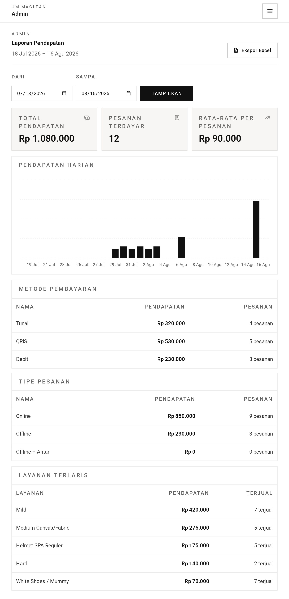
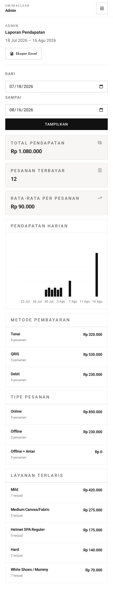
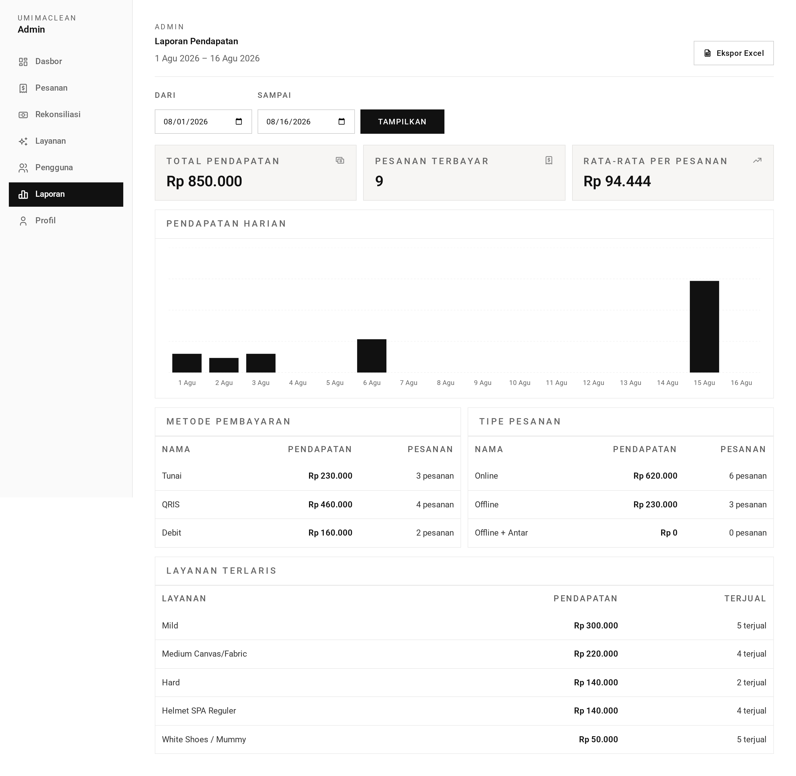
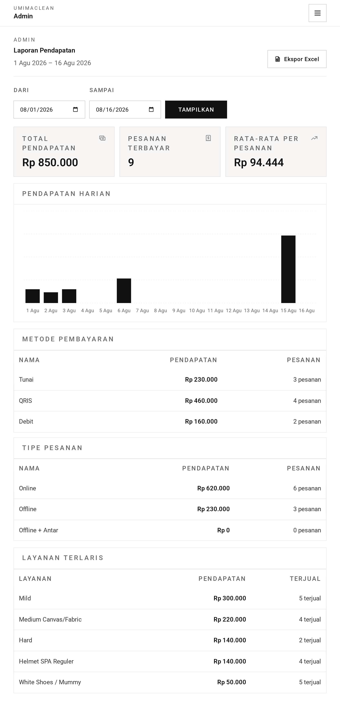
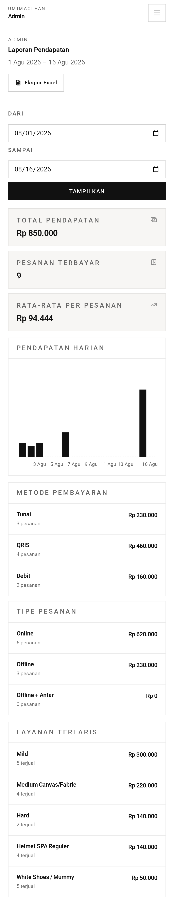

# Laporan — Panduan

Tempat admin menjawab "berapa penghasilan kita, dan dari mana?"

## Memilih periode

Laporan mencakup satu rentang tanggal. Jika tidak diberikan, ia menampilkan **30
hari terakhir** sampai hari ini.

Jika tanggalnya dimasukkan terbalik — tanggal akhir mendahului tanggal awal —
aplikasi diam-diam menukarnya alih-alih protes. Anda mendapat rentang yang jelas
Anda maksudkan.

## Angka utama

**Total pendapatan** — uang yang benar-benar lunas dalam periode itu. Pesanan
yang sudah dihargai tetapi tidak pernah dibayar tidak menyumbang apa pun.

**Pesanan lunas** — dari berapa pesanan berbeda uang itu berasal.

**Nilai pesanan rata-rata** — pendapatan dibagi jumlah pesanan, dibulatkan ke
bilangan bulat. Ketika tidak ada yang dibayar, ia menampilkan nol alih-alih
galat.

## Pendapatan harian

Deret hari demi hari sepanjang rentang.

Hari tanpa pendapatan muncul sebagai nol alih-alih dilewati, sehingga bentuk
grafiknya jujur — masa sepi terlihat sepi ketimbang terperas hilang.

## Menurut metode pembayaran

Pendapatan dan jumlah pesanan untuk tunai, QRIS, dan debit.

Setiap metode didaftar meski tidak pernah dipakai, dengan nilai nol. Ini menjaga
rinciannya tetap stabil antar periode.

Dua hal memengaruhi cara membacanya. Pembayaran yang dikonfirmasi manual lewat
[rekonsiliasi](../reconciliation/) muncul di bawah metode mana pun yang dipilih
admin — jadi akurasi rincian ini bergantung pada ketepatan pilihan admin. Dan
pesanan konter mencatat metodenya langsung di kasir.

## Menurut tipe pesanan

Pembagian yang sama untuk pesanan online, offline, dan langsung-dengan-antar.
Berguna untuk melihat berapa banyak bisnis yang datang lewat aplikasi
dibandingkan lewat konter.

## Layanan terlaris

Sepuluh layanan katalog yang menghasilkan paling banyak dalam periode itu,
beserta kategori dan pendapatannya.

**Satu peringatan yang layak diketahui.** Di samping pendapatan ada sebuah
hitungan, dan hitungan itu adalah jumlah _baris layanan_, bukan pesanan. Pesanan
dengan tiga layanan menambah tiga. Jadi angka ini tidak akan sejajar dengan angka
pesanan-lunas di bagian atas, dan memang tidak dimaksudkan begitu — ia menjawab
"seberapa sering layanan ini dikenakan", yang merupakan pertanyaan berguna untuk
sebuah layanan.

## Mengekspor

Ekspor menghasilkan lembar sebar berisi **deret pendapatan harian** — satu baris
per hari, dengan tanggal dan jumlahnya. Nama berkasnya membawa rentang
tanggalnya.

Perhatikan ekspornya hanya memuat deret itu. Pembagian metode pembayaran,
pembagian tipe, dan tabel layanan terlaris ada di layar tetapi tidak ada di
berkas. Jika Anda membutuhkannya dalam lembar sebar, itu harus ditambahkan.

## Tangkapan Layar

Setiap keadaan di bawah ditampilkan pada tiga lebar — desktop (1440px), tablet (834px), dan mobile (430px). Gambar utama di atas memakai tampilan desktop, sesuai cara layar role ini biasa dipakai.

**Laporan pada rentang bawaan 30 hari**

| Desktop                                                                                           | Tablet                                                                                          | Mobile                                                                                          |
| ------------------------------------------------------------------------------------------------- | ----------------------------------------------------------------------------------------------- | ----------------------------------------------------------------------------------------------- |
|  |  |  |

**Laporan pada rentang yang ditentukan**

| Desktop                                                                                            | Tablet                                                                                           | Mobile                                                                                           |
| -------------------------------------------------------------------------------------------------- | ------------------------------------------------------------------------------------------------ | ------------------------------------------------------------------------------------------------ |
|  |  |  |

→ Versi satu menit: [tldr.md](tldr.md)
→ Detail implementasi: [teknis.md](teknis.md)
