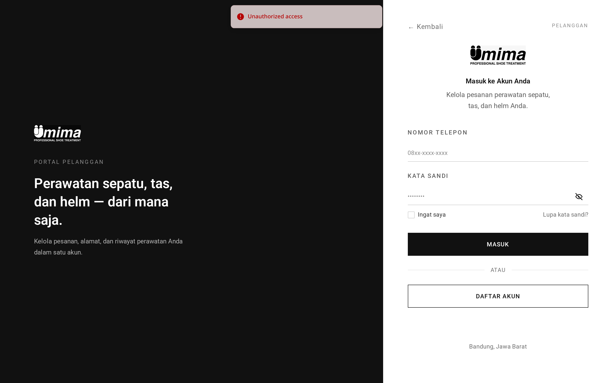

# Alamat — TL;DR

**Satu pelanggan punya tepat satu alamat aktif.** Bukan daftar, bukan alamat
utama — satu. Menyimpan alamat baru menggantikan yang lama.

## Lima hal yang perlu diketahui

1. **Satu alamat aktif per pelanggan**, ditegakkan indeks unik parsial di basis
   data: `one_active_address_per_user ON addresses (user_id) WHERE is_active = true`.
2. **Mengganti tidak selalu menghapus.** Jika masih ada pesanan yang menunjuk
   alamat lama, alamat itu dinonaktifkan (`is_active = false`) alih-alih dihapus,
   supaya riwayat pesanan tetap menyimpan lokasi pengantarannya.
3. **Alamat harus berada di dalam area layanan.** Ini uji titik-dalam-poligon
   PostGIS sungguhan (`ST_Covers`), bukan radius.
4. **Pencarian peta diproksikan, bukan di sisi klien.** Geocoding lewat aplikasi
   ke Nominatim, disaring ke area operasional sebelum hasil dikembalikan.
5. **Pencarian alamat dibatasi laju** 30 permintaan per menit per pengguna.

## Route sekilas

| Method | URL                | Fungsi                            |
| ------ | ------------------ | --------------------------------- |
| GET    | `/address`         | Menampilkan alamat tersimpan      |
| GET    | `/address/create`  | Halaman pemilih peta              |
| POST   | `/address`         | Menyimpan, menggantikan yang lama |
| GET    | `/address/geocode` | Mencari tempat berdasarkan nama   |
| GET    | `/address/nearby`  | Mencari penanda di sekitar titik  |

## Jebakannya

**Pengantaran hanya ditawarkan kepada pelanggan yang punya akun dan alamat
tersimpan.** Alamatlah asal sifat "bisa diantar" — pesanan tanpa `address_id`
berakhir di `cleaning_done` (diambil di toko) alih-alih `in_delivery`.

Jebakan kedua: pin di luar area gagal validasi pada field **`radius`**, padahal
pelanggan tidak pernah mengisi field itu. Yang penting pesannya, bukan nama
field-nya.

→ Penjelasan bahasa sehari-hari: [panduan.md](panduan.md)
→ Detail implementasi: [teknis.md](teknis.md)
