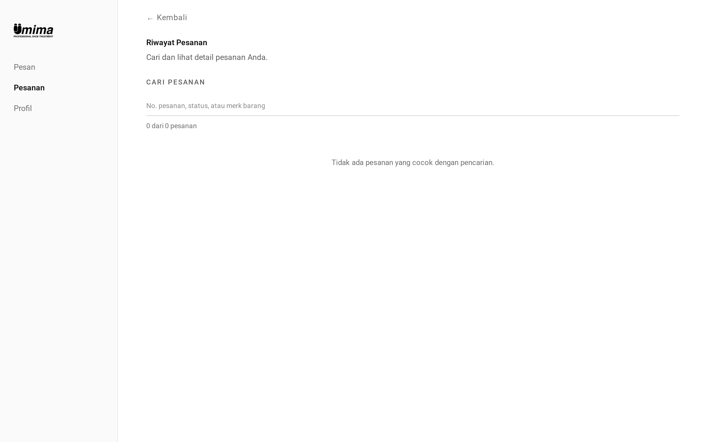
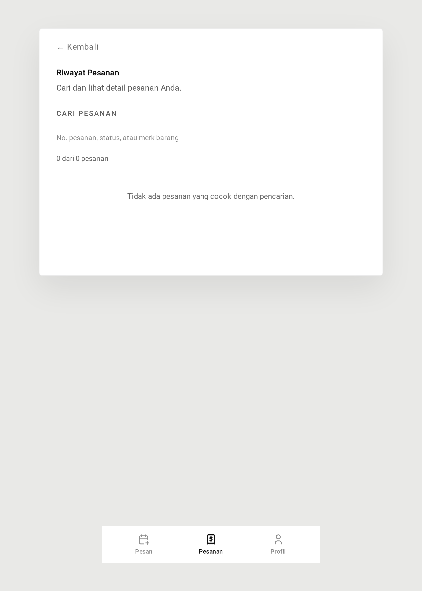
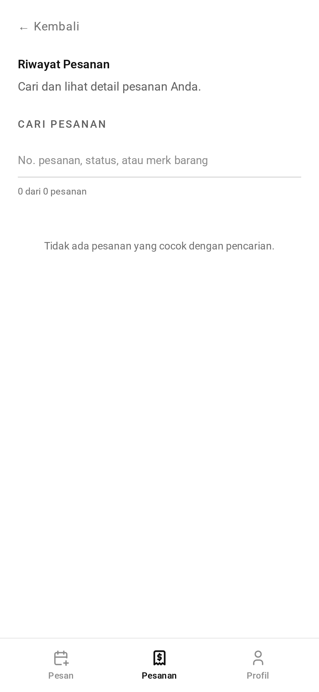
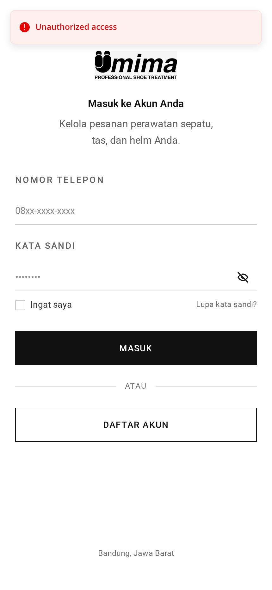

# Pesanan — Panduan

Ini sisi pelanggan dari sebuah pesanan: memesannya, memantau perkembangannya,
dan mendapat struk di akhir.

## Sebelum bisa memesan

Pelanggan butuh [alamat](../address/) tersimpan. Pesanan mengambil lokasi
penjemputan, nama penerima, dan telepon kontak **dari alamat**, bukan dari form
pesanan — jadi tanpa alamat tidak ada tempat untuk menjemput.

Mencoba memesan tanpa alamat memunculkan pesan yang meminta mereka menambahkan
alamat lebih dulu.

## Memesan penjemputan

Formnya menanyakan dua hal: **kapan** dan **apa**.

**Kapan** — tanggal penjemputan, yang harus di masa depan. Pemesanan untuk hari
yang sama tidak diizinkan.

Setiap tanggal punya kapasitas **10 penjemputan**. Jika sepuluh pelanggan sudah
memesan hari itu, tanggalnya ditolak dan mereka diminta memilih yang lain.
Pesannya muncul pada field tanggal jemput.

Yang layak dipahami: batas itu menghitung pesanan yang _masih menunggu
dijemput_. Begitu kurir benar-benar menjemput sebuah pesanan, statusnya berpindah
dan slotnya bebas. Jadi batasnya sebenarnya "sepuluh penjemputan tertunggak pada
tanggal itu", yang dalam praktik cocok dengan berapa rit yang sanggup dikerjakan
tim.

**Apa** — daftar barang, antara satu sampai sepuluh. Untuk tiap barang pelanggan
menjelaskan:

- Jenis: sepatu, tas, atau helm
- Merek, model, ukuran, bahan
- Catatan opsional

Perhatikan apa yang _tidak_ ditanyakan: layanannya. Pelanggan tidak memilih
"cuci mendalam" atau "reparasi" — mereka menjelaskan bendanya, dan petugas yang
memutuskan perlakuan apa yang dibutuhkan saat memeriksa fisiknya.

## Kenapa harganya belum ada

Ini hal terpenting yang perlu dipahami tentang aplikasi ini.

Saat dipesan, pesanan **sama sekali belum punya harga**. `totalPrice` kosong. Itu
bukan fitur yang hilang — Anda tidak bisa menghargai cuci sepatu tanpa melihat
sepatunya.

Harga muncul setelah penjemputan, ketika petugas memeriksa barang dan
mencocokkan tiap barang dengan layanan katalog. Barulah pesanan punya tagihan,
dan barulah pelanggan bisa membayar.

Jadi pengalaman pelanggan adalah: pesan → tunggu → dijemput → **menerima harga**

## Tangkapan Layar

Setiap keadaan di bawah ditampilkan pada tiga lebar — desktop (1440px), tablet (834px), dan mobile (430px). Gambar utama di atas memakai tampilan desktop, sesuai cara layar role ini biasa dipakai.

**Riwayat pesanan**

| Desktop                                                                         | Tablet                                                                        | Mobile                                                                        |
| ------------------------------------------------------------------------------- | ----------------------------------------------------------------------------- | ----------------------------------------------------------------------------- |
|  |  |  |

**Belum ada pesanan**

| Desktop                                                                           | Tablet                                                                          | Mobile                                                                          |
| --------------------------------------------------------------------------------- | ------------------------------------------------------------------------------- | ------------------------------------------------------------------------------- |
|  |  |  |

**Form pemesanan — tanggal jemput dan barang**

| Desktop                                                                                                     | Tablet                                                                                                    | Mobile                                                                                                    |
| ----------------------------------------------------------------------------------------------------------- | --------------------------------------------------------------------------------------------------------- | --------------------------------------------------------------------------------------------------------- |
|  |  |  |

**`pickup_scheduled` — sudah dipesan, masih bisa dibatalkan**

| Desktop                                                                                                                              | Tablet                                                                                                                             | Mobile                                                                                                                             |
| ------------------------------------------------------------------------------------------------------------------------------------ | ---------------------------------------------------------------------------------------------------------------------------------- | ---------------------------------------------------------------------------------------------------------------------------------- |
|  |  |  |

**`in_pickup` — sudah dijemput, menuju toko**

| Desktop                                                                                                       | Tablet                                                                                                      | Mobile                                                                                                      |
| ------------------------------------------------------------------------------------------------------------- | ----------------------------------------------------------------------------------------------------------- | ----------------------------------------------------------------------------------------------------------- |
|  |  |  |

**`awaiting_payment` — sudah dihargai, menunggu dibayar**

| Desktop                                                                                                                          | Tablet                                                                                                                         | Mobile                                                                                                                         |
| -------------------------------------------------------------------------------------------------------------------------------- | ------------------------------------------------------------------------------------------------------------------------------ | ------------------------------------------------------------------------------------------------------------------------------ |
|  |  |  |

**`in_cleaning` — sudah lunas, sedang dikerjakan**

| Desktop                                                                                                              | Tablet                                                                                                             | Mobile                                                                                                             |
| -------------------------------------------------------------------------------------------------------------------- | ------------------------------------------------------------------------------------------------------------------ | ------------------------------------------------------------------------------------------------------------------ |
|  |  |  |

**`cleaning_done` — siap diambil di toko**

| Desktop                                                                                                        | Tablet                                                                                                       | Mobile                                                                                                       |
| -------------------------------------------------------------------------------------------------------------- | ------------------------------------------------------------------------------------------------------------ | ------------------------------------------------------------------------------------------------------------ |
|  |  |  |

**`in_delivery` — dalam perjalanan kembali**

| Desktop                                                                                                        | Tablet                                                                                                       | Mobile                                                                                                       |
| -------------------------------------------------------------------------------------------------------------- | ------------------------------------------------------------------------------------------------------------ | ------------------------------------------------------------------------------------------------------------ |
|  |  |  |

**`completed` — beserta riwayat aksi lengkap**

| Desktop                                                                                                        | Tablet                                                                                                       | Mobile                                                                                                       |
| -------------------------------------------------------------------------------------------------------------- | ------------------------------------------------------------------------------------------------------------ | ------------------------------------------------------------------------------------------------------------ |
|  |  |  |

**`cancelled` — tetap di riwayat, tidak dihapus**

| Desktop                                                                                                           | Tablet                                                                                                          | Mobile                                                                                                          |
| ----------------------------------------------------------------------------------------------------------------- | --------------------------------------------------------------------------------------------------------------- | --------------------------------------------------------------------------------------------------------------- |
|  |  |  |

**Struk siap cetak**

| Desktop                                                                            | Tablet                                                                           | Mobile                                                                           |
| ---------------------------------------------------------------------------------- | -------------------------------------------------------------------------------- | -------------------------------------------------------------------------------- |
|  |  |  |

→ bayar → barang kembali.

## Memantau

Halaman pesanan menampilkan tahap saat ini. Siklusnya:

1. **Penjemputan dijadwalkan** — sudah dipesan, menunggu kurir
2. **Dalam penjemputan** — sudah diambil, menuju toko
3. **Dalam inspeksi** — sedang diperiksa dan dihargai
4. **Menunggu pelunasan** — sudah dihargai, menunggu pelanggan membayar
5. **Dalam pencucian** — sudah lunas, sedang dikerjakan
6. Lalu **dalam pengantaran** (jika punya alamat) atau **siap diambil** (jika
   tidak)
7. **Selesai**

Halaman ini diperbarui langsung saat petugas memajukan pesanan — tanpa perlu
muat ulang.

## Membatalkan

Pesanan hanya bisa dibatalkan selama masih **penjemputan dijadwalkan** dan hanya
**sebelum tanggal jemput tiba**. Pada atau setelah hari penjemputan, pilihan
batal hilang — kurir mungkin sudah dalam perjalanan.

Membatalkan tidak menghapus apa pun. Pesanan tetap ada di daftar dengan tanda
dibatalkan.

## Struk

Setiap pesanan punya halaman struk siap cetak yang menampilkan barang, layanan
yang dikenakan pada tiap barang, dan totalnya.

→ Versi satu menit: [tldr.md](tldr.md)
→ Detail implementasi: [teknis.md](teknis.md)
