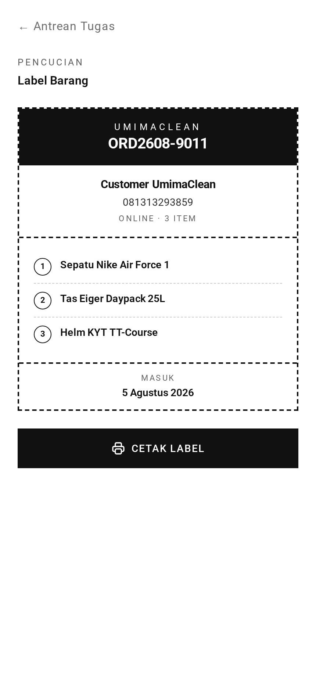

# Pencucian & Serah Terima — TL;DR

Paruh belakang alur kerja: mencuci barang, memberi tahu pelanggan bahwa barang
siap, dan menyerahkannya. Ditambah label siap cetak.



## Lima hal yang perlu diketahui

1. **Keduanya tidak diklaim.** Beberapa orang mengerjakan area cuci sekaligus,
   jadi pencucian dan serah terima bersifat bersama, tidak dikunci.
2. **Menuntaskan pencucian bercabang menurut kelayakan antar.** Pesanan punya
   alamat → `in_delivery`. Tanpa alamat → `cleaning_done` (diambil di toko).
3. **Pencucian butuh foto. Serah terima tidak.**
4. **Tidak ada yang mengirim pemberitahuan siap-ambil secara manual.** Sebuah
   perintah harian mengabari setiap pesanan yang menunggu diambil; aksi
   `ready_notice_sent` menjaga agar tidak ada yang dikabari dua kali.
5. **Kegagalan WhatsApp tidak memblokir apa pun.** Pesanan yang gagal tetap
   berstatus perlu dikabari dan dicoba lagi pada jalannya perintah esok hari.

## Route sekilas

| Method | URL                               | Fungsi                             |
| ------ | --------------------------------- | ---------------------------------- |
| POST   | `/staff/tasks/:number/cleaning`   | Tandai selesai dicuci (foto wajib) |
| POST   | `/staff/tasks/:number/collection` | Tandai sudah diserahkan            |
| GET    | `/staff/tasks/:number/tag`        | Label siap cetak untuk barang      |

WhatsApp siap-ambil tidak punya route — `node ace send:daily-notices`
mengirimnya sekali sehari.

## Percabangannya

```ts
nextStatuses(order) {
  if (order.status !== IN_CLEANING) return ORDER_TRANSITIONS[order.status]
  return this.isDeliverable(order) ? [IN_DELIVERY] : [CLEANING_DONE]
}
```

## Jebakannya

**Serah terima menyelesaikan pesanan tanpa foto dan tanpa klaim.** Ini aksi
paling ringan dalam aplikasi — siapa pun yang sedang bertugas bisa menandai
barang sudah diserahkan. Jika Anda mencari jejak audit siapa yang melepas
barangnya, itu ada pada catatan aksi `collected`, bukan pada klaim.

→ Penjelasan bahasa sehari-hari: [panduan.md](panduan.md)
→ Detail implementasi: [teknis.md](teknis.md)
