# Pesanan Konter — Panduan

Seseorang masuk ke toko membawa sepasang sepatu. Beginilah petugas menerima
pesanan itu.

## Kenapa berbeda dari pesanan online

Pesanan online tersebar selama beberapa hari: pelanggan memesan, kurir menjemput,
seseorang menginspeksi dan menghargai, pelanggan membayar, dan barulah pencucian
dimulai.

Di konter, semua itu mengerucut menjadi satu momen. Pelanggan berdiri di sana
bersama barangnya. Petugas bisa melihat apa yang perlu dikerjakan, menyebutkan
harga, dan menerima uangnya seketika.

Jadi pesanan konter **langsung melompat ke antrean cuci**. Tidak ada penjemputan,
tidak ada tahap inspeksi, dan tidak ada penantian pembayaran — langkah-langkah
itu sudah terjadi secara langsung.

## Menerima pesanan

Formnya menggabungkan semuanya:

**Siapa** — nama dan telepon pelanggan. Petugas bisa secara opsional menautkan
pesanan ke akun yang sudah ada dengan mencarinya. Mengetik tiga karakter atau
lebih dari nama atau nomor telepon memunculkan kecocokan; kurang dari tiga tidak
mengembalikan apa pun.

Menautkan akun layak dilakukan bila pelanggannya langganan — riwayat pesanannya
tetap terkumpul di satu tempat alih-alih menciptakan catatan tanpa akun.

**Apa** — barangnya, persis seperti pada [inspeksi](../inspection/): jenis,
merek, model, ukuran, bahan, kondisi, satu layanan utama untuk masing-masing,
plus tambahan apa pun. Antara 1 sampai 10 barang.

**Uang** — metode pembayaran (tunai, QRIS, atau debit). Jika membayar tunai,
petugas juga mencatat berapa yang diserahkan, supaya struk bisa menampilkan
kembaliannya.

**Foto** barang saat diterima, dan catatan opsional.

## Pengantaran di konter

Petugas bisa menawarkan mengantarkan barang bersih kembali alih-alih meminta
pelanggan datang lagi.

Ini hanya bisa jika pelanggan **punya akun dan akun itu punya alamat
tersimpan**. Alamat adalah satu-satunya tempat tujuan pengantaran berada.

Jika pengantaran diminta tanpa akun, atau dengan akun yang tidak punya alamat,
formnya ditolak dengan pesan yang menjelaskan mana yang kurang. Ia tidak
diam-diam diturunkan menjadi diambil-di-toko — petugas diberi tahu, karena itu
mengubah apa yang mereka janjikan kepada pelanggan.

Pesanan yang dihasilkan ditandai bertipe pengantaran, sehingga ketika pencucian
selesai ia masuk antrean pengantaran alih-alih menunggu diambil.

## Struk

Setelah membuat pesanan, petugas mendarat di halaman struk. Untuk pembayaran
tunai, struk menampilkan **kembalian** — jumlah yang diserahkan dikurangi
totalnya.

## Mengoreksi barang

Ada layar sunting untuk membetulkan barang pada sebuah pesanan. Layar itu
menghargai ulang seluruh pesanan dari nol: barang lama dihapus dan daftar yang
dikirim menjadi kebenaran yang baru.

**Tetapi ini hanya berfungsi selama pesanan menunggu pelunasan.** Karena pesanan
konter sudah lunas sejak saat dibuat, layar ini tidak berlaku untuk pesanan
konter. Layar itu ada untuk pesanan online yang sudah diinspeksi tetapi
pelanggannya belum membayar — jika penginspeksi keliru, di sinilah kekeliruan itu
dibetulkan sebelum pelanggan ditagih.

Begitu uang berpindah tangan, barangnya terkunci.

## Apa yang terjadi berikutnya

Pesanan berada di antrean cuci seperti yang lain. Dari sana ia mengikuti jalur
normal: dicuci, lalu diantar atau diambil.

## Tangkapan Layar

Setiap keadaan di bawah ditampilkan pada tiga lebar — desktop (1440px), tablet (834px), dan mobile (430px). Gambar utama di atas memakai tampilan mobile, sesuai cara layar role ini biasa dipakai.

**Form pesanan konter — barang, pembayaran, foto sekaligus**

| Desktop                                                                                                                        | Tablet                                                                                                                       | Mobile                                                                                                                       |
| ------------------------------------------------------------------------------------------------------------------------------ | ---------------------------------------------------------------------------------------------------------------------------- | ---------------------------------------------------------------------------------------------------------------------------- |
| 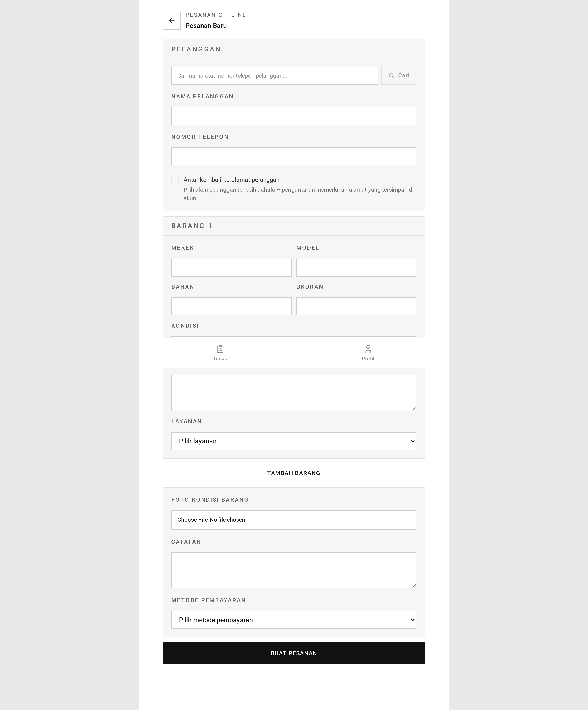 | 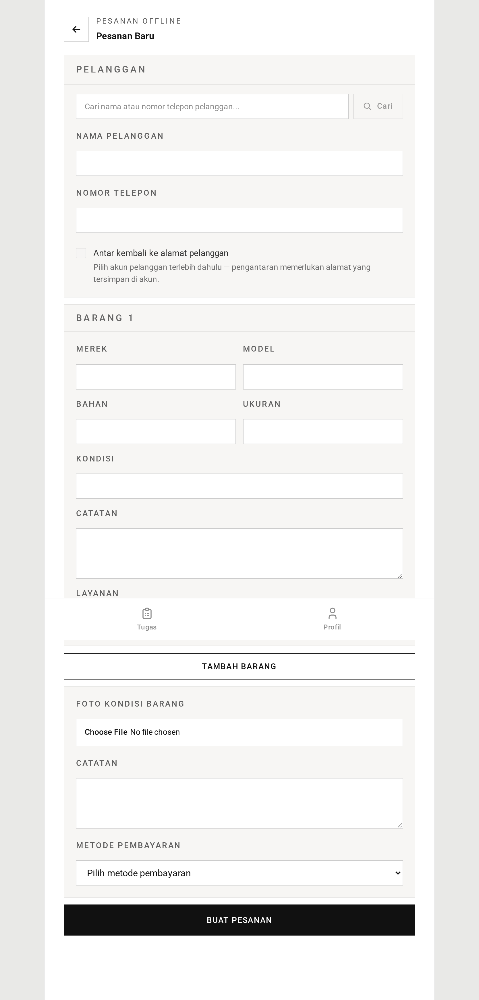 |  |

**Autocomplete pelanggan (3+ karakter)**

| Desktop                                                                                                    | Tablet                                                                                                   | Mobile                                                                                                   |
| ---------------------------------------------------------------------------------------------------------- | -------------------------------------------------------------------------------------------------------- | -------------------------------------------------------------------------------------------------------- |
| 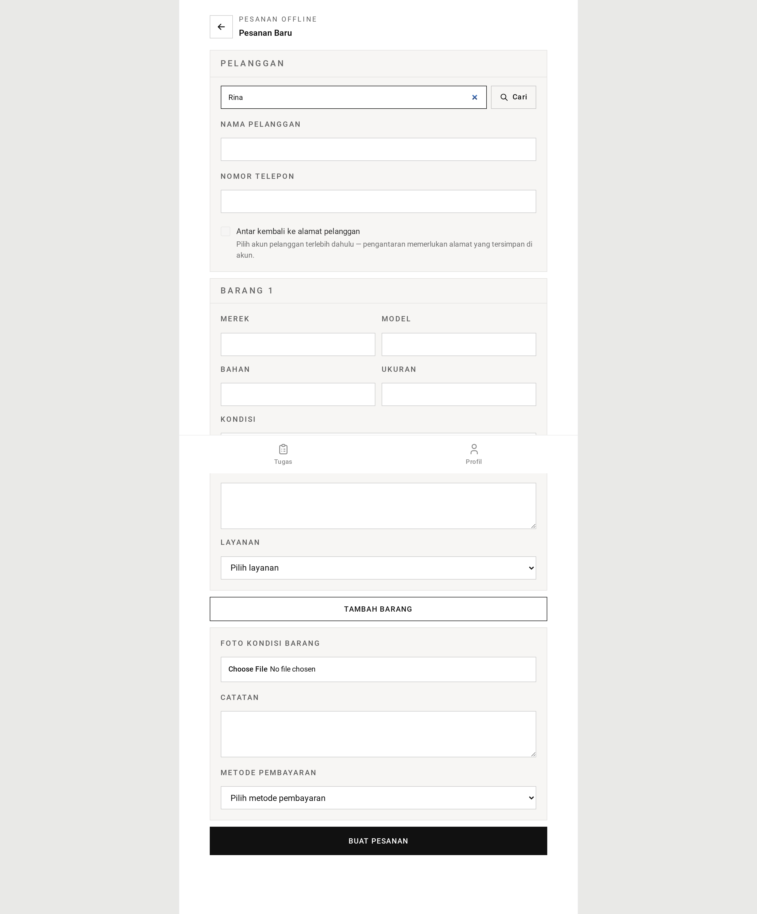 | 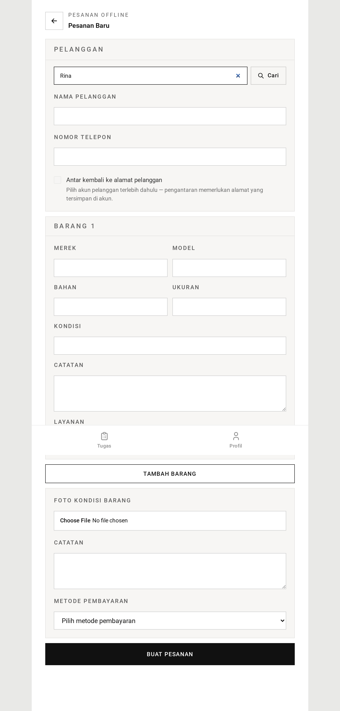 | 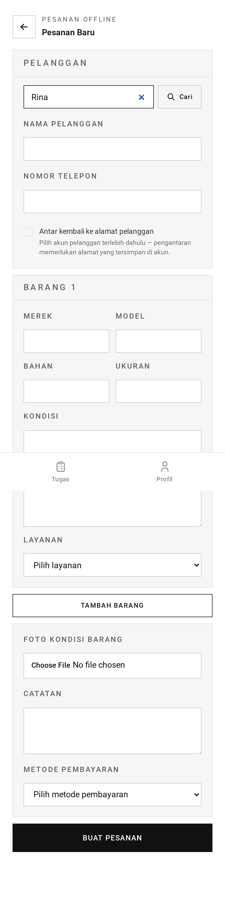 |

**Mengoreksi barang pada pesanan yang menunggu pelunasan**

| Desktop                                                                                                                    | Tablet                                                                                                                   | Mobile                                                                                                                   |
| -------------------------------------------------------------------------------------------------------------------------- | ------------------------------------------------------------------------------------------------------------------------ | ------------------------------------------------------------------------------------------------------------------------ |
| 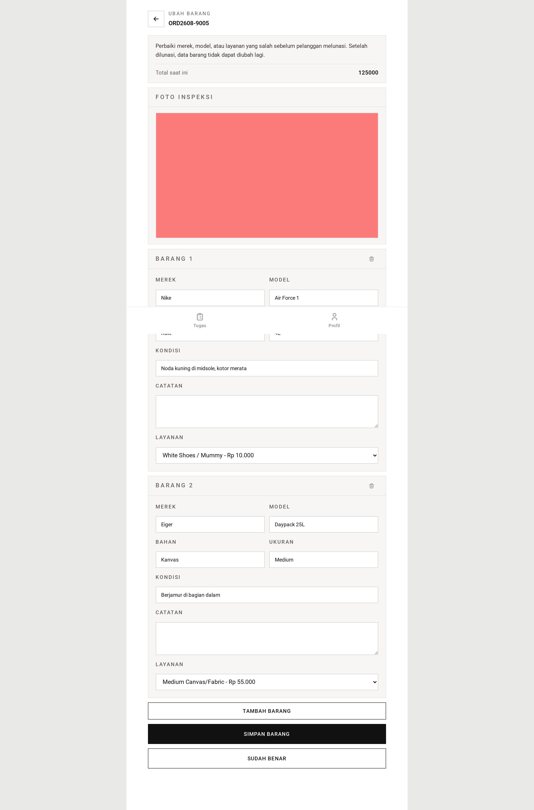 | 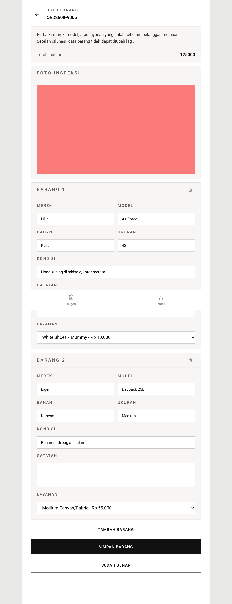 | 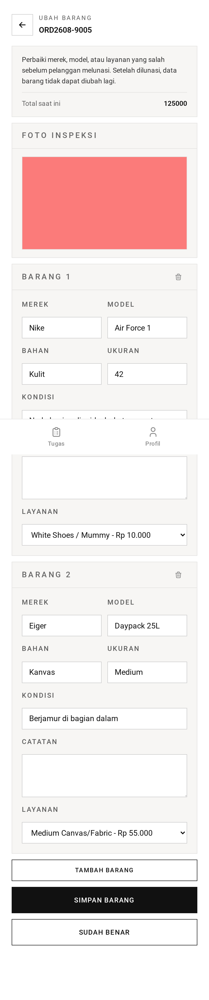 |

**Struk yang menampilkan kembalian pembayaran tunai**

| Desktop                                                                                                                  | Tablet                                                                                                                 | Mobile                                                                                                                 |
| ------------------------------------------------------------------------------------------------------------------------ | ---------------------------------------------------------------------------------------------------------------------- | ---------------------------------------------------------------------------------------------------------------------- |
| 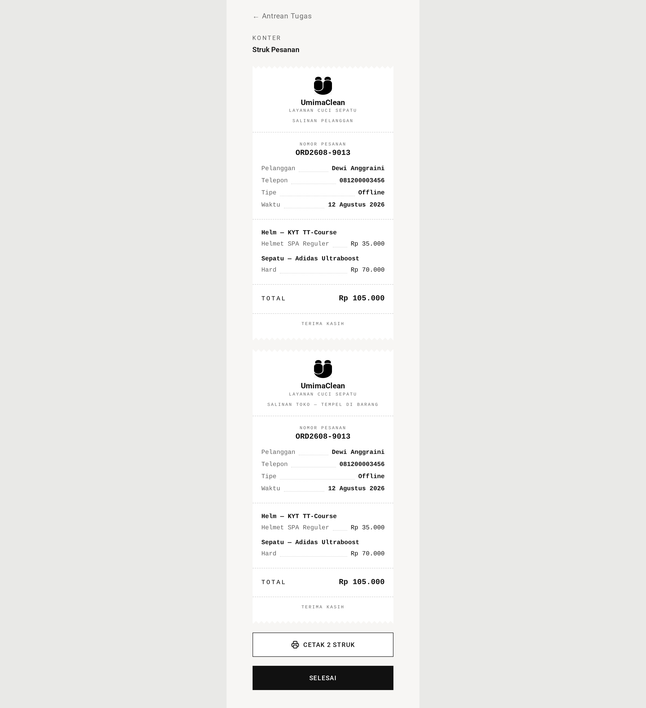 | 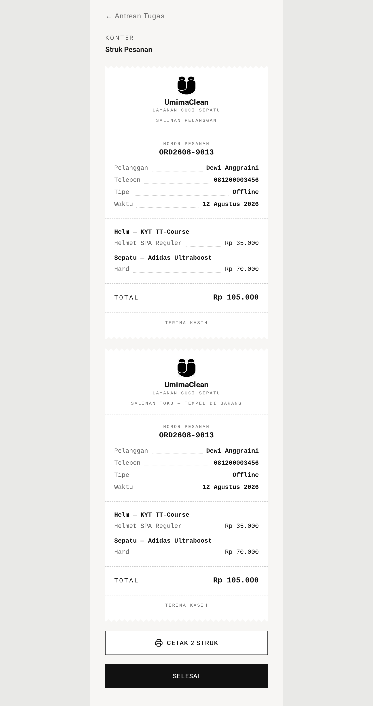 | 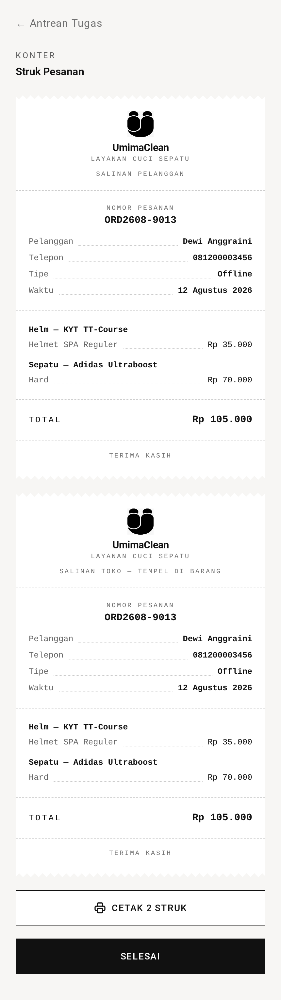 |

→ Versi satu menit: [tldr.md](tldr.md)
→ Detail implementasi: [teknis.md](teknis.md)
