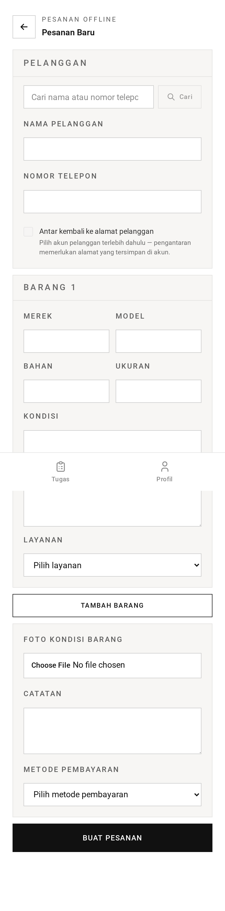

# Pesanan Konter — TL;DR

Pelanggan langsung yang berdiri di toko. Barang, harga, dan uang semuanya masuk
dalam **satu pengiriman** — jadi pesanannya lahir dalam keadaan sudah lunas.

## Lima hal yang perlu diketahui

1. **Pesanan konter melompati empat tahap.** Ia dimulai di `in_cleaning`, bukan
   `pickup_scheduled` — tanpa penjemputan, tanpa inspeksi, tanpa menunggu
   pelunasan.
2. **Pesanan dibuat sudah lunas.** Transaksi `paid` ditulis dalam transaksi basis
   data yang sama dengan pesanannya.
3. **Akun bersifat opsional; pengantaran menuntut akun.** `customerId` opsional,
   tetapi meminta pengantaran tanpa pelanggan yang punya alamat tersimpan adalah
   galat validasi.
4. **Dua jenis pesanan.** `offline` (diambil di toko) atau `walk_in_delivery`
   (punya alamat).
5. **Pembayaran tunai menuntut `cashReceived`**, ditegakkan lewat
   `requiredWhen('paymentMethod', '=', 'cash')`.

## Route sekilas

| Method | URL                             | Fungsi                                     |
| ------ | ------------------------------- | ------------------------------------------ |
| GET    | `/staff/orders/create`          | Form pesanan konter                        |
| POST   | `/staff/orders`                 | Membuatnya — barang + pembayaran sekaligus |
| GET    | `/staff/orders/:number/edit`    | Mengoreksi barang                          |
| PUT    | `/staff/orders/:number`         | Menyimpan koreksi (menghargai ulang)       |
| GET    | `/staff/orders/:number/receipt` | Struk, beserta kembalian                   |
| GET    | `/staff/customers`              | Autocomplete pelanggan (JSON)              |

## Jebakannya

**Koreksi barang hanya berfungsi selama pesanan berstatus `awaiting_payment`.**
Padahal pesanan konter dibuat di `in_cleaning` dan sudah lunas — jadi layar
sunting itu **tidak** berlaku untuk pesanan konter dalam praktiknya. Layar itu
ada untuk pesanan online yang sudah diinspeksi tetapi belum dibayar.

Jebakan kedua: **pencarian pelanggan butuh 3+ karakter** dan diam-diam
mengembalikan larik kosong di bawah itu.

→ Penjelasan bahasa sehari-hari: [panduan.md](panduan.md)
→ Detail implementasi: [teknis.md](teknis.md)
