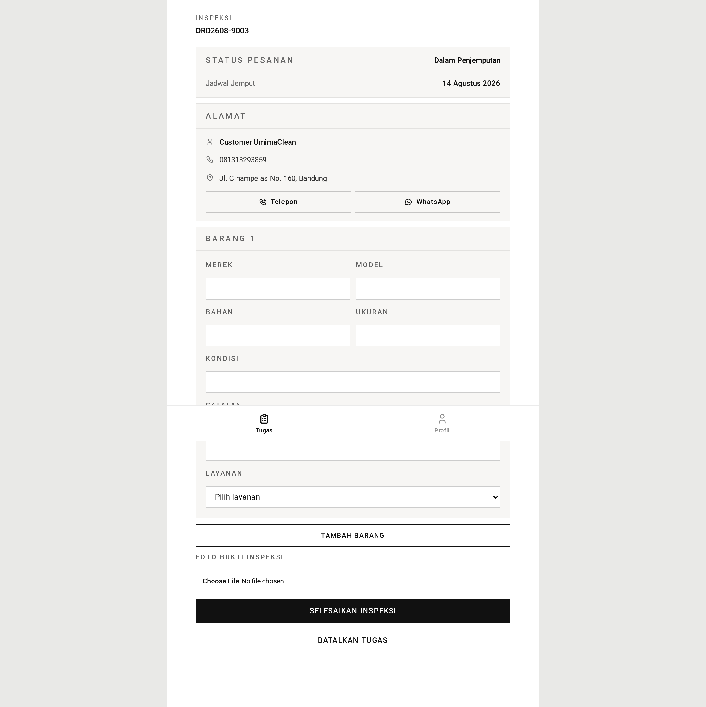
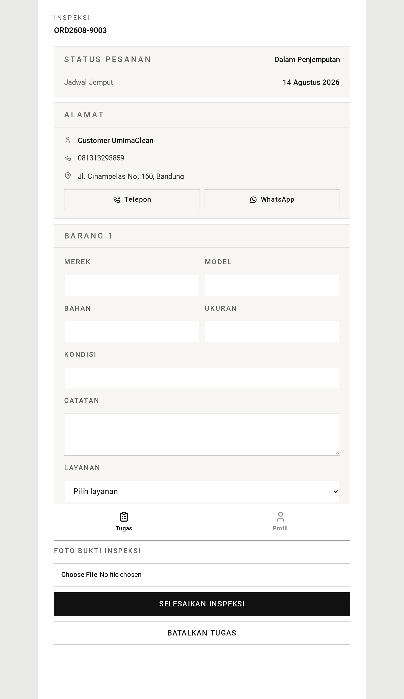

# Inspeksi — Panduan

Inspeksi adalah momen ketika sebuah pesanan berhenti menjadi perkiraan dan
berubah menjadi tagihan.

## Kenapa inspeksi ada

Ketika pelanggan memesan, mereka menjelaskan apa yang dikirim: "sepasang sepatu
kets kulit putih". Itu berguna untuk perencanaan, tetapi tidak cukup untuk
menghargai apa pun. Sepatunya bisa jadi hanya sedikit berdebu atau justru
bernoda parah. Bisa jadi ada empat pasang, bukan satu. Solnya mungkin perlu
diperbaiki.

Jadi aplikasi sengaja tidak menetapkan harga saat pemesanan. Ia menunggu sampai
ada orang yang memegang barangnya secara langsung.

## Apa yang dikerjakan petugas

Layar inspeksi menampilkan pesanan dan katalog layanan lengkap.

Untuk tiap barang fisik, petugas mencatat:

- **Barangnya apa** — jenis (sepatu, tas, helm), merek, model, ukuran, bahan
- **Kondisinya saat tiba** — teks bebas, sampai 255 karakter
- **Layanan yang dibutuhkan** — satu layanan utama
- **Tambahan apa pun** — ekstra opsional seperti pelapis pelindung atau biaya
  kilat
- **Catatan**, bila ada yang perlu disampaikan

Mereka bisa mencatat antara 1 sampai 10 barang.

### Katalog hanya menawarkan yang cocok

Daftar layanan disaring menurut jenis barang. Sepatu bisa menerima layanan cuci
sepatu dan reparasi sepatu. Tas hanya menerima cuci tas. Helm hanya cuci helm.

Layanan tambahan berbeda: ia tidak terikat pada jenis barang mana pun, jadi
pelapis pelindung berlaku sama baiknya untuk tas maupun sepatu. Tambahan
ditawarkan untuk semuanya.

Jika seseorang mengirim kombinasi yang tidak cocok — layanan cuci tas pada helm —
aplikasi menolaknya dan menunjuk barang mana persisnya yang keliru dalam daftar.

## Harganya

Totalnya sekadar penjumlahan setiap layanan yang dipilih pada setiap barang.
Layanan utama dan tiap tambahan menyumbangkan harga katalognya.

Harga dicatat pada tiap baris pada saat inspeksi. Jika katalog berubah bulan
depan, pesanan ini tetap menyimpan berapa yang ditagihkan.

## Daftar pelanggan digantikan

Ini mengejutkan banyak orang, jadi layak dinyatakan terang-terangan.

Ketika petugas mengirim hasil inspeksi, **barang yang dijelaskan pelanggan
dihapus** dan digantikan barang yang dicatat petugas.

Itu disengaja. Penjelasan pelanggan hanyalah perkiraan yang dibuat saat memesan.
Petugaslah yang memegang barang sesungguhnya. Jika pelanggan bilang satu pasang
tetapi mengirim tiga, inspeksilah yang benar, dan tagihan mengikuti inspeksi.

## Menuntaskan

Foto wajib — bukti kondisi barang saat tiba. JPG atau PNG, sampai 5 MB.

Saat dikirim, semuanya terjadi bersamaan: barang lama dihapus, barang baru
beserta baris layanannya ditulis, totalnya ditetapkan, pesanan pindah ke
**menunggu pelunasan**, aksinya dicatat beserta foto, dan klaimnya dilepas.

Jika ada bagian yang gagal, tidak ada satu pun yang diterapkan. Tidak ada
keadaan setengah-terinspeksi.

Pelanggan kini bisa melihat tagihannya dan membayar.

## Memperbaiki kekeliruan

Jika harganya ternyata salah, petugas bisa menyunting barang pada pesanan yang
masih menunggu pelunasan — lihat [counter-orders](../counter-orders/) untuk alur
itu. Begitu pelanggan membayar, barangnya terkunci.

Penetapan harga ulang selalu menghitung seluruh total dari daftar yang dikirim.
Tidak ada penambahan satu baris ke tagihan yang sudah ada.

## Tangkapan Layar

Setiap keadaan di bawah ditampilkan pada tiga lebar — desktop (1440px), tablet (834px), dan mobile (430px). Gambar utama di atas memakai tampilan mobile, sesuai cara layar role ini biasa dipakai.

**Form inspeksi — barang, kondisi, layanan**

| Desktop                                                                                                  | Tablet                                                                                                 | Mobile                                                                                                 |
| -------------------------------------------------------------------------------------------------------- | ------------------------------------------------------------------------------------------------------ | ------------------------------------------------------------------------------------------------------ |
|  |  |  |

**Inspeksi terblokir (`blocked: true`, katalog kosong)**

| Desktop                                                                                                                 | Tablet                                                                                                                | Mobile                                                                                                                |
| ----------------------------------------------------------------------------------------------------------------------- | --------------------------------------------------------------------------------------------------------------------- | --------------------------------------------------------------------------------------------------------------------- |
|  |  |  |

→ Versi satu menit: [tldr.md](tldr.md)
→ Detail implementasi: [teknis.md](teknis.md)
