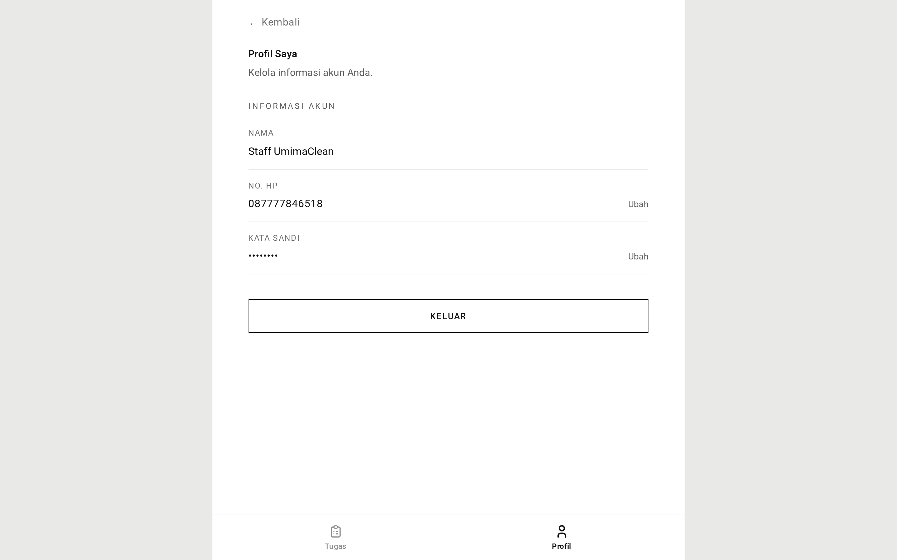
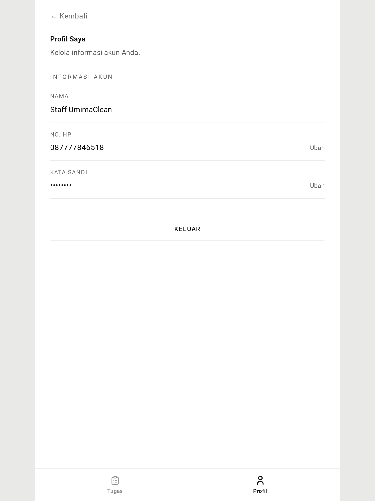

# Profil Petugas — Panduan

Tempat petugas mengelola akunnya sendiri. Tiga form, persis seperti pelanggan.

## Ke mana petugas mendarat

Setelah masuk, petugas dibawa ke **halaman profilnya**, bukan ke antrean kerja.
Ini mengejutkan orang yang mengira akan langsung tiba di daftar tugas — antreannya
berjarak satu langkah navigasi di `/staff/tasks`.

## Mengganti nama

Ketik nama baru, kirim. Hanya huruf, spasi, dan tanda hubung, sampai 50 karakter.

## Mengganti kata sandi

Menuntut kata sandi saat ini, ditambah yang baru diketik dua kali. Jika kata
sandi saat ini salah, galatnya menunjuk field itu secara spesifik.

Kata sandi baru harus 8 sampai 16 karakter dengan huruf dan angka sekaligus,
tanpa simbol.

Mengganti kata sandi di sini **tidak** mengeluarkan petugas dari perangkat lain.
Hanya atur ulang penuh lewat alur lupa-kata-sandi yang melakukan itu.

## Mengganti nomor telepon

Karena nomor telepon adalah cara petugas masuk, menggantinya butuh dua langkah.

Mereka memasukkan nomor baru. Aplikasi memeriksa bahwa itu bukan nomor mereka
saat ini dan belum dipakai orang lain, lalu mengirim tautan verifikasi WhatsApp
**ke nomor baru**. Membuka tautan itu menyelesaikan penggantian. Tautannya
kedaluwarsa setelah 15 menit.

Kehati-hatian yang sama berlaku seperti pada pelanggan: pesannya dikirim ke nomor
yang mereka ketik. Salah ketik berarti tautan sampai ke orang asing, dan tidak
ada yang melaporkan kegagalannya. Jika tautan tidak kunjung datang, periksa
nomornya dan ajukan ulang.

## Yang tidak bisa dilakukan petugas di sini

**Petugas tidak bisa mengubah role-nya sendiri atau menonaktifkan dirinya.** Itu
aksi admin, dilakukan dari layar manajemen pengguna admin. Petugas tidak punya
cara untuk menaikkan haknya sendiri.

Mereka juga tidak bisa melihat atau menyunting profil orang lain. Halaman ini
ketat hanya untuk akunnya sendiri.

## Layak diketahui

Halaman ini adalah _kode yang sama_ dengan halaman profil pelanggan, tersambung
ke prefix URL berbeda. Jika perilaku profil berubah untuk petugas, ia berubah
untuk pelanggan dan admin pada saat yang sama. Itu disengaja — ada satu model
akun dan satu himpunan aturan untuk menyuntingnya.

## Tangkapan Layar

Setiap keadaan di bawah ditampilkan pada tiga lebar — desktop (1440px), tablet (834px), dan mobile (430px). Gambar utama di atas memakai tampilan mobile, sesuai cara layar role ini biasa dipakai.

**Halaman akun petugas sendiri**

| Desktop                                                                                   | Tablet                                                                                  | Mobile                                                                                  |
| ----------------------------------------------------------------------------------------- | --------------------------------------------------------------------------------------- | --------------------------------------------------------------------------------------- |
|  |  |  |

→ Versi satu menit: [tldr.md](tldr.md)
→ Detail implementasi: [teknis.md](teknis.md)
