# Tugas — Panduan

Semua yang harus dikerjakan petugas ada di satu halaman: `/staff/tasks`. Halaman
itu terbagi menjadi empat tab.

## Dari mana pekerjaannya berasal

Tidak ada daftar tugas terpisah yang diisi seseorang. **Antreannya adalah daftar
pesanan, dilihat dari sudut yang berbeda.**

Pesanan yang berada di "penjemputan dijadwalkan" _adalah_ pekerjaan jemput.
Pesanan di "dalam pencucian" _adalah_ pekerjaan cuci. Ketika seseorang
menyelesaikan tugas, status pesanannya berubah, lalu pesanan itu hilang dari tab
tersebut dan muncul di tab berikutnya secara otomatis.

Artinya antrean tidak akan pernah menyimpang dari kenyataan. Tidak ada yang perlu
direkonsiliasi.

## Empat tab

**Perjalanan** — penjemputan dan pengantaran disatukan, karena keduanya adalah
perjalanan menuju sebuah alamat. Daftarnya diurutkan sebagai rute yang
direncanakan, bukan berdasarkan waktu, sehingga petugas yang berangkat mendapat
urutan pemberhentian yang masuk akal beserta jaraknya.

**Inspeksi** — pesanan yang sudah dijemput dan menunggu diperiksa serta
dihargai. Diurutkan yang paling lama dulu.

**Pencucian** — pesanan yang sudah lunas dan menunggu dicuci.

**Serah terima** — pesanan yang sudah dicuci dan menunggu pelanggan datang
mengambilnya.

## Klaim: bagaimana dua orang menghindari pekerjaan yang sama

Ini mekanika yang penting.

Ketika petugas **membuka** sebuah tugas, tugas itu langsung diklaim olehnya.
Tanpa tombol, tanpa konfirmasi — membukanya adalah klaimnya.

Sejak saat itu, petugas lain melihat tugas tersebut sebagai sudah diambil. Jika
orang lain membukanya, mereka tetap mendapat rincian pesanan tetapi halamannya
memberi tahu bahwa tugas sedang ditangani orang lain, dan tombol aksinya hilang.

### Klaim kedaluwarsa

Sebuah klaim bertahan **tiga jam**.

Ini penting karena petugas kadang meninggalkan pekerjaan. Ponsel mati, giliran
kerja berakhir, seseorang membuka tugas lalu ditarik ke urusan lain. Tanpa
kedaluwarsa, pesanan itu akan terkunci selamanya tanpa cara memulihkannya.

Setelah tiga jam, tugasnya kembali ke kolam dan siapa pun bisa mengambilnya.
Tidak ada yang perlu membuka kunci apa pun.

### Mengembalikan tugas

Jika petugas membuka sesuatu dan menyadari tidak bisa mengerjakannya, mereka bisa
mengembalikannya ke antrean secara eksplisit alih-alih menunggu tiga jam. Tugas
itu langsung tersedia lagi.

Hanya pemegang klaim yang bisa melepasnya.

### Tidak semuanya diklaim

Hanya **jemput, antar, dan inspeksi** yang diklaim. Ini pekerjaan yang secara
fisik dilakukan satu orang — satu kurir berkendara ke satu alamat.

**Pencucian dan serah terima tidak diklaim.** Beberapa orang mengerjakan area
cuci sekaligus, dan menyerahkan barang di konter dilakukan siapa pun yang sedang
berdiri di sana. Menguncinya justru memperlambat toko tanpa manfaat.

## Mengerjakan tugasnya

Tiap jenis tugas punya alurnya sendiri, didokumentasikan terpisah:

- [trips](../trips/) — perjalanan jemput dan antar
- [inspection](../inspection/) — mencatat dan menghargai barang
- [cleaning-collection](../cleaning-collection/) — mencuci, mengabari, serah terima

Sebagian besar menuntut **foto** sebagai bukti penyelesaian.

## Hal yang sering menjebak

**Membuka tugas mengubah data.** Sekadar melihat halaman detail sudah
mengklaimnya. Jika petugas menelusuri beberapa tugas untuk melihat isinya,
mereka telah mengklaim semuanya — masing-masing tiga jam, kecuali dilepas.

**Tugas yang sudah diambil tetap terbuka.** Mereka tidak akan mendapat halaman
galat. Mereka melihat pesanannya, dengan catatan bahwa orang lain memegangnya dan
tanpa cara untuk bertindak.

## Tangkapan Layar

Setiap keadaan di bawah ditampilkan pada tiga lebar — desktop (1440px), tablet (834px), dan mobile (430px). Gambar utama di atas memakai tampilan mobile, sesuai cara layar role ini biasa dipakai.

**Antrean dengan empat tab beserta jumlahnya**

| Desktop                                                                                                | Tablet                                                                                               | Mobile                                                                                               |
| ------------------------------------------------------------------------------------------------------ | ---------------------------------------------------------------------------------------------------- | ---------------------------------------------------------------------------------------------------- |
| 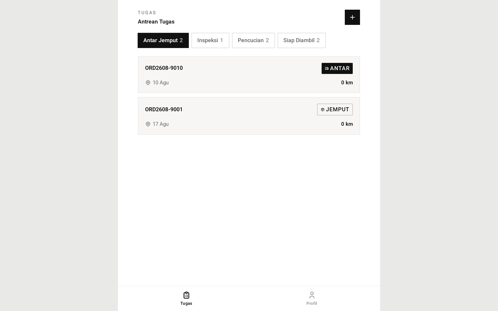 | 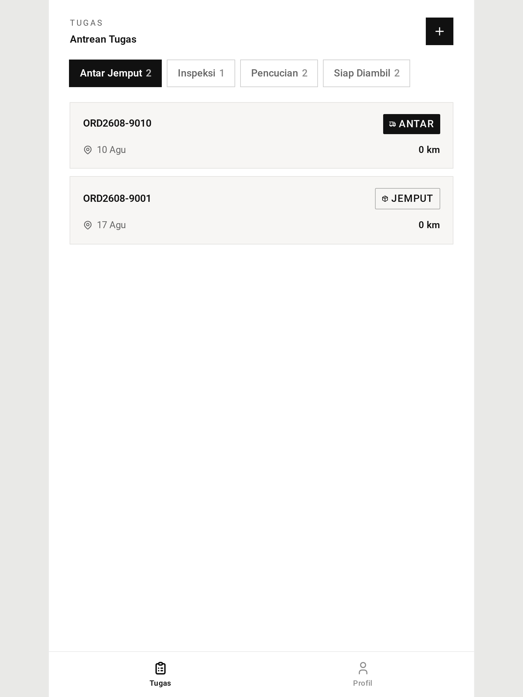 |  |

**Tab Antar Jemput — jemput dan antar, urut rute**

| Desktop                                                                                                        | Tablet                                                                                                       | Mobile                                                                                                       |
| -------------------------------------------------------------------------------------------------------------- | ------------------------------------------------------------------------------------------------------------ | ------------------------------------------------------------------------------------------------------------ |
|  |  | 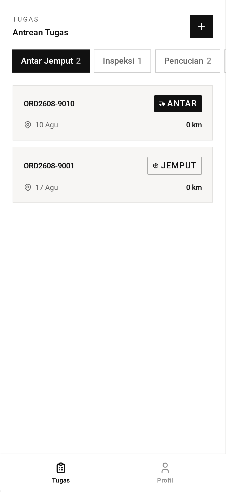 |

**Tab Inspeksi**

| Desktop                                                                           | Tablet                                                                          | Mobile                                                                          |
| --------------------------------------------------------------------------------- | ------------------------------------------------------------------------------- | ------------------------------------------------------------------------------- |
| 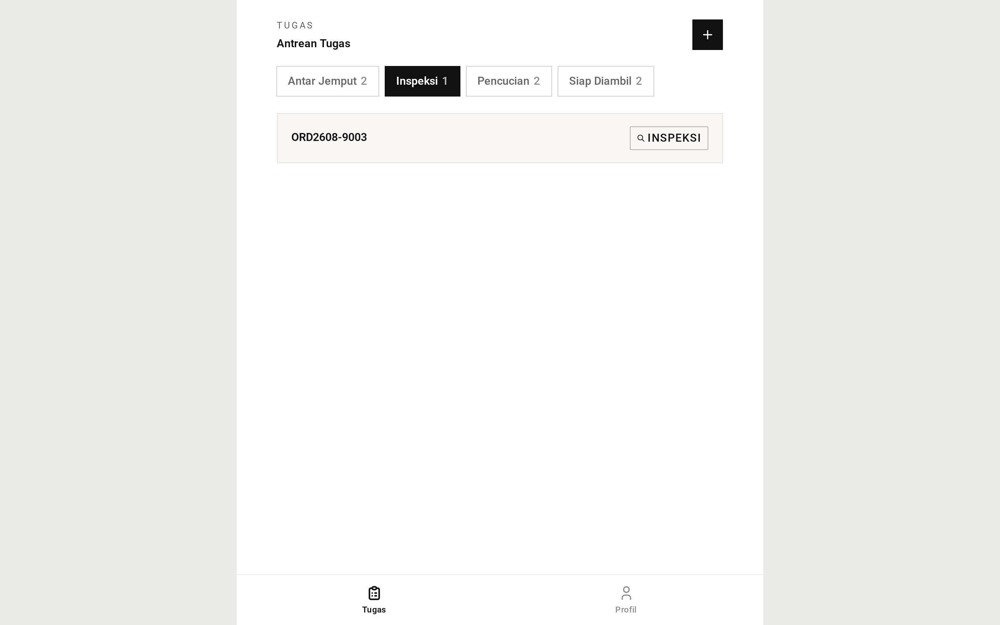 | 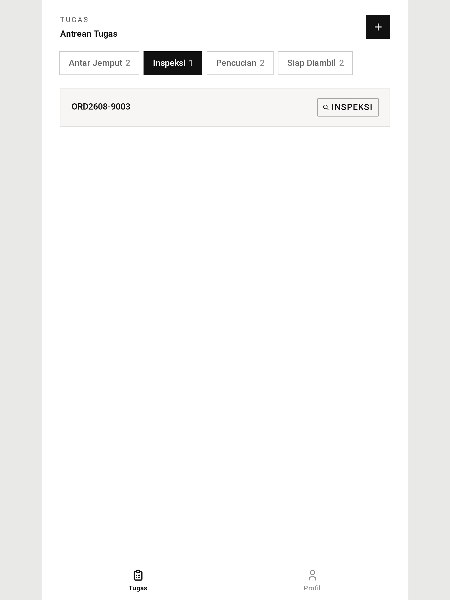 | 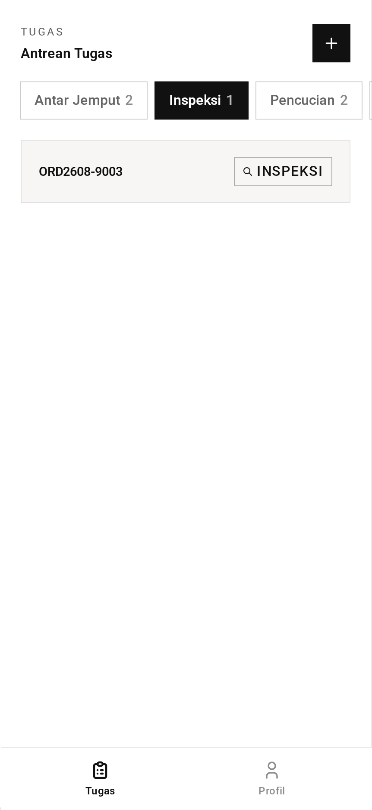 |

**Tab Pencucian**

| Desktop                                                                          | Tablet                                                                         | Mobile                                                                         |
| -------------------------------------------------------------------------------- | ------------------------------------------------------------------------------ | ------------------------------------------------------------------------------ |
| 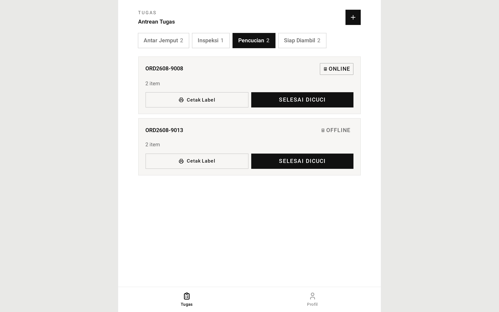 | 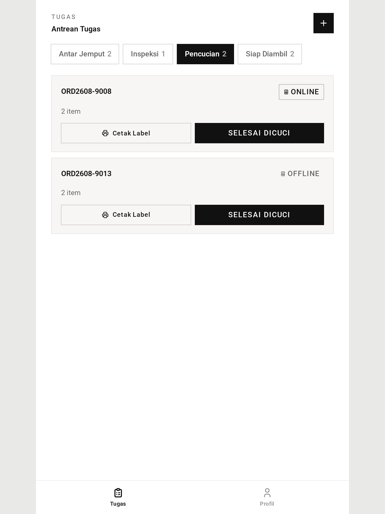 | 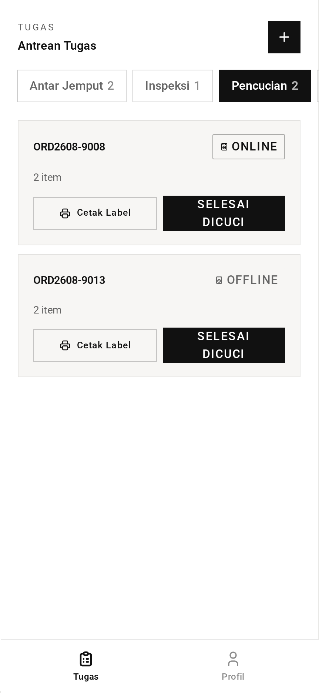 |

**Tab Siap Diambil, dengan aksi pemberitahuan**

| Desktop                                                                                                          | Tablet                                                                                                         | Mobile                                                                                                         |
| ---------------------------------------------------------------------------------------------------------------- | -------------------------------------------------------------------------------------------------------------- | -------------------------------------------------------------------------------------------------------------- |
| 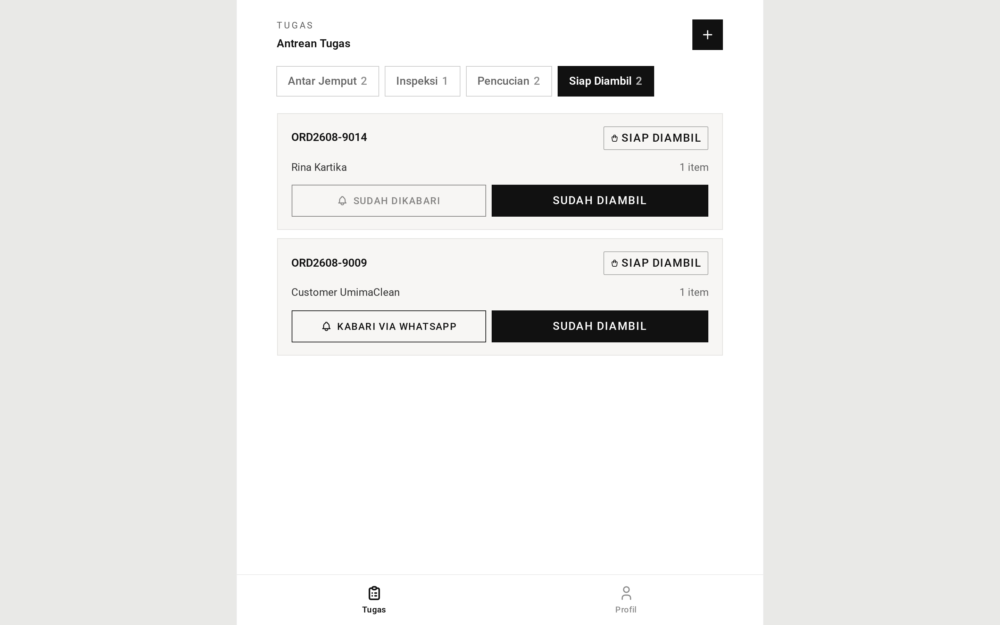 | 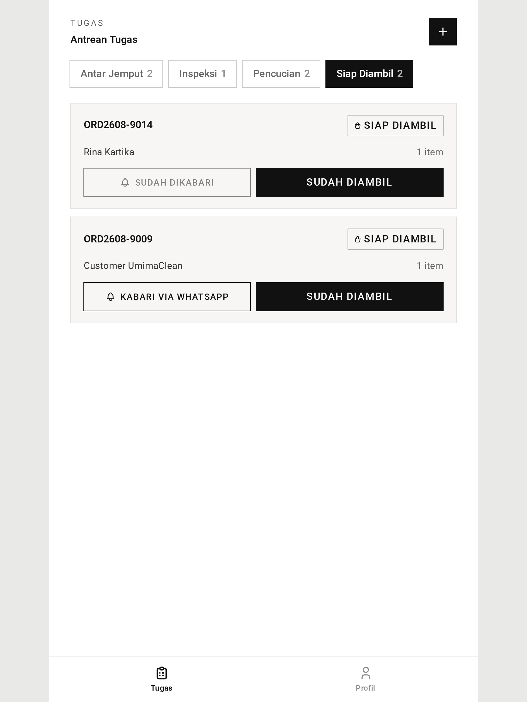 | 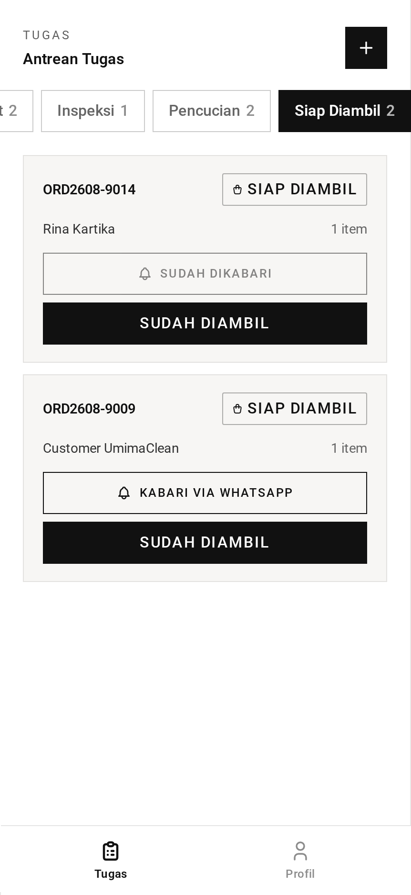 |

→ Versi satu menit: [tldr.md](tldr.md)
→ Detail implementasi: [teknis.md](teknis.md)
