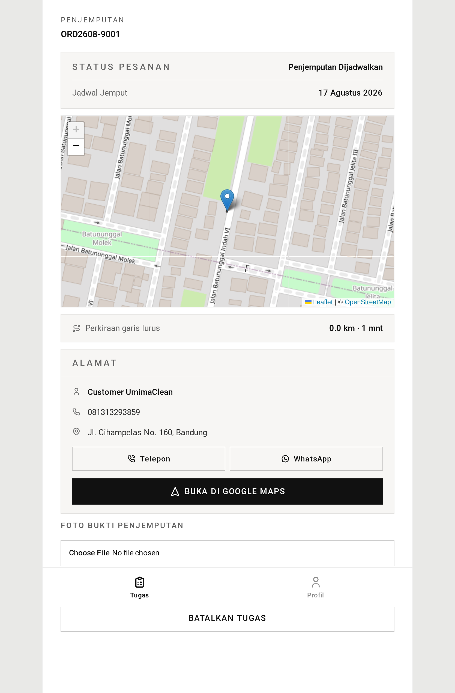
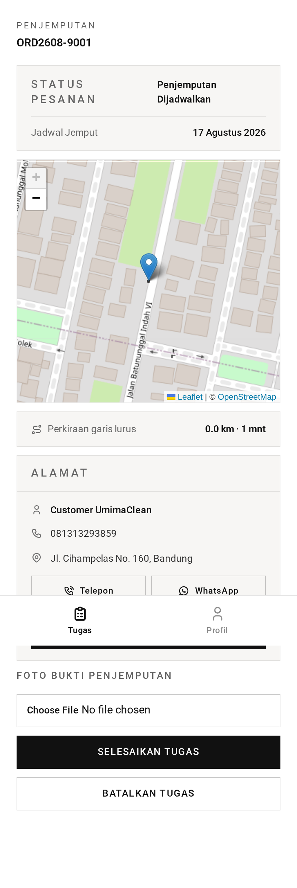
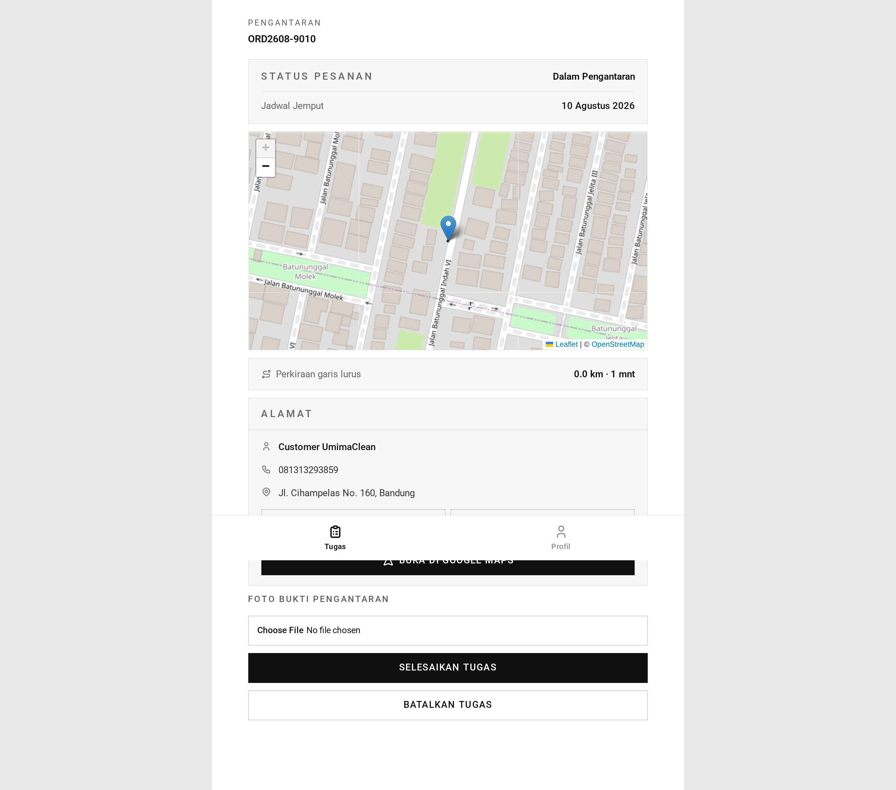
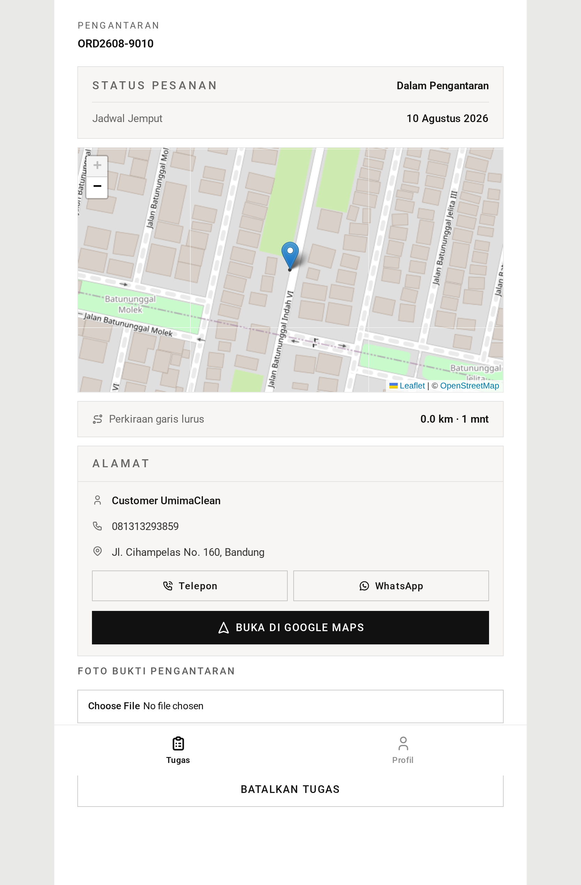
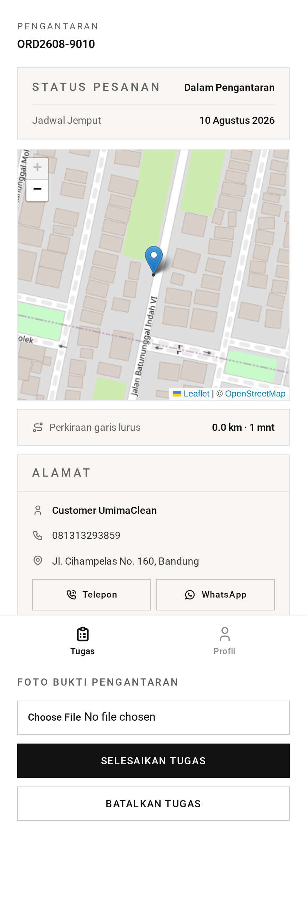
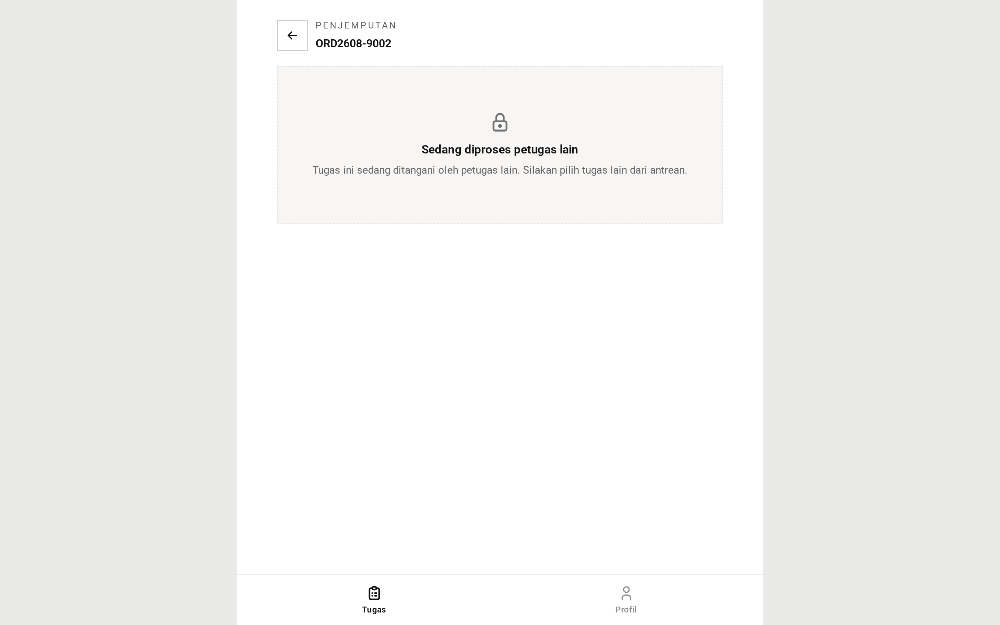
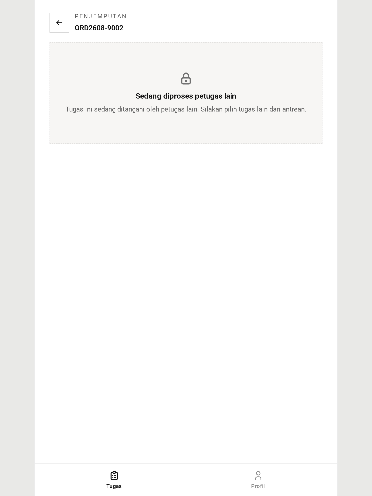
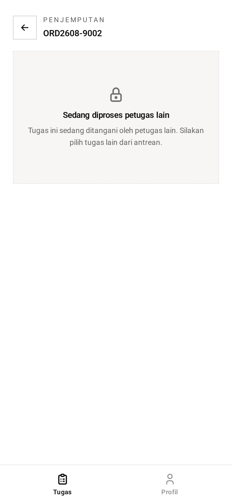

# Perjalanan — Panduan

Perjalanan adalah rit menuju alamat pelanggan — entah untuk mengambil barang di
awal pesanan, atau mengembalikannya di akhir.

## Kenapa jemput dan antar disatukan

Dari sudut pandang aplikasi keduanya tugas yang sama: berkendara ke alamat,
menemui pelanggan, memotret serah terima, memajukan pesanan. Hanya arah dan
status hasilnya yang berbeda.

Jadi keduanya berbagi layar, perencana rute, dan form penyelesaian. URL-nya yang
membawa informasi jenisnya.

## Rutenya

Tab perjalanan tidak sekadar mendaftar pekerjaan menurut waktu. Tab ini
**merencanakan rute**.

Berangkat dari toko, aplikasi mengurutkan pemberhentian sehingga tiap
pemberhentian adalah yang terdekat dari sisa yang ada — urutan sederhana dan
mudah ditebak, bukan tur optimal. Tiap pemberhentian menampilkan jaraknya.

Titik awalnya adalah pusat area operasional. Jika tidak ada area yang
dikonfigurasi, titik awalnya jatuh ke pemberhentian pertama.

### Ketika layanan perutean tidak tersedia

Jarak jalan sebenarnya berasal dari layanan perutean. Layanan itu bisa saja
dimatikan atau tidak terjangkau.

Ketika itu terjadi, tidak ada yang rusak. Aplikasi jatuh ke jarak garis lurus
dikalikan faktor kelokan jalan 1,3, yang merupakan pendekatan cukup baik untuk
berkendara dalam kota. Pemberhentian tetap diurutkan dengan masuk akal, angkanya
saja yang kurang presisi.

Petugas tidak akan melihat galat, dan tabnya tetap berfungsi.

## Menjalankan perjalanan

Membuka perjalanan berarti **mengklaimnya** — lihat [tasks](../tasks/) untuk cara
kerjanya. Setelah diklaim, petugas melihat pesanan, alamat, dan garis peta
menuju ke sana.

Mereka berkendara, menemui pelanggan, dan menyelesaikan perjalanan dengan
**mengambil foto**. Fotonya wajib. Itu bukti serah terima untuk kedua arah —
bahwa barang telah diambil, atau bahwa barang telah diantar.

Format yang diterima adalah JPG dan PNG, sampai 5 MB.

## Apa yang terjadi saat selesai

**Menuntaskan penjemputan** memindahkan pesanan ke "dalam penjemputan" dan
pesanan muncul di antrean inspeksi. Pesannya memberi tahu petugas untuk lanjut
ke inspeksi.

**Menuntaskan pengantaran** memindahkan pesanan ke "selesai". Itu akhir hidup
pesanan tersebut.

Pada kedua kasus, aplikasi mencatat entri aksi pada pesanan — siapa yang
melakukannya, kapan, dan fotonya — lalu klaimnya dilepas sehingga catatan petugas
menjadi bersih.

## Mengembalikan perjalanan

Jika perjalanan tidak bisa dikerjakan, petugas mengembalikannya ke antrean.
Perjalanan itu langsung tersedia bagi semua orang, tanpa menunggu kedaluwarsa
klaim tiga jam.

## Hal yang perlu diketahui

**Hanya pesanan dengan alamat yang muncul di sini.** Pesanan konter tanpa alamat
pengantaran tidak pernah menjadi perjalanan; pesanan itu berakhir di "siap
diambil".

**Foto diunggah sebelum pesanan diperbarui.** Jika perubahan status kemudian
gagal — misalnya pesanan sudah maju di tab lain — fotonya terlanjur tersimpan.
Tidak berbahaya, sekadar berkas yang tidak terpakai.

## Tangkapan Layar

Setiap keadaan di bawah ditampilkan pada tiga lebar — desktop (1440px), tablet (834px), dan mobile (430px). Gambar utama di atas memakai tampilan mobile, sesuai cara layar role ini biasa dipakai.

**Perjalanan jemput beserta peta rutenya**

| Desktop                                                                                             | Tablet                                                                                            | Mobile                                                                                            |
| --------------------------------------------------------------------------------------------------- | ------------------------------------------------------------------------------------------------- | ------------------------------------------------------------------------------------------------- |
|  |  |  |

**Perjalanan antar**

| Desktop                                                                         | Tablet                                                                        | Mobile                                                                        |
| ------------------------------------------------------------------------------- | ----------------------------------------------------------------------------- | ----------------------------------------------------------------------------- |
|  |  |  |

**Terblokir — sedang diklaim petugas lain**

| Desktop                                                                                               | Tablet                                                                                              | Mobile                                                                                              |
| ----------------------------------------------------------------------------------------------------- | --------------------------------------------------------------------------------------------------- | --------------------------------------------------------------------------------------------------- |
|  |  |  |

→ Versi satu menit: [tldr.md](tldr.md)
→ Detail implementasi: [teknis.md](teknis.md)
