# The Order Lifecycle

One order, one status column, three roles looking at the same value. This is the
document to read before any of the role folders — almost every rule in the
system is really a rule about *which status an order is in*.

Source of truth: [`app/enums/order_status_enum.ts`](../app/enums/order_status_enum.ts)
and the transitions scattered across `OrderService`, `TaskService`,
`TransactionService`, and `ReconciliationService`.

---

## 1. The states

| Value              | Indonesian label          | Meaning                                                     | Who moves it on                          |
| ------------------ | ------------------------- | ----------------------------------------------------------- | ---------------------------------------- |
| `pickup_scheduled` | Penjemputan Dijadwalkan   | Booked, waiting for its pickup day                          | Staff (claim) or customer (cancel)       |
| `in_pickup`        | Dalam Penjemputan         | A staff member has claimed this stop and is on the way       | Staff (complete or release)              |
| `in_inspection`    | Dalam Inspeksi            | Items are at the shop, waiting to be recorded and priced     | Staff (inspection)                       |
| `awaiting_payment` | Menunggu Pelunasan        | Priced. The customer owes money.                             | Midtrans webhook, or admin override      |
| `in_cleaning`      | Dalam Pencucian           | Paid (or paid at the counter). Being washed.                 | Staff (cleaning done)                    |
| `in_delivery`      | Dalam Pengantaran         | Washed, waiting for a delivery run                           | Staff (complete delivery)                |
| `completed`        | Selesai                   | Terminal. Handed over.                                       | —                                        |
| `cancelled`        | Dibatalkan                | Terminal. Cancelled by the customer before pickup day.       | —                                        |

There is **no** "refunded", "on hold", or "failed" order state. A failed payment
leaves the order in `awaiting_payment` and only the *transaction* records the
failure.

---

## 2. The two paths

```mermaid
flowchart TD
    subgraph Online["Online order — booked in the app"]
        A[Customer books a pickup date] --> B(pickup_scheduled)
        B -->|staff opens the pickup task| C(in_pickup)
        C -->|proof photo uploaded| D(in_inspection)
        C -.staff releases the task.-> B
        D -->|items recorded + priced| E(awaiting_payment)
        E -->|Midtrans webhook: settlement| F(in_cleaning)
        E -.admin manual override.-> F
        F -->|cleaning photo uploaded| G(in_delivery)
        G -->|handover photo uploaded| H(completed)
        B -.cancel, strictly before pickup day.-> X(cancelled)
    end

    subgraph Offline["Walk-in order — recorded at the counter"]
        W[Staff records items + takes payment] --> F2(in_cleaning)
        F2 -->|cleaning photo uploaded| H2(completed)
    end
```



### Why a walk-in starts at `in_cleaning`

Everything the earlier states exist to establish is already true at the counter:
the items are physically present (no pickup), staff are looking at them while
they type (no separate inspection), and the money is taken before the customer
leaves (no awaiting payment). Starting the order at `in_cleaning` is not a
shortcut — it is an accurate statement of where the order is.

### Why a walk-in ends at `completed` without delivery

The exit from `in_cleaning` is decided by one line in
[`TaskService.markCleaningDone`](../app/services/task_service.ts):

```ts
const nextStatus = order.addressId ? OrderStatus.IN_DELIVERY : OrderStatus.COMPLETED
```

`address_id` is the *existence of somewhere to deliver to*. A walk-in has none —
the customer will come back to the counter — so the order is finished the moment
it is washed.

---

## 3. Every transition, with its trigger

| From                | To                 | Trigger                                                                 | Code                                                                |
| ------------------- | ------------------ | ----------------------------------------------------------------------- | ------------------------------------------------------------------- |
| —                   | `pickup_scheduled` | Customer submits the booking form                                        | `OrderService.createOnlineOrder`                                     |
| —                   | `in_cleaning`      | Staff submits the walk-in form                                           | `OrderService.createOfflineOrder`                                    |
| `pickup_scheduled`  | `in_pickup`        | Staff **opens** the pickup task page (the claim itself)                  | `TaskService.claimTask`                                              |
| `in_pickup`         | `pickup_scheduled` | Staff releases the task                                                  | `TaskService.releaseTask`                                            |
| `in_pickup`         | `in_inspection`    | Staff uploads the collection photo                                       | `TaskService.completeTask`                                           |
| `in_inspection`     | `awaiting_payment` | Staff submits the inspection (items + photo). Sets `total_price`.        | `TaskService.completeInspection`                                     |
| `awaiting_payment`  | `in_cleaning`      | Midtrans notifies `settlement`/`capture+accept`                          | `TransactionService.handleNotification`                              |
| `awaiting_payment`  | `in_cleaning`      | Admin confirms payment manually                                          | `ReconciliationService.confirmPayment`                               |
| `in_cleaning`       | `in_delivery`      | Staff uploads the cleaning photo **and** the order has an address        | `TaskService.markCleaningDone`                                       |
| `in_cleaning`       | `completed`        | Staff uploads the cleaning photo, order has **no** address (walk-in)     | `TaskService.markCleaningDone`                                       |
| `in_delivery`       | `completed`        | Staff uploads the handover photo                                         | `TaskService.completeTask`                                           |
| `pickup_scheduled`  | `cancelled`        | Customer cancels, strictly before the pickup date                        | `OrderService.cancelOrder`                                           |

### There is no central state machine

Nothing validates "is this transition legal" in one place. Instead, **each
operation re-queries the order with the status it requires** and fails with
`firstOrFail()` if it is not in that status:

```ts
// TaskService.getTaskOrder — an order in the wrong status simply does not exist here
Order.query().where('order_number', orderNumber).whereIn('status', TASK_STATUSES[type]).firstOrFail()
```

```ts
// TaskService.getEditableItemsOrder — item corrections only while awaiting payment
Order.query().where('order_number', orderNumber).where('status', OrderStatus.AWAITING_PAYMENT).firstOrFail()
```

> **Why this is fine, and what it costs.** With one process, a handful of
> transitions, and a status column indexed on every query, the guard-by-query
> approach is simpler than a machine and impossible to bypass by calling the
> wrong method. The cost is that the transition table above exists nowhere in
> code — if you add a state, you must find every `whereIn('status', ...)` and
> `PAYABLE_STATUSES`-style constant yourself. Grep for `OrderStatus.` before
> changing anything here.

---

## 4. The action log

Every meaningful event writes a row to `order_actions`
([`app/enums/order_action_enum.ts`](../app/enums/order_action_enum.ts)):

| `name`                | Label (UI)                      | Written when                                              | Photo? |
| --------------------- | ------------------------------- | --------------------------------------------------------- | ------ |
| `attempt_pickup`      | Tugas Penjemputan Diambil       | Staff opens a pickup task → **claims the lock**            | no     |
| `attempt_delivery`    | Tugas Pengantaran Diambil       | Staff opens a delivery task                                | no     |
| `attempt_inspection`  | Tugas Inspeksi Diambil          | Staff opens an inspection                                  | no     |
| `release_pickup`      | Tugas Penjemputan Dibatalkan    | Staff abandons a pickup → **releases the lock**            | no     |
| `release_delivery`    | Tugas Pengantaran Dibatalkan    | Staff abandons a delivery                                  | no     |
| `release_inspection`  | Tugas Inspeksi Dibatalkan       | Staff abandons an inspection                               | no     |
| `pickup`              | Penjemputan Selesai             | Collection completed                                       | **yes** |
| `delivery`            | Pengantaran Selesai             | Handover completed                                         | **yes** |
| `inspection`          | Inspeksi Selesai                | Items recorded and priced                                  | **yes** |
| `cleaning_done`       | Pencucian Selesai               | Batch washed                                               | **yes** |
| `offline_order`       | Pesanan Offline                 | Walk-in order created (carries the counter note)           | no     |
| `items_edited`        | Barang Diperbarui               | Items corrected after inspection                           | no     |
| `payment_override`    | Pembayaran Dikonfirmasi Manual  | Admin settled a payment by hand (carries the reason)       | no     |

This table does double duty:

1. **Audit trail** — the admin order detail page prints it in full, with the
   staff member's name and timestamp against every row.
2. **Lock state** — the current holder of a task is *derived* from the last
   attempt/release/complete action, not stored. See
   [staff/task-board.md](staff/task-board.md#the-lock).

The customer timeline in
[`customer/order/show.tsx`](../inertia/pages/customer/order/show.tsx) reads only
the three completion actions (`pickup`, `inspection`, `delivery`) — claims and
releases are internal noise the customer never sees. The before/after slider
pairs the `inspection` photo with the `cleaning_done` photo.

---

## 5. Money, in lifecycle terms

`orders.total_price` is `NULL` until something prices the order:

- **online** — set by `completeInspection`, recomputed by `replaceOrderItems`
- **offline** — set inside `createOfflineOrder`, in the same transaction

`PAYABLE_STATUSES` in [`TransactionService`](../app/services/transaction_service.ts)
is `[awaiting_payment, in_cleaning]`: the first is an online order waiting to be
paid, the second is a walk-in being paid at the counter. Asking to charge an
order in any other status is a validation error
(`"Pesanan ini tidak memerlukan pembayaran saat ini."`).

Only the webhook and the admin override advance the *order* on payment. A cash
or debit walk-in payment creates a `paid` transaction row but changes no status —
the order is already in `in_cleaning`.

For reporting, "revenue" means **`orders.total_price` for orders that have at
least one `paid` transaction** — never the sum of transaction rows, because one
order can have several (expired QR, retry, then settle). See
[admin/reports.md](admin/reports.md).

---

## 6. Order numbers

```ts
ORD + yyLLdd + '-' + NNN     // ORD260728-001
```

Generated by `OrderService.generateOrderNumber`: take the highest number issued
today, add one, pad to three digits. The sequence restarts each day.

Because "read the max, then insert" is not atomic, two simultaneous orders can
compute the same number. The unique index on `order_number` turns that into a
failed insert (Postgres `23505`), and
`OrderService.createWithUniqueOrderNumber` catches it and retries up to three
times — the retry re-reads the max and picks up the number the winner just took.
Both creation paths go through that wrapper, so a collision is never visible to
a customer or a staff member.

⚠️ Three digits caps the shop at **999 orders per day**. Far beyond current
volume, but it is a real ceiling.

---

## 7. Reading a status in the UI

| Surface                | What it shows                                                                    |
| ---------------------- | -------------------------------------------------------------------------------- |
| Customer order page    | The Indonesian label in a black hero card, plus milestone dates and proof photos |
| Staff task board       | Only orders in a status that makes them claimable work                           |
| Admin monitor          | The label as a coloured badge, keyed on `statusValue` via `orderStatusStyles`     |
| Admin dashboard        | Counts per status, in lifecycle order rather than by size                         |

Badge colours live in
[`inertia/lib/constants.ts`](../inertia/lib/constants.ts) and are keyed on the
**raw** enum value, deliberately, so rewording a label cannot silently grey out a
badge.
